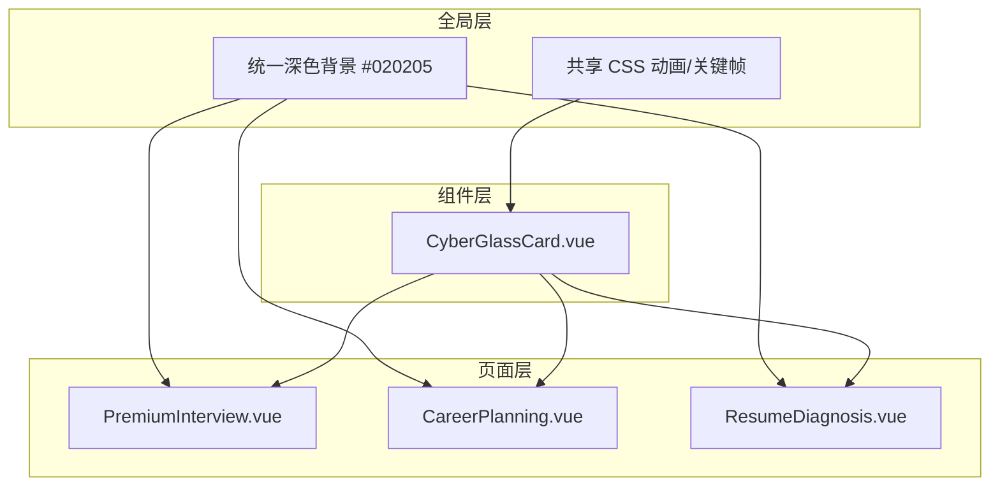
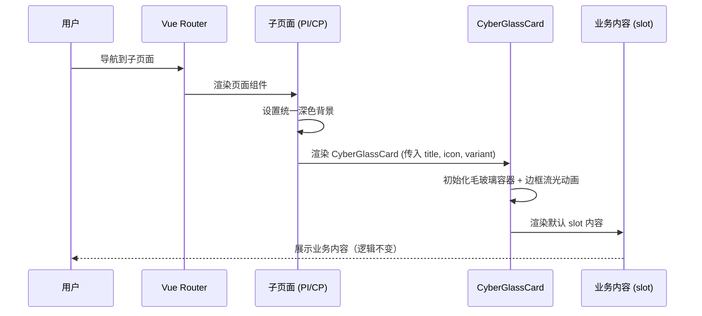
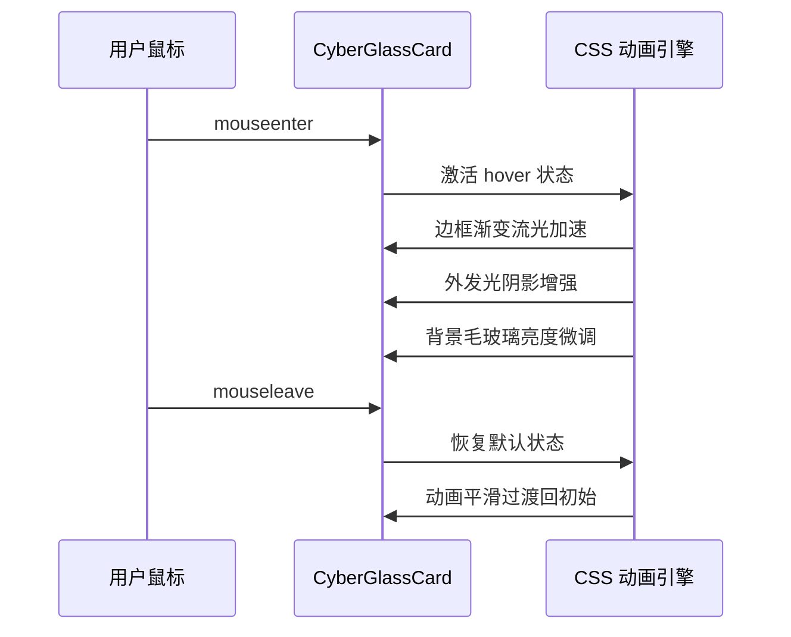

# Design Document: CyberGlassCard UI Unification

## Overview

本设计旨在提取一个全局通用的高颜值赛博朋克毛玻璃卡片容器组件 `CyberGlassCard.vue`，统一全站子页面的视觉风格。当前 Dashboard 已建立"暗黑赛博朋克 + Glassmorphism + 高信息密度"的设计基调，但子页面（PremiumInterview、CareerPlanning）缺乏统一的设计语言。

核心策略是"只动皮囊，不动筋骨"——仅替换 UI 容器与样式层，绝不触碰任何业务逻辑（ref 状态、API 请求、Markdown 渲染等）。最终效果应呈现"顶级 AI 实验室数据大屏"的视觉质感。

组件设计参考 Dashboard 中已有的紫/青色光晕配色方案（`rgba(139, 92, 246, ...)` 紫色系 + `rgba(6, 182, 212, ...)` 青色系），并在此基础上增加边框流光动画、极光阴影、科技感角标等创意效果。

## Architecture



## Sequence Diagrams

### 页面渲染流程



### 组件交互流程



## Components and Interfaces

### Component 1: CyberGlassCard

**Purpose**: 全局通用的赛博朋克毛玻璃卡片容器，提供统一的视觉包装层

**Interface**:

```typescript
// Props 定义
interface CyberGlassCardProps {
  title?: string              // 卡片标题文本
  icon?: Component            // Lucide 图标组件
  variant?: 'default' | 'cyan' | 'purple' | 'pink' | 'emerald'  // 主题色变体
  noPadding?: boolean         // 是否移除内部 padding
  headerless?: boolean        // 是否隐藏 header 区域
}

// Slots 定义
interface CyberGlassCardSlots {
  default: () => VNode[]      // 主体内容区域
  header?: () => VNode[]      // 自定义 header（覆盖默认 title+icon）
  corner?: () => VNode[]      // 右上角科技感角标区域
}
```

**Responsibilities**:
- 提供统一的毛玻璃背景容器（backdrop-blur + 半透明背景）
- 渲染带有渐变流光效果的边框动画
- 支持 Header 区域（Title + Lucide Icon）
- 通过 variant prop 切换不同的主题色光晕
- 提供 hover 时的视觉增强反馈（发光加强、边框流光加速）
- 渲染科技感角标装饰元素

### Component 2: BackButton (内联于页面)

**Purpose**: 统一的"返回工作台"导航按钮，保留原有路由功能并美化样式

**Interface**:

```typescript
// 内联在各页面中，不单独抽取组件
// 统一样式规范：
interface BackButtonStyle {
  icon: ArrowLeft              // Lucide ArrowLeft 图标
  text: '返回工作台'
  route: '/dashboard'
  animation: 'hover:-translate-x-1' // hover 时左移动画
  color: 'cyan-400/70 → cyan-400'   // 默认/hover 颜色
}
```

**Responsibilities**:
- 保留原有 `router.push('/dashboard')` 路由导航功能
- 统一视觉样式：半透明背景 + 边框 + hover 发光
- 位于页面左上角，不被 CyberGlassCard 包裹

## Data Models

### CyberGlassCard 主题色配置

```typescript
type VariantConfig = {
  borderColor: string         // 边框颜色 (e.g., 'purple-500/30')
  glowColor: string           // 外发光颜色 (e.g., 'rgba(139, 92, 246, 0.15)')
  gradientFrom: string        // 流光渐变起始色
  gradientTo: string          // 流光渐变终止色
  iconColor: string           // 图标颜色 class
  titleColor: string          // 标题颜色 class
  cornerColor: string         // 角标颜色
}

const VARIANT_MAP: Record<string, VariantConfig> = {
  default: {
    borderColor: 'rgba(139, 92, 246, 0.2)',
    glowColor: 'rgba(139, 92, 246, 0.08)',
    gradientFrom: 'rgba(139, 92, 246, 0.6)',
    gradientTo: 'rgba(6, 182, 212, 0.6)',
    iconColor: 'text-purple-400',
    titleColor: 'text-purple-200',
    cornerColor: 'rgba(139, 92, 246, 0.5)'
  },
  cyan: {
    borderColor: 'rgba(6, 182, 212, 0.2)',
    glowColor: 'rgba(6, 182, 212, 0.08)',
    gradientFrom: 'rgba(6, 182, 212, 0.6)',
    gradientTo: 'rgba(59, 130, 246, 0.6)',
    iconColor: 'text-cyan-400',
    titleColor: 'text-cyan-200',
    cornerColor: 'rgba(6, 182, 212, 0.5)'
  },
  purple: {
    borderColor: 'rgba(139, 92, 246, 0.2)',
    glowColor: 'rgba(139, 92, 246, 0.08)',
    gradientFrom: 'rgba(168, 85, 247, 0.6)',
    gradientTo: 'rgba(139, 92, 246, 0.6)',
    iconColor: 'text-purple-400',
    titleColor: 'text-purple-200',
    cornerColor: 'rgba(168, 85, 247, 0.5)'
  },
  pink: {
    borderColor: 'rgba(236, 72, 153, 0.2)',
    glowColor: 'rgba(236, 72, 153, 0.08)',
    gradientFrom: 'rgba(236, 72, 153, 0.6)',
    gradientTo: 'rgba(232, 121, 249, 0.6)',
    iconColor: 'text-pink-400',
    titleColor: 'text-pink-200',
    cornerColor: 'rgba(236, 72, 153, 0.5)'
  },
  emerald: {
    borderColor: 'rgba(16, 185, 129, 0.2)',
    glowColor: 'rgba(16, 185, 129, 0.08)',
    gradientFrom: 'rgba(16, 185, 129, 0.6)',
    gradientTo: 'rgba(6, 182, 212, 0.6)',
    iconColor: 'text-emerald-400',
    titleColor: 'text-emerald-200',
    cornerColor: 'rgba(16, 185, 129, 0.5)'
  }
}
```

**Validation Rules**:
- variant 必须是预定义的 5 种之一，默认为 'default'
- title 为空时 header 区域仍渲染（显示 icon 或留白）
- headerless 为 true 时完全隐藏 header 区域

## Algorithmic Pseudocode

### 边框流光动画算法

```typescript
// CSS @keyframes 实现的边框渐变流光
// 使用 conic-gradient 旋转实现流光扫描效果

@keyframes borderGlow {
  0% {
    // 锥形渐变起始角度 0°
    background: conic-gradient(from 0deg, transparent, gradientFrom, gradientTo, transparent)
  }
  100% {
    // 旋转一圈 360°
    background: conic-gradient(from 360deg, transparent, gradientFrom, gradientTo, transparent)
  }
}

// 实现方式：双层结构
// 外层 (::before): 承载旋转的 conic-gradient，略大于内层
// 内层: 实际内容区域，覆盖在外层之上，形成"边框"视觉
```

### 页面集成算法

```typescript
// PremiumInterview.vue 改造伪代码
ALGORITHM refactorPage(page: VueComponent)
  INPUT: 原始页面组件
  OUTPUT: 使用 CyberGlassCard 包裹的页面

  STEP 1: 保留 <script setup> 完全不变
  STEP 2: 修改 <template>
    - 替换最外层背景色为统一深色 (#020205 或 #050505)
    - 移除原有的独立背景装饰元素（aurora-blob 等）
    - 用 CyberGlassCard 包裹各功能区块
    - 保留"返回工作台"按钮，统一样式
    - 所有 slot 内容保持原有结构不变
  STEP 3: 精简 <style scoped>
    - 移除被 CyberGlassCard 替代的样式
    - 保留业务相关样式（markdown-body 等）
    - 添加必要的布局适配样式
```

## Key Functions with Formal Specifications

### Function 1: CyberGlassCard 渲染逻辑

```typescript
// CyberGlassCard.vue <script setup>
import { computed } from 'vue'
import type { Component } from 'vue'

const props = withDefaults(defineProps<{
  title?: string
  icon?: Component
  variant?: 'default' | 'cyan' | 'purple' | 'pink' | 'emerald'
  noPadding?: boolean
  headerless?: boolean
}>(), {
  variant: 'default',
  noPadding: false,
  headerless: false
})

const variantClasses = computed(() => {
  const map = {
    default: 'cyber-card--default',
    cyan: 'cyber-card--cyan',
    purple: 'cyber-card--purple',
    pink: 'cyber-card--pink',
    emerald: 'cyber-card--emerald'
  }
  return map[props.variant] || map.default
})
```

**Preconditions:**
- `variant` 为预定义的 5 种值之一
- `icon` 如果传入，必须是有效的 Vue 组件（Lucide icon）

**Postconditions:**
- 渲染一个带有毛玻璃效果的卡片容器
- 边框流光动画持续运行
- hover 时视觉效果增强
- slot 内容正确渲染在内容区域

### Function 2: 页面背景统一

```typescript
// 各子页面统一背景设置
function unifyPageBackground(page: 'PremiumInterview' | 'CareerPlanning') {
  // 移除原有的独立背景元素
  // 设置统一的极暗深色背景
  return 'bg-[#020205] min-h-[100dvh]'
}
```

**Preconditions:**
- 页面已正确挂载
- Tailwind CSS 已加载

**Postconditions:**
- 页面背景统一为极暗深色调
- 原有的 aurora-blob 等装饰元素被移除或简化
- 视觉风格与 Dashboard 保持一致

## Example Usage

```vue
<!-- 基础用法：带标题和图标 -->
<CyberGlassCard title="能力评估雷达" :icon="Compass" variant="cyan">
  <div class="radar-content">
    <!-- 业务内容 -->
  </div>
</CyberGlassCard>

<!-- 无 Header 用法 -->
<CyberGlassCard headerless variant="purple" no-padding>
  <div class="chat-messages">
    <!-- 聊天消息列表 -->
  </div>
</CyberGlassCard>

<!-- 自定义 Header + 角标 -->
<CyberGlassCard variant="pink">
  <template #header>
    <div class="flex items-center gap-2">
      <Flame class="w-5 h-5 text-pink-400" />
      <span class="text-pink-200 font-bold">P8 压力面试</span>
    </div>
  </template>
  <template #corner>
    <span class="text-[10px] text-pink-400/60 font-mono">LIVE</span>
  </template>
  <!-- 默认 slot: 面试内容 -->
  <div class="interview-content">...</div>
</CyberGlassCard>

<!-- 在 PremiumInterview.vue 中的集成示例 -->
<template>
  <div class="min-h-[100dvh] bg-[#020205] relative flex">
    <!-- 统一背景光效（简化版） -->
    <div class="absolute inset-0 pointer-events-none overflow-hidden">
      <div class="absolute top-[-10%] left-[-5%] w-[50vw] h-[50vw] bg-purple-600/20 blur-[150px] rounded-full"></div>
      <div class="absolute bottom-[-10%] right-[-5%] w-[50vw] h-[50vw] bg-cyan-600/15 blur-[150px] rounded-full"></div>
    </div>

    <div class="relative z-10 flex w-full h-[100dvh]">
      <!-- 左侧面板 -->
      <CyberGlassCard title="候选人档案" :icon="FileText" variant="cyan" class="w-[30%]">
        <!-- 原有的简历预览、雷达图等内容 slot -->
      </CyberGlassCard>

      <!-- 右侧对话区 -->
      <CyberGlassCard headerless variant="default" no-padding class="flex-1">
        <!-- 原有的聊天消息列表、输入框等 -->
      </CyberGlassCard>
    </div>
  </div>
</template>
```

## Correctness Properties

*A property is a characteristic or behavior that should hold true across all valid executions of a system-essentially, a formal statement about what the system should do. Properties serve as the bridge between human-readable specifications and machine-verifiable correctness guarantees.*

### Property 1: Business Logic Preservation

*For any* sub-page (PremiumInterview, CareerPlanning) refactored to use CyberGlassCard, the `<script setup>` block SHALL remain byte-for-byte identical to the original, preserving all ref declarations, computed properties, API calls, event handlers, and Vue Router navigation calls.

**Validates: Requirements 4.1, 4.3**

### Property 2: Slot Content Completeness

*For any* original business UI element (forms, lists, chat messages, markdown output, input fields) present in a sub-page before refactoring, that element SHALL be rendered inside a CyberGlassCard slot after refactoring without omission or structural change.

**Validates: Requirements 4.2**

### Property 3: Variant Color Mapping Consistency

*For any* valid variant value (default, cyan, purple, pink, emerald), the CyberGlassCard SHALL apply the correct corresponding theme colors to border glow, icon color, title color, corner decoration, and animation gradient — matching the VARIANT_MAP configuration exactly.

**Validates: Requirements 1.3, 2.2, 3.3**

### Property 4: Invalid Variant Fallback

*For any* string value that is not one of the five valid variants (default, cyan, purple, pink, emerald), the CyberGlassCard SHALL render with the default variant configuration without errors or visual breakage.

**Validates: Requirements 7.1**

### Property 5: Responsive Rendering

*For any* viewport width from 320px to 2560px, the CyberGlassCard container SHALL not cause horizontal overflow, layout breakage, or content clipping on any sub-page.

**Validates: Requirements 6.1**

### Property 6: Back Button Navigation

*For any* sub-page that contains a Back_Button, clicking the button SHALL invoke router.push('/dashboard') and the button SHALL remain visible and accessible in the page-level layout outside of CyberGlassCard containers.

**Validates: Requirements 5.1, 5.5**

## Error Handling

### Error Scenario 1: Icon 组件未传入

**Condition**: `icon` prop 为 undefined/null
**Response**: Header 区域仅显示 title 文本，icon 位置留空
**Recovery**: 无需恢复，属于正常使用场景

### Error Scenario 2: Variant 值无效

**Condition**: 传入了未定义的 variant 字符串
**Response**: 回退到 'default' 变体配色
**Recovery**: 通过 TypeScript 类型约束在开发阶段捕获

### Error Scenario 3: 移动端布局溢出

**Condition**: 内容超出 CyberGlassCard 容器高度
**Response**: 内容区域自动启用 `overflow-y-auto` 滚动
**Recovery**: 滚动条样式与赛博朋克主题一致（半透明细滚动条）

## Testing Strategy

### Unit Testing Approach

- 验证 CyberGlassCard 组件在不同 props 组合下正确渲染
- 验证 variant 切换时 CSS class 正确应用
- 验证 slot 内容正确传递和渲染
- 验证 headerless 模式下 header 区域不渲染

### Visual Regression Testing

- 截图对比重构前后的页面视觉效果
- 确认 hover 动画效果正常触发
- 确认移动端响应式布局正确

### Integration Testing Approach

- 验证 PremiumInterview 页面重构后所有面试功能正常（发送消息、接收 SSE 流、评估报告生成）
- 验证 CareerPlanning 页面重构后职业规划生成功能正常（SSE 流式输出、Markdown 渲染）
- 验证"返回工作台"路由导航功能正常
- 验证历史记录恢复功能不受影响

## Performance Considerations

- **CSS 动画优化**: 边框流光使用 `will-change: transform` 提示浏览器优化合成层
- **backdrop-filter 性能**: 毛玻璃效果 (`backdrop-blur`) 在低端设备上可能有性能开销，通过 `@media (prefers-reduced-motion)` 提供降级方案
- **动画帧率**: 所有动画使用 CSS 而非 JavaScript，确保 60fps 流畅度
- **DOM 结构**: CyberGlassCard 仅增加 2-3 层 DOM 嵌套，不显著影响渲染树深度

## Security Considerations

- 本次改造纯 UI 层面，不涉及数据流、API 请求或用户输入处理
- 不引入任何新的外部依赖
- 不修改任何认证、授权或数据传输逻辑

## Dependencies

- **现有依赖（无新增）**:
  - Vue 3 (^3.5.32)
  - Tailwind CSS (^4.2.2)
  - lucide-vue-next (^1.0.0)
  - vue-router (^5.0.4)

- **设计参考**:
  - `src/components/CyberRadarChart.vue` — 配色方案参考
  - `src/Dashboard.vue` — 整体视觉基调参考
