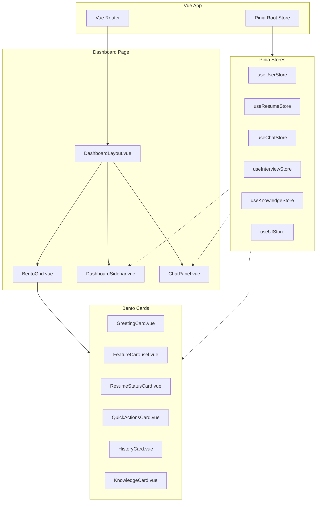
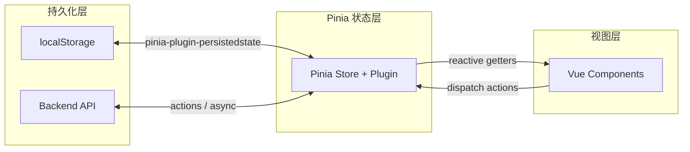
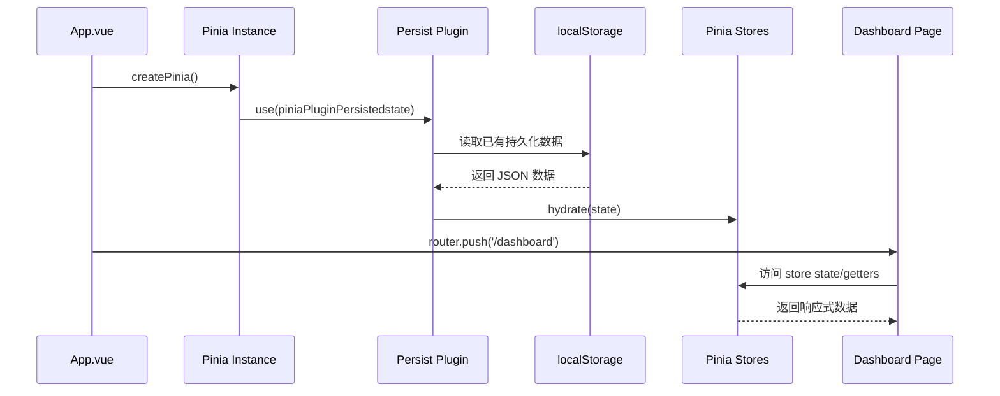
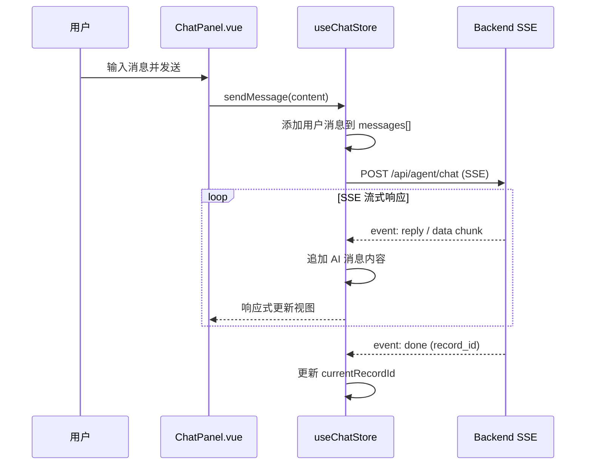
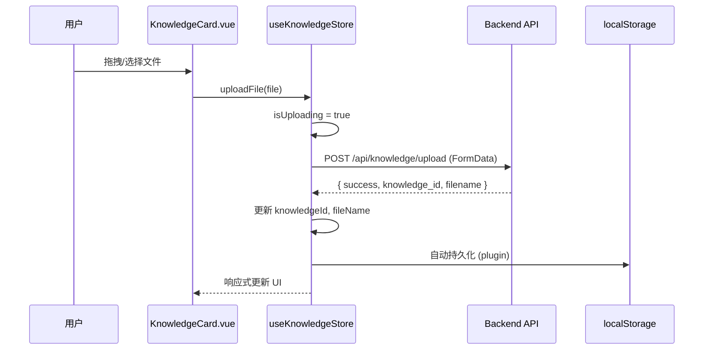

# Design Document: Dashboard Bento 面板升级与 Pinia 状态管理重构

## Overview

本设计文档描述了 AI Career Navigator 项目中 Dashboard 页面的全面重构方案。当前 Dashboard.vue 是一个约 2000 行的单体组件，所有状态通过 `ref` + `localStorage` 管理，缺乏集中式状态管理，组件职责混杂。

重构目标包括三个核心方向：(1) 引入 Pinia 作为集中式状态管理方案，替代分散的 localStorage 读写；(2) 将 Dashboard 拆分为多个职责单一的子组件；(3) 采用 Bento Grid 布局重新设计 Dashboard 面板，提升视觉层次和信息密度。整个迁移过程需保持向后兼容，确保已有 localStorage 数据可被平滑迁移至 Pinia store。

## Architecture

### 整体架构图



### 数据流架构



## Sequence Diagrams

### 应用初始化与状态恢复流程



### 聊天消息发送流程



### 知识库文件上传流程




## Components and Interfaces

### Component 1: DashboardLayout.vue

**Purpose**: Dashboard 页面的顶层布局容器，负责整体结构编排（侧边栏 + 主内容区 + 聊天面板）

**Interface**:
```javascript
// Props: 无（顶层页面组件）
// Emits: 无
// Slots: 无

// 内部组合
import DashboardSidebar from '@/components/dashboard/DashboardSidebar.vue'
import BentoGrid from '@/components/dashboard/BentoGrid.vue'
import ChatPanel from '@/components/dashboard/ChatPanel.vue'
```

**Responsibilities**:
- 管理三栏布局（侧边栏 / Bento 网格 / 聊天面板）
- 响应式断点处理（移动端折叠侧边栏）
- 背景光影效果渲染

---

### Component 2: BentoGrid.vue

**Purpose**: Bento 网格布局容器，管理卡片的网格排列

**Interface**:
```javascript
// Props
const props = defineProps({
  columns: { type: Number, default: 4 },  // 网格列数
  gap: { type: String, default: '1rem' }  // 卡片间距
})

// Slots
// default: 接收 BentoCard 子组件
```

**Responsibilities**:
- CSS Grid 布局管理
- 卡片尺寸规范（1x1, 2x1, 2x2 等）
- 响应式列数调整

---

### Component 3: ChatPanel.vue

**Purpose**: 右侧聊天面板，处理用户与 AI Agent 的对话交互

**Interface**:
```javascript
// Props: 无（通过 store 获取数据）
// Emits: 无

// 依赖的 Store
import { useChatStore } from '@/stores/chat'
import { useKnowledgeStore } from '@/stores/knowledge'
```

**Responsibilities**:
- 消息列表渲染与自动滚动
- 用户输入处理（文本 + 文件附件）
- SSE 流式响应展示
- 新建对话 / 保存对话操作

---

### Component 4: FeatureCarousel.vue

**Purpose**: 功能卡片轮播组件（简历诊断、模拟面试、职业规划、升学避坑）

**Interface**:
```javascript
const props = defineProps({
  features: { type: Array, required: true },
  autoPlay: { type: Boolean, default: true },
  interval: { type: Number, default: 3000 }
})

const emit = defineEmits(['feature-click'])
```

**Responsibilities**:
- 无限循环轮播逻辑
- 卡片点击导航
- 自动播放 / 暂停控制

---

### Component 5: DashboardSidebar.vue

**Purpose**: 左侧导航侧边栏

**Interface**:
```javascript
const props = defineProps({
  collapsed: { type: Boolean, default: false }
})

const emit = defineEmits(['menu-click', 'toggle-collapse'])
```

**Responsibilities**:
- 菜单项渲染与路由导航
- 工作区切换
- 折叠/展开状态管理

## Data Models

### Store 1: useUserStore

```javascript
/**
 * 用户基础信息 Store
 * 管理用户身份、姓名等全局用户数据
 */
export const useUserStore = defineStore('user', {
  state: () => ({
    candidateName: '',       // 用户姓名
    userId: 'user_001',     // 用户 ID
    activeWorkspace: '机构'  // 当前工作区
  }),

  getters: {
    /** 动态时间问候语 */
    greeting: () => {
      const hour = new Date().getHours()
      if (hour >= 6 && hour < 12) return '早上好'
      if (hour >= 12 && hour < 14) return '中午好'
      if (hour >= 14 && hour < 18) return '下午好'
      if (hour >= 18 && hour < 24) return '晚上好'
      return '夜深了'
    },

    /** 是否已完成初始设置 */
    isSetupComplete: (state) => !!state.candidateName
  },

  actions: {
    /** 从 localStorage 迁移旧数据 */
    migrateFromLocalStorage() {
      const name = localStorage.getItem('candidate_name')
      if (name && !this.candidateName) {
        this.candidateName = name
      }
    }
  },

  persist: {
    key: 'career-nav-user',
    pick: ['candidateName', 'userId', 'activeWorkspace']
  }
})
```

**Validation Rules**:
- `candidateName` 非空时长度 ≤ 50 字符
- `userId` 格式为 `user_` + 数字或 UUID

---

### Store 2: useResumeStore

```javascript
/**
 * 简历状态 Store
 * 管理全局简历文本、文件名、上传状态
 */
export const useResumeStore = defineStore('resume', {
  state: () => ({
    resumeText: '',          // 简历全文
    fileName: '',            // 简历文件名
    pendingText: '',         // 待确认的简历文本
    pendingFileName: '',     // 待确认的文件名
    showConfirmDialog: false // 是否显示确认弹窗
  }),

  getters: {
    /** 简历就绪状态 */
    status: (state) => state.resumeText ? 'ready' : 'missing',

    /** 是否有简历 */
    hasResume: (state) => !!state.resumeText
  },

  actions: {
    /** 确认更新简历 */
    confirmUpdate() {
      this.resumeText = this.pendingText.trim()
      this.fileName = this.pendingFileName
      this.pendingText = ''
      this.pendingFileName = ''
      this.showConfirmDialog = false
    },

    /** 取消更新 */
    cancelUpdate() {
      this.pendingText = ''
      this.pendingFileName = ''
      this.showConfirmDialog = false
    },

    /** 从 localStorage 迁移旧数据 */
    migrateFromLocalStorage() {
      const text = localStorage.getItem('resume_text')
      const name = localStorage.getItem('resume_file_name')
      if (text && !this.resumeText) {
        this.resumeText = text
        this.fileName = name || ''
      }
    }
  },

  persist: {
    key: 'career-nav-resume',
    pick: ['resumeText', 'fileName']
  }
})
```

**Validation Rules**:
- `resumeText` 最大长度 100,000 字符
- `fileName` 支持扩展名: `.pdf`, `.txt`, `.docx`

---

### Store 3: useChatStore

```javascript
/**
 * 聊天 Store
 * 管理 Dashboard 通用聊天的消息列表、发送状态、历史记录
 */
export const useChatStore = defineStore('chat', {
  state: () => ({
    messages: [],            // ChatMessage[]
    isLoading: false,        // 是否正在等待 AI 响应
    currentRecordId: null,   // 当前对话的后端记录 ID
    userInput: ''            // 当前输入框内容
  }),

  getters: {
    /** 是否有对话内容 */
    hasConversation: (state) =>
      state.messages.some(msg => String(msg.content || '').trim()),

    /** 最近 N 条消息（用于发送上下文） */
    recentHistory: (state) =>
      state.messages.slice(-10).map(msg => ({
        role: msg.role === 'user' ? 'user' : 'assistant',
        content: msg.content || ''
      }))
  },

  actions: {
    /** 发送消息（SSE 流式） */
    async sendMessage(content, extraParams = {}) { /* 见算法部分 */ },

    /** 清空对话，开始新会话 */
    resetConversation() {
      this.messages = []
      this.userInput = ''
      this.isLoading = false
      this.currentRecordId = null
    },

    /** 保存当前对话并重置 */
    async saveAndReset() { /* 见算法部分 */ }
  }

  // 注意：聊天消息不持久化到 localStorage（刷新即清空）
})
```

---

### Store 4: useKnowledgeStore

```javascript
/**
 * 知识库 Store
 * 管理知识库文件上传、ID、状态
 */
export const useKnowledgeStore = defineStore('knowledge', {
  state: () => ({
    knowledgeId: '',         // 知识库 ID
    fileName: '',            // 知识库文件名
    isUploading: false       // 上传中状态
  }),

  getters: {
    /** 是否已挂载知识库 */
    hasKnowledge: (state) => !!state.knowledgeId
  },

  actions: {
    /** 上传知识库文件 */
    async uploadFile(file) { /* 见算法部分 */ },

    /** 清除知识库 */
    clear() {
      this.knowledgeId = ''
      this.fileName = ''
    },

    /** 从 localStorage 迁移旧数据 */
    migrateFromLocalStorage() {
      const id = localStorage.getItem('dashboard_knowledge_id')
      const name = localStorage.getItem('dashboard_knowledge_file_name')
      if (id && !this.knowledgeId) {
        this.knowledgeId = id
        this.fileName = name || ''
      }
    }
  },

  persist: {
    key: 'career-nav-knowledge',
    pick: ['knowledgeId', 'fileName']
  }
})
```

---

### Store 5: useInterviewStore

```javascript
/**
 * 面试 Store
 * 管理面试 JD、支付状态、面试模态框
 */
export const useInterviewStore = defineStore('interview', {
  state: () => ({
    jdText: '',              // 岗位描述文本
    showModal: false,        // 面试舱门模态框
    isUnlocking: false,      // 解锁中状态
    paymentDone: false       // 支付完成标记
  }),

  actions: {
    /** 打开面试模态框 */
    openModal() {
      const savedJd = localStorage.getItem('current_interview_jd')
      if (savedJd) this.jdText = savedJd
      this.showModal = true
    },

    /** 确认并跳转面试 */
    confirmAndNavigate(router) {
      if (!this.jdText.trim()) return false
      localStorage.setItem('current_interview_jd', this.jdText.trim())
      this.showModal = false
      this.paymentDone = false
      this.isUnlocking = false
      router.push('/interview')
      return true
    },

    /** 关闭模态框 */
    closeModal() {
      this.showModal = false
      this.jdText = ''
      this.paymentDone = false
      this.isUnlocking = false
    }
  },

  persist: {
    key: 'career-nav-interview',
    pick: ['jdText']
  }
})
```


## Algorithmic Pseudocode

### 状态迁移算法（localStorage → Pinia）

```pascal
ALGORITHM migrateAllStores()
INPUT: 无（读取 localStorage）
OUTPUT: 所有 Store 状态已就绪

BEGIN
  // 前置条件：Pinia 已初始化，persist plugin 已加载
  ASSERT pinia.isInstalled = true

  stores ← [useUserStore, useResumeStore, useKnowledgeStore]

  FOR EACH storeFactory IN stores DO
    store ← storeFactory()

    // 持久化插件会先尝试从新 key 恢复
    // 如果新 key 无数据，则从旧 localStorage key 迁移
    IF store.$state 为默认空值 THEN
      store.migrateFromLocalStorage()
    END IF
  END FOR

  // 迁移完成后，清理旧 key（可选，延迟执行）
  SCHEDULE cleanupLegacyKeys() AFTER 5000ms
END
```

**Preconditions:**
- Pinia 实例已通过 `app.use(pinia)` 安装
- `pinia-plugin-persistedstate` 已注册
- localStorage 可访问

**Postconditions:**
- 所有 Store 的 state 已从持久化数据或旧 localStorage 恢复
- 组件可安全访问 Store 数据

**Loop Invariants:**
- 每次迭代后，当前 store 的状态已完成恢复或迁移

---

### SSE 流式聊天算法

```pascal
ALGORITHM sendChatMessage(content, extraParams)
INPUT: content (用户消息文本), extraParams (附加参数)
OUTPUT: AI 响应已追加到 messages[]

BEGIN
  ASSERT content.trim() 非空
  ASSERT this.isLoading = false

  // Step 1: 构建用户消息并追加
  userMsg ← {
    role: 'user',
    content: content,
    timestamp: formatTime(now())
  }
  aiMsg ← {
    role: 'ai',
    content: '',
    timestamp: formatTime(now()),
    isNew: true,
    agentLabel: ''
  }

  this.messages.push(userMsg)
  this.messages.push(aiMsg)
  this.userInput ← ''
  this.isLoading ← true

  // Step 2: 构建请求 payload
  payload ← {
    user_input: content,
    history: this.recentHistory
  }

  IF knowledgeStore.knowledgeId 非空 THEN
    payload.knowledge_id ← knowledgeStore.knowledgeId
  END IF

  IF resumeStore.resumeText 非空 THEN
    payload.resume_text ← resumeStore.resumeText
  END IF

  // Step 3: 发起 SSE 请求
  TRY
    response ← fetch(API_BASE_URL + '/agent/chat', {
      method: 'POST',
      headers: { 'Content-Type': 'application/json' },
      body: JSON.stringify(payload)
    })

    IF response 不成功 THEN
      THROW Error('HTTP ' + response.status)
    END IF

    reader ← response.body.getReader()
    buffer ← ''

    // Step 4: 流式读取 SSE
    WHILE NOT done DO
      { value, done } ← reader.read()
      IF done THEN BREAK

      buffer ← buffer + decode(value)
      blocks ← buffer.split('\n\n')
      buffer ← blocks.pop()

      FOR EACH block IN blocks DO
        // 不变量：aiMsg.content 持续累加，不会丢失已接收内容
        parsedEvent ← parseSSEBlock(block)

        IF parsedEvent.type = 'meta' THEN
          aiMsg.agentLabel ← parsedEvent.agentLabel
        ELSE IF parsedEvent.type = 'reply' THEN
          aiMsg.content ← aiMsg.content + parsedEvent.content
        ELSE IF parsedEvent.type = 'done' THEN
          this.currentRecordId ← parsedEvent.recordId
        END IF
      END FOR
    END WHILE

    IF aiMsg.content 为空 THEN
      aiMsg.content ← '模型没有返回有效内容，请稍后再试。'
    END IF

  CATCH error
    aiMsg.content ← error.message 或 '连接失败，请稍后重试。'
  FINALLY
    this.isLoading ← false
  END TRY
END
```

**Preconditions:**
- `content` 为非空字符串
- `this.isLoading` 为 false（防止重复发送）
- 网络可达

**Postconditions:**
- `messages[]` 包含新的用户消息和 AI 响应
- `isLoading` 恢复为 false
- 如果成功，`currentRecordId` 已更新

**Loop Invariants:**
- `aiMsg.content` 单调递增（只追加不删除）
- `buffer` 始终包含未完成的 SSE 块

---

### 知识库上传算法

```pascal
ALGORITHM uploadKnowledgeFile(file)
INPUT: file (File 对象)
OUTPUT: knowledgeId 和 fileName 已更新

BEGIN
  ASSERT file 非空
  ASSERT this.isUploading = false

  ext ← file.name 的扩展名（小写）

  IF ext 不在 ['pdf', 'txt'] 中 THEN
    THROW Error('当前知识库仅支持 PDF / TXT 文件')
  END IF

  this.isUploading ← true

  TRY
    formData ← new FormData()
    formData.append('file', file)

    response ← fetch(API_BASE_URL + '/knowledge/upload', {
      method: 'POST',
      body: formData
    })

    IF response 不成功 THEN
      errorData ← response.json()
      THROW Error(errorData.detail 或 'HTTP ' + response.status)
    END IF

    data ← response.json()

    IF NOT data.success 或 NOT data.knowledge_id THEN
      THROW Error(data.message 或 '知识库挂载失败')
    END IF

    this.knowledgeId ← data.knowledge_id
    this.fileName ← data.filename 或 file.name
    // persist plugin 自动同步到 localStorage

  CATCH error
    THROW error  // 由调用方处理 UI 提示
  FINALLY
    this.isUploading ← false
  END TRY
END
```

**Preconditions:**
- `file` 为有效 File 对象
- 文件扩展名为 pdf 或 txt
- 未处于上传中状态

**Postconditions:**
- 成功时：`knowledgeId` 和 `fileName` 已更新，`isUploading` 为 false
- 失败时：状态不变，`isUploading` 为 false，错误已抛出

**Loop Invariants:** N/A（无循环）


## Key Functions with Formal Specifications

### Function 1: createPiniaInstance()

```javascript
/**
 * 创建并配置 Pinia 实例（含持久化插件）
 * @returns {Pinia} 配置完成的 Pinia 实例
 */
function createPiniaInstance() {
  const pinia = createPinia()
  pinia.use(piniaPluginPersistedstate)
  return pinia
}
```

**Preconditions:**
- `createPinia` 和 `piniaPluginPersistedstate` 已正确导入
- 尚未创建 Pinia 实例

**Postconditions:**
- 返回的 Pinia 实例已注册持久化插件
- 可安全传入 `app.use(pinia)`

---

### Function 2: useBentoLayout(columns)

```javascript
/**
 * Bento 网格布局计算 composable
 * @param {Ref<number>} columns - 响应式列数
 * @returns {{ gridStyle, cardClass }} 网格样式与卡片类名
 */
function useBentoLayout(columns) {
  const gridStyle = computed(() => ({
    display: 'grid',
    gridTemplateColumns: `repeat(${columns.value}, 1fr)`,
    gap: '1rem',
    gridAutoRows: 'minmax(120px, auto)'
  }))

  const cardClass = (span = { col: 1, row: 1 }) => ({
    gridColumn: `span ${span.col}`,
    gridRow: `span ${span.row}`
  })

  return { gridStyle, cardClass }
}
```

**Preconditions:**
- `columns` 为正整数 Ref（1 ≤ columns ≤ 6）

**Postconditions:**
- `gridStyle` 返回有效 CSS Grid 样式对象
- `cardClass` 返回的 span 不超过 columns 值

---

### Function 3: useStoreMigration()

```javascript
/**
 * 一次性迁移 composable，在 App 挂载时调用
 * 将旧 localStorage 数据迁移到 Pinia stores
 */
function useStoreMigration() {
  const userStore = useUserStore()
  const resumeStore = useResumeStore()
  const knowledgeStore = useKnowledgeStore()

  const migrate = () => {
    userStore.migrateFromLocalStorage()
    resumeStore.migrateFromLocalStorage()
    knowledgeStore.migrateFromLocalStorage()
  }

  return { migrate }
}
```

**Preconditions:**
- Pinia 已安装且 stores 可访问
- localStorage 可读

**Postconditions:**
- 所有 store 的 state 已从旧 key 恢复（如果新 key 无数据）
- 迁移操作幂等（多次调用不会覆盖已有数据）

---

### Function 4: parseSSEBlock(block)

```javascript
/**
 * 解析单个 SSE 数据块
 * @param {string} block - 以 \n\n 分隔的 SSE 块
 * @returns {{ type: string, content?: string, agentLabel?: string, recordId?: string }}
 */
function parseSSEBlock(block) {
  const lines = block.split('\n')
  const eventLine = lines.find(l => l.startsWith('event:'))
  const dataLines = lines.filter(l => l.startsWith('data:'))
  const eventName = eventLine ? eventLine.replace('event:', '').trim() : 'reply'
  const rawData = dataLines.map(l => l.replace('data:', '').trim()).join('\n')

  try {
    const data = JSON.parse(rawData)
    const content = data.payload?.content || ''

    if (eventName === 'meta') return { type: 'meta', agentLabel: data.payload?.agent_label }
    if (eventName === 'reply') return { type: 'reply', content }
    if (eventName === 'done') return { type: 'done', recordId: data.payload?.record_id }
    if (eventName === 'error' || eventName === 'warning') return { type: 'reply', content: '\n\n' + content }

    return { type: 'unknown' }
  } catch {
    return { type: 'unknown' }
  }
}
```

**Preconditions:**
- `block` 为非空字符串，包含至少一行 `data:` 开头的内容

**Postconditions:**
- 返回结构化对象，`type` 为 'meta' | 'reply' | 'done' | 'unknown'
- 解析失败时返回 `{ type: 'unknown' }`，不抛出异常

## Example Usage

### 在 main.js 中初始化 Pinia

```javascript
import { createApp } from 'vue'
import { createPinia } from 'pinia'
import piniaPluginPersistedstate from 'pinia-plugin-persistedstate'
import App from './App.vue'
import router from './router'

const pinia = createPinia()
pinia.use(piniaPluginPersistedstate)

const app = createApp(App)
app.use(pinia)
app.use(router)
app.mount('#app')
```

### 在组件中使用 Store

```javascript
// GreetingCard.vue
import { useUserStore } from '@/stores/user'

const userStore = useUserStore()

// 模板中直接使用
// {{ userStore.greeting }}，{{ userStore.candidateName }}
```

### Bento Grid 布局使用

```html
<!-- BentoGrid.vue -->
<template>
  <div :style="gridStyle">
    <div :style="cardClass({ col: 2, row: 1 })">
      <GreetingCard />
    </div>
    <div :style="cardClass({ col: 2, row: 1 })">
      <ResumeStatusCard />
    </div>
    <div :style="cardClass({ col: 4, row: 2 })">
      <FeatureCarousel />
    </div>
    <div :style="cardClass({ col: 2, row: 1 })">
      <QuickActionsCard />
    </div>
    <div :style="cardClass({ col: 2, row: 1 })">
      <HistoryCard />
    </div>
  </div>
</template>
```

### 状态迁移调用

```javascript
// App.vue - onMounted
import { useStoreMigration } from '@/composables/useStoreMigration'

const { migrate } = useStoreMigration()
onMounted(() => {
  migrate()
})
```


## Correctness Properties

### Property 1: 状态一致性

∀ store ∈ PiniaStores, ∀ t ∈ Time: store.state(t) = persistedState(t) ∨ store.state(t) = migratedState(t)

任何时刻，Store 的状态要么来自持久化恢复，要么来自迁移，不会出现"丢失"。

### Property 2: 迁移幂等性

∀ store: migrateFromLocalStorage(store) ∘ migrateFromLocalStorage(store) = migrateFromLocalStorage(store)

多次调用迁移函数，结果与单次调用相同。已有数据不会被覆盖。

### Property 3: 消息有序性

∀ i < j: messages[i].timestamp ≤ messages[j].timestamp

消息列表始终按时间顺序排列，新消息只追加到末尾。

### Property 4: SSE 完整性

∀ sseStream: 最终 aiMsg.content = concat(所有 reply 事件的 content)

AI 消息内容等于所有 SSE reply 事件内容的拼接，不丢失不重复。

### Property 5: 加载状态一致性

∀ sendMessage 调用: isLoading 在请求开始时为 true，在 finally 块中恢复为 false

无论成功或失败，加载状态最终都会恢复，不会永久卡在 loading。

### Property 6: 持久化同步性

∀ state 变更: 如果 store 配置了 persist，则 localStorage 在下一个 tick 内同步更新

持久化插件保证状态变更及时写入 localStorage。

### Property 7: 组件隔离性

∀ BentoCard: card.state ⊆ relevantStore.state

每个 Bento 卡片只访问与其职责相关的 Store 数据，不跨域访问无关 Store。

## Error Handling

### Error Scenario 1: 网络请求失败

**Condition**: SSE 连接中断或 HTTP 请求返回非 2xx 状态码
**Response**: 在 AI 消息中显示友好错误提示（"连接失败，请稍后重试"）
**Recovery**: `isLoading` 恢复为 false，用户可重新发送消息

### Error Scenario 2: 知识库上传失败

**Condition**: 文件格式不支持、文件过大、或后端返回错误
**Response**: 抛出错误由组件层 catch 并显示 alert 提示
**Recovery**: `isUploading` 恢复为 false，已有 knowledgeId 不受影响

### Error Scenario 3: localStorage 不可用

**Condition**: 浏览器隐私模式或存储配额已满
**Response**: persist plugin 静默失败，Store 仍可正常工作（内存态）
**Recovery**: 用户刷新后状态丢失，但功能不受阻断

### Error Scenario 4: SSE 数据解析失败

**Condition**: 后端返回非标准 JSON 格式的 SSE 数据
**Response**: `parseSSEBlock` 返回 `{ type: 'unknown' }`，跳过该块
**Recovery**: 不影响后续 SSE 块的解析，消息流继续

### Error Scenario 5: 迁移数据格式异常

**Condition**: 旧 localStorage 中存储了非预期格式的数据
**Response**: 迁移函数使用条件判断（`if (data && !this.currentValue)`），不覆盖已有数据
**Recovery**: 保持 Store 默认值，用户需重新录入

## Testing Strategy

### Unit Testing Approach

- 使用 Vitest 作为测试框架
- 每个 Pinia Store 独立测试其 state、getters、actions
- Mock `fetch` 和 `localStorage` 进行隔离测试
- 测试覆盖率目标：Store 层 ≥ 90%，Composables ≥ 80%

**关键测试用例**:
- Store 初始化后 state 为默认值
- `migrateFromLocalStorage` 正确读取旧 key
- `migrateFromLocalStorage` 不覆盖已有数据（幂等性）
- `sendMessage` 在 loading 状态下不重复发送
- `parseSSEBlock` 处理各种 event 类型
- `parseSSEBlock` 对畸形数据不抛异常

### Property-Based Testing Approach

**Property Test Library**: fast-check (vitest + @fast-check/vitest)

**属性测试场景**:
1. ∀ 随机字符串 content: `sendMessage(content)` 后 messages 长度增加 2（user + ai）
2. ∀ 随机 SSE 块序列: 解析后 aiMsg.content = 所有 reply content 的拼接
3. ∀ store 初始状态 + 随机 localStorage 数据: 迁移后 store 状态有效

### Integration Testing Approach

- 使用 `@vue/test-utils` + `@pinia/testing` 进行组件集成测试
- 测试 Store 与组件的交互（响应式更新）
- 测试路由守卫与 Store 状态的联动
- E2E 测试使用 Playwright 覆盖关键用户流程

## Performance Considerations

1. **Pinia 持久化节流**: 使用 `pinia-plugin-persistedstate` 的 `beforeHydrate` 钩子，避免高频写入 localStorage（特别是 chatMessages 不持久化）
2. **组件懒加载**: Bento 卡片使用 `defineAsyncComponent` 按需加载，减少首屏 JS 体积
3. **虚拟滚动**: 聊天消息列表超过 100 条时启用虚拟滚动（可选优化）
4. **SSE 解析优化**: 使用 `TextDecoder` 的 stream 模式，避免重复创建 decoder 实例
5. **Bento Grid**: 使用 CSS Grid 原生布局，避免 JS 计算布局位置

## Security Considerations

1. **XSS 防护**: 聊天消息中的 Markdown 渲染使用 `marked` 时配置 `sanitize` 选项
2. **localStorage 敏感数据**: 简历文本存储在 localStorage 中，需提醒用户公共设备风险
3. **API 请求**: 所有 fetch 请求使用相对路径（生产环境）或 localhost（开发环境），不暴露内部 API 地址
4. **文件上传验证**: 前端校验文件扩展名 + 后端二次校验文件内容类型

## Dependencies

| 依赖包 | 版本 | 用途 |
|--------|------|------|
| pinia | ^2.1.0 | Vue 3 状态管理 |
| pinia-plugin-persistedstate | ^4.0.0 | Pinia 状态持久化到 localStorage |
| @fast-check/vitest | ^0.1.0 | 属性测试（开发依赖） |
| vitest | ^2.0.0 | 单元测试框架（开发依赖） |
| @vue/test-utils | ^2.4.0 | Vue 组件测试工具（开发依赖） |
| @pinia/testing | ^0.1.0 | Pinia 测试辅助（开发依赖） |

### 目录结构规划

```
frontend/src/
├── stores/                    # Pinia Stores
│   ├── user.js               # useUserStore
│   ├── resume.js             # useResumeStore
│   ├── chat.js               # useChatStore
│   ├── knowledge.js          # useKnowledgeStore
│   └── interview.js          # useInterviewStore
├── composables/              # 组合式函数
│   ├── useBentoLayout.js     # Bento 网格布局
│   ├── useStoreMigration.js  # 状态迁移
│   └── useTypewriter.js      # 打字机效果
├── components/
│   └── dashboard/            # Dashboard 子组件
│       ├── DashboardLayout.vue
│       ├── DashboardSidebar.vue
│       ├── BentoGrid.vue
│       ├── ChatPanel.vue
│       ├── GreetingCard.vue
│       ├── FeatureCarousel.vue
│       ├── ResumeStatusCard.vue
│       ├── QuickActionsCard.vue
│       ├── HistoryCard.vue
│       └── KnowledgeCard.vue
└── pages/
    └── Dashboard.vue          # 重构后的轻量入口（仅引用 DashboardLayout）
```
