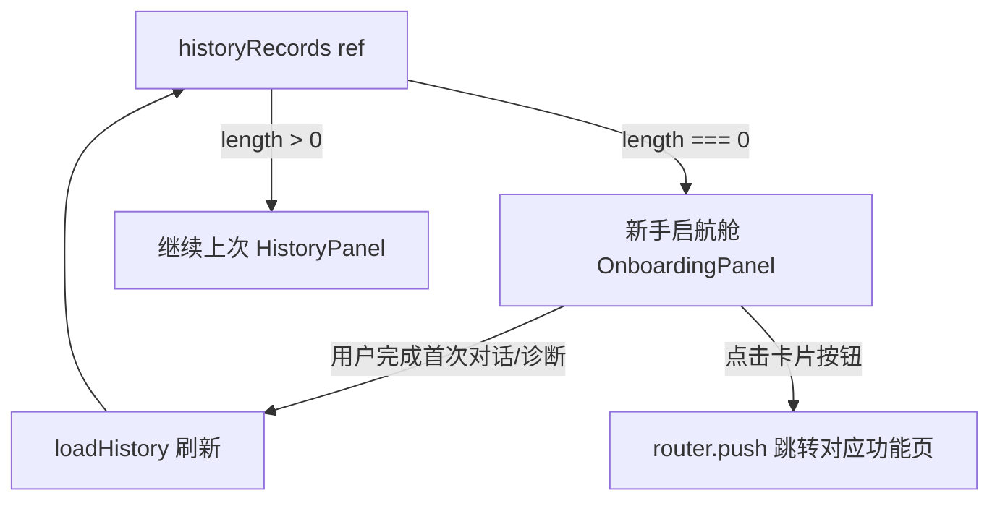
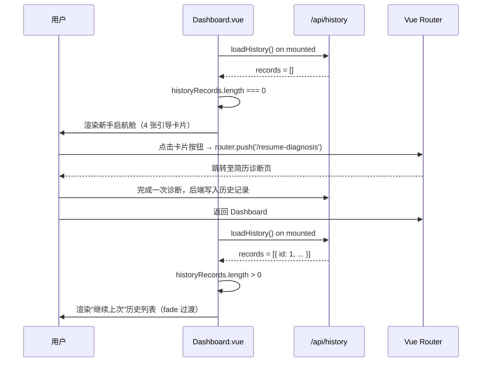

# 设计文档：Dashboard 新手启航舱（Onboarding Empty State）

## Overview

为 Dashboard 底部的"继续上次"区块重构零数据态（Empty State）体验。当用户尚无任何历史记录时（`historyRecords.length === 0`），渲染"新手启航舱"引导面板，展示 4 个功能引导卡片；一旦产生任意一条历史记录，引导舱自动隐藏并平滑切换回现有的历史记录列表。

整个改动**仅涉及 `frontend/src/Dashboard.vue` 单文件**，不引入任何新依赖，与现有 Dark Cyberpunk + Glassmorphism 视觉风格完全一致。

---

## Architecture



### 序列图：状态切换流程



---

## Components and Interfaces

### 现有组件：Dashboard.vue（修改）

**修改范围**：仅替换"继续上次"区块的条件渲染逻辑，不改动其他任何部分。

**现有接口（保持不变）**：
```typescript
// 已有 ref
const historyRecords = ref([])          // 历史记录数组
const router = useRouter()              // Vue Router 实例

// 已有函数
const loadHistory = async () => { ... } // 从 /api/history?limit=2 加载
```

**新增内联数据（无需新 ref）**：
```typescript
// 新手启航舱卡片配置（静态数据，直接内联在 template 中）
const onboardingCards = [
  {
    id: 'resume',
    emoji: '📄',
    title: '简历诊断',
    subtitle: 'Resume Scanner',
    desc: '深度解析过往经历，精准对齐目标岗位。找出致命失分项并提供重构建议，让你的简历一击必中。',
    action: '立即诊断',
    path: '/resume-diagnosis',
    locked: false,
    themeColor: 'purple',  // border-purple-500/40, bg-purple-500/10, text-purple-400
  },
  {
    id: 'interview',
    emoji: '🎙️',
    title: '模拟面试',
    subtitle: 'Combat Simulator',
    desc: '沉浸式 AI 语音实战对练。模拟真实业务场景与高频拷问，生成多维度能力雷达，彻底消除实战恐慌。',
    action: '开启实战',
    path: '/interview',
    locked: false,
    themeColor: 'pink',
  },
  {
    id: 'career',
    emoji: '🗺️',
    title: '职业规划',
    subtitle: 'Career Compass',
    desc: '基于个人特质与行业真实大数据，打破信息壁垒，为你定制科学、清晰的长线职场发展路径。',
    action: '生成路线',
    path: '/career-planning',
    locked: false,
    themeColor: 'blue',
  },
  {
    id: 'education',
    emoji: '🎓',
    title: '升学与避坑',
    subtitle: 'Academic Radar',
    desc: '专插本、考研真实数据导航。帮你平衡繁重的课业规划与升学抉择，绕开前人踩过的坑。',
    action: '模块构筑中...',
    path: null,
    locked: true,
    themeColor: 'emerald',
  },
]
```

---

## Data Models

### 状态判断逻辑

```typescript
// 零数据态判断（纯计算，无需新 computed）
// 直接在 template 中使用 v-if / v-else 双分支
// historyRecords 已是响应式 ref，loadHistory() 更新后自动触发重渲染

// 分支 A：空态 → 新手启航舱
v-if="historyRecords.length === 0"

// 分支 B：有数据 → 继续上次（现有代码）
v-else
```

### 锁定卡片状态

```typescript
interface OnboardingCard {
  id: string
  emoji: string
  title: string
  subtitle: string
  desc: string
  action: string       // 按钮文案
  path: string | null  // null = 锁定，不可跳转
  locked: boolean      // true = 显示 Coming Soon 样式
  themeColor: 'purple' | 'pink' | 'blue' | 'emerald'
}
```

### 渲染决策伪代码

```pascal
PROCEDURE renderHistorySection(historyRecords)
  INPUT: historyRecords (reactive ref array)
  OUTPUT: DOM 渲染结果

  IF historyRecords.length = 0 THEN
    RENDER OnboardingPanel
      SEQUENCE
        RENDER globalGuideText
        FOR each card IN onboardingCards DO
          IF card.locked = true THEN
            RENDER LockedCard(card)
              // opacity: 0.6
              // 按钮替换为闪烁 "模块构筑中... Coming Soon"
              // cursor: not-allowed
          ELSE
            RENDER ActiveCard(card)
              // 主色高亮按钮
              // @click → router.push(card.path)
          END IF
        END FOR
      END SEQUENCE
  ELSE
    RENDER HistoryPanel(historyRecords)
  END IF
END PROCEDURE
```

---

## UI 布局规范

### 容器

与现有"继续上次"卡片使用**完全相同**的外层容器样式，保证视觉一致性：

```
rounded-[28px] border border-white/10 bg-white/[0.03] backdrop-blur-xl p-5
animate-fade-in-up animation-delay-500
```

### 全局引导语（顶部）

```
位置：容器顶部，卡片网格上方
样式：text-xs text-gray-400，带左侧竖线装饰（border-l-2 border-purple-500/50 pl-3）
文案："系统初始化完成。欢迎登舰，新同学。四大核心引擎已就绪，请选择你的首个突破口进行全息扫描。"
```

### 卡片网格布局

```
宽屏（lg+）：grid-cols-4（横向 4 列，固定不变）
中屏（md）：grid-cols-2（2×2 网格）
窄屏（sm 以下）：grid-cols-1（单列堆叠）

Tailwind 类：grid grid-cols-1 md:grid-cols-2 lg:grid-cols-4 gap-3
```

### 单张引导卡片结构

```
外层容器：
  - 正常卡片：rounded-2xl border bg-white/[0.02] backdrop-blur-md p-4 flex flex-col gap-3
  - 锁定卡片：同上 + opacity-60 cursor-not-allowed

内部结构（从上到下）：
  1. Emoji 图标 + 主题色背景圆角块（w-10 h-10）
  2. 标题行：title（text-sm font-bold text-white）+ subtitle（text-xs text-gray-500）
  3. 描述文本：text-xs text-gray-400 leading-relaxed（限制 3 行，line-clamp-3）
  4. 操作按钮（mt-auto 推到底部）
```

### 主题色映射

| 功能 | 主题色 | 边框 | 按钮背景 | 按钮文字 |
|------|--------|------|----------|----------|
| 简历诊断 | purple | border-purple-500/40 | bg-purple-500/20 hover:bg-purple-500/30 | text-purple-300 |
| 模拟面试 | pink | border-pink-500/40 | bg-pink-500/20 hover:bg-pink-500/30 | text-pink-300 |
| 职业规划 | blue | border-blue-500/40 | bg-blue-500/20 hover:bg-blue-500/30 | text-blue-300 |
| 升学避坑 | emerald | border-emerald-500/40 | — | — |

### 锁定卡片特殊处理

```
整体：opacity-60（Tailwind: opacity-60）
按钮：
  - 文案：[ 模块构筑中... Coming Soon ]
  - 样式：border border-emerald-500/20 bg-emerald-500/5 text-emerald-500/50
  - 闪烁：animate-pulse
  - 交互：cursor-not-allowed，@click.prevent（阻止跳转）+ showToastMsg 反馈
```

---

## 过渡动画

### 空态 ↔ 有数据 切换

使用 Vue `<transition>` 包裹整个区块，实现 fade 效果：

```vue
<transition name="onboarding-fade" mode="out-in">
  <!-- 空态：新手启航舱 -->
  <div v-if="historyRecords.length === 0" key="onboarding" ...>
    ...
  </div>
  <!-- 有数据：继续上次 -->
  <div v-else key="history" ...>
    ...
  </div>
</transition>
```

CSS 过渡定义（添加到 `<style scoped>`）：

```css
.onboarding-fade-enter-active,
.onboarding-fade-leave-active {
  transition: opacity 0.4s ease, transform 0.4s ease;
}
.onboarding-fade-enter-from,
.onboarding-fade-leave-to {
  opacity: 0;
  transform: translateY(8px);
}
```

### 卡片悬停动画

```
hover:-translate-y-1 hover:shadow-[0_8px_24px_rgba(主题色,0.2)]
transition-all duration-300
```

---

## Error Handling

| 场景 | 处理方式 |
|------|----------|
| `loadHistory()` 请求失败 | `historyRecords` 保持 `[]`，继续显示新手启航舱（现有 catch 已处理） |
| 锁定卡片被点击 | `@click.prevent` 阻止默认行为，调用 `showToastMsg('该模块正在开发中，敬请期待！')` 反馈 |
| `router.push` 失败 | Vue Router 内部处理，不影响 Dashboard 渲染 |

---

## Testing Strategy

### 单元测试思路

1. **空态渲染**：`historyRecords = []` 时，新手启航舱可见，"继续上次"不可见
2. **有数据渲染**：`historyRecords = [{ id: 1 }]` 时，"继续上次"可见，新手启航舱不可见
3. **锁定卡片**：education 卡片的按钮不触发 `router.push`，但触发 Toast 提示
4. **正常卡片跳转**：点击"立即诊断"按钮，`router.push('/resume-diagnosis')` 被调用

### 属性测试思路

- **互斥性**：对任意 `historyRecords.length`，新手启航舱与历史列表有且仅有一个可见
- **幂等性**：多次调用 `loadHistory()` 后，渲染结果仅取决于最终的 `historyRecords` 值

### 视觉回归测试

- 宽屏（≥1024px）：4 列布局，卡片等高
- 中屏（768px–1023px）：2×2 网格
- 窄屏（<768px）：单列堆叠

---

## 性能考量

- 新手启航舱为**纯静态渲染**，无额外 API 请求，无计算开销
- 卡片数据内联在 `<template>` 中（或作为 `const` 常量），不占用响应式内存
- `<transition>` 使用 CSS `opacity` + `transform`，GPU 加速，无布局重排

---

## 安全考量

- 锁定卡片通过 `@click.prevent` + `cursor-not-allowed` 双重防护，防止误触跳转
- 所有跳转路径均为硬编码的内部路由（`/resume-diagnosis`、`/interview`、`/career-planning`），无外部链接注入风险

---

## 依赖

**无新增依赖**。所有能力均来自现有技术栈：

| 能力 | 来源 |
|------|------|
| 响应式状态 | Vue 3 `ref`（已有） |
| 路由跳转 | `useRouter()`（已有） |
| 图标 | `lucide-vue-next`（已有：FileText, Mic, MessageSquare, GraduationCap） |
| 样式 | Tailwind CSS 4（已有） |
| 过渡动画 | Vue `<transition>` + CSS（已有模式） |
| 毛玻璃容器 | 现有 `backdrop-blur-xl` 类（已有） |

---

## Correctness Properties

*属性（Property）是在系统所有合法执行路径上都应成立的行为特征——本质上是对系统应做什么的形式化陈述。属性是人类可读规范与机器可验证正确性保证之间的桥梁。*

### Property 1: Mutual Exclusion Rendering

*对任意* `historyRecords` 数组（无论为空还是非空），OnboardingPanel 与 HistoryPanel 有且仅有一个处于可见状态，二者的可见性满足严格的 XOR 关系。

**Validates: Requirements 1.1, 1.2, 1.3**

### Property 2: Active Card Route Navigation Correctness

*对任意*激活状态的引导卡片，点击其操作按钮时，`router.push` 被调用且参数与该卡片配置的 `path` 字段完全一致；不同卡片的跳转路径互不相同且均为预定义的内部路由。

**Validates: Requirements 4.2, 4.3, 4.4**

### Property 3: Active Card Content Completeness

*对任意*激活状态的引导卡片，其渲染结果中必须同时包含：Emoji 图标区域、中文功能标题、英文副标题、功能描述文本、以及主色高亮操作按钮，缺少任意一项均视为不合格。

**Validates: Requirements 4.5**

### Property 4: Locked Card Unreachability

*对任意*处于锁定状态（`locked = true`）的引导卡片，无论用户如何点击其操作按钮，`router.push` 永远不被调用；同时系统应通过 Toast 提示向用户反馈该模块尚未开放。

**Validates: Requirements 5.5**

### Property 5: Card Content Config Consistency

*对任意*引导卡片（激活或锁定），其渲染的描述文本内容与 `onboardingCards` 静态配置数组中对应条目的 `desc` 字段完全一致，不存在截断、替换或乱序。

**Validates: Requirements 7.1, 7.2, 7.3, 7.4**

### Property 6: Rendering Idempotency

*对任意*初始 `historyRecords` 状态，多次调用 `loadHistory()` 后，Dashboard 的面板渲染结果仅由最终的 `historyRecords` 值决定，与调用次数无关。

**Validates: Requirements 8.4**

### Property 7: Zero Side Effect Rendering

*对任意*导致 `historyRecords.length === 0` 的状态，OnboardingPanel 的渲染过程不修改任何现有的 Vue 响应式 `ref` 状态（`historyRecords` 本身除外），所有 `ref` 的值在渲染前后保持不变。

**Validates: Requirements 8.2**
