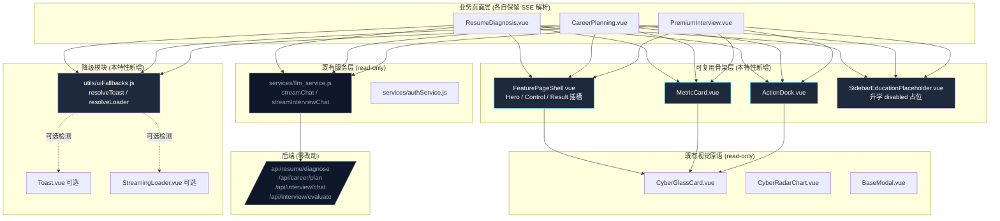
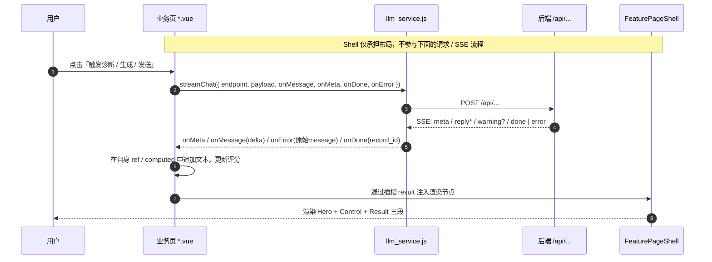
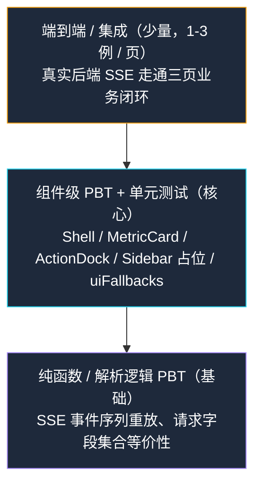

# Design Document — Frontend Mission Console Shell

## Overview

本特性以「视觉同源、叙事不同型」为目标，把 `ResumeDiagnosis.vue` / `CareerPlanning.vue` / `PremiumInterview.vue` 三个独立业务页统一收敛到一套「AI 任务控制台骨架」（Feature Mission Page Shell）：三页共享 Hero / Control Grid / Result Zone 的三段式纵向布局与暗黑赛博毛玻璃视觉语言，但保留各自差异化的业务叙事与控件集合。

整个改动**只在前端 UI 层发生**：

- 后端路由（`Router/`）、Service / Agent 层、SSE 事件协议、`frontend/src/services/llm_service.js`、`frontend/src/router/index.js`、`Dashboard.vue`、`CyberGlassCard.vue`、`BaseModal.vue`、`CyberRadarChart.vue` 均**不修改**（Requirement 7）。
- 三页 SSE 事件序列（`meta` / `reply` / `warning` / `error` / `done`）的处理位置**保留在各业务页面内部**，新增的 `FeaturePageShell.vue` 仅承担布局骨架与具名插槽，**不接业务 API、不处理请求、不解析 SSE**（用户补充约束 b）。
- 错误展示规则收紧为「只展示后端原始错误内容，不再额外编造或包装新的错误话术」（用户补充约束 a）。

最终交付物：

1. 三个新增的可复用组件：`FeaturePageShell.vue`、`MetricCard.vue`、`ActionDock.vue`
2. 一个共享的降级模块：`frontend/src/utils/uiFallbacks.js`，封装 `Toast` 与 `StreamingLoader` 的「先检测、缺失则降级」逻辑（Requirement 8 第 8 条）
3. `ResumeDiagnosis.vue` / `CareerPlanning.vue` / `PremiumInterview.vue` 三页改写为「Shell + 业务插槽」结构，业务闭环、HTTP 端点、SSE 处理逻辑保持原状
4. 在三页可见的「侧边栏区域」中渲染「升学」disabled 占位项（不改 Dashboard.vue，见 §Architecture 中的「侧边栏占位策略」）

## Architecture

### High-Level Architecture



### 关键架构决策

| 决策 | 选择 | 理由 / 拒绝的替代方案 |
|---|---|---|
| **Shell 的职责边界** | 仅做布局 + 具名插槽，不接 API、不处理 SSE、不持有业务状态 | 用户补充约束 b 强制要求；如果 Shell 内部内嵌 SSE 处理，会把三页业务逻辑偷偷抽散，破坏「视觉重构 ≠ 业务重构」红线。 |
| **响应式断点** | 不论视口宽度均采用单列纵向堆叠（Requirement 1.3 / 1.4 一致） | 业务侧已确定不需要桌面端横向布局；保持纵向堆叠简化栅格规则，避免在 ≥1024px 引入额外的两列 / 三列方案带来视觉漂移。 |
| **SSE 处理位置** | **保留在各业务页面**（`ResumeDiagnosis.vue` 内的 `fetch` + 行解析、`PremiumInterview.vue` 内的 `streamInterviewChat` 等） | 三页历史实现已经稳定（部分用 `streamInterviewChat`，部分页面在组件内手写行解析），强行抽离会改动事件流，违反 Requirement 2.5 / 2.6 / 2.8。本次只做视觉重构。 |
| **降级模块统一在 utils/** | `frontend/src/utils/uiFallbacks.js` 集中导出 `resolveToast()` / `resolveLoader()` | Requirement 8.8 明确要求「集中在一处复用模块、不在三页内各自重复」。放在 `utils/` 与项目既有约定（`fileConstants.js` / `ocrHelper.js`）一致。 |
| **错误文案** | onError 回调直接展示后端 `error` 事件中的原始 message，禁止再次包装 | 用户补充约束 a 强制；同时与 `llm_service.js` 既有行为一致——其 `processBlock` 已抽出 `parsed?.payload?.message ?? parsed?.message ?? parsed?.content ?? '服务端发生错误'`，业务页只透传，不再自造文案。仅当**网络层完全失败**（fetch reject、HTTP 非 2xx）才使用 `'服务端发生错误'` 这一兜底字符串，且**不覆盖** SSE 已经推送过的 error 文案。 |
| **侧边栏占位的实现位置** | 新增 `SidebarEducationPlaceholder.vue` 组件，在三个业务页（不在 Dashboard.vue）内**同款**渲染 | Requirement 7.6 禁止改 Dashboard.vue；Requirement 6 要求三页所共享的侧边栏中渲染「升学」disabled 占位。三页目前并没有共享的真实侧边栏组件，因此**在三页各自的页面顶部 / 左侧**通过同一个 `SidebarEducationPlaceholder.vue` 组件保证文案与禁用态一致；Dashboard.vue 自身的侧边栏维持原状。 |

### 业务闭环 → Shell 三段映射

| 页面 | Hero（叙事区） | Control Grid（控件区） | Result Zone（结果区） |
|---|---|---|---|
| **ResumeDiagnosis.vue** | 标题「简历诊断」+ 三阶段徽章「扫描 / 诊断 / 报告」 | 文件上传 dropzone、目标岗位输入、JD 文本框、`触发诊断` 按钮（用 ActionDock 聚合） | 流式 Markdown 报告、`CyberRadarChart` 六维评分（来自 LLM JSON 块） |
| **CareerPlanning.vue** | 标题「职业规划」+ 三阶段徽章「路线图 / 阶段目标 / 能力缺口」 | 简历文本（来自 userStore）、用户困惑输入、推荐问题 chips、`生成蓝图` 按钮 | 流式 Markdown 蓝图、`复制 / 导出` 操作（ActionDock） |
| **PremiumInterview.vue** | 标题「模拟面试」+ 三阶段徽章「训练舱 / 实时评分 / 复盘」 | 难度选择（温和/标准/P8）、消息输入、`发送 / 结束面试` 按钮（ActionDock） | 对话气泡流、压力分 MetricCard、复盘 Modal（保留既有 `CyberRadarChart`） |

### 数据流（保持原状，不重构）



### 视觉风格基准（与 Dashboard.vue 同源）

直接复用 Dashboard.vue 已经稳定的视觉变量，三页在样式上**只引用、不重定义**：

- 页面背景：`bg-[#020205]` + 三层 ambient blur（紫 / 青 / 靛蓝）
- 卡片容器：`CyberGlassCard.vue`（圆角 16px、毛玻璃 `backdrop-blur(16px)`、`conic-gradient` 边框流光）
- 字体层级：标题 `text-white font-bold`、副标题 `text-cyan-200/200`、正文 `text-gray-300/400`
- 强调色谱：紫 `#a855f7`（简历）/ 蓝 `#3b82f6`（职业规划）/ 粉 `#ec4899` / 青 `#06b6d4`（评分通道）
- 阴影：`shadow-[0_0_30px_rgba(...)]`（与 Dashboard 卡片 hover 同款）

## Components and Interfaces

### 1. `FeaturePageShell.vue`（新增）

**唯一职责**：纵向三段布局 + 具名插槽容器。**不接 props 以外的运行时数据，不持有业务状态，不发起请求，不解析 SSE。**

**Props**：

| 名称 | 类型 | 必填 | 说明 |
|---|---|---|---|
| `title` | `String` | ✅ | Hero 区主标题，例如「简历诊断」 |
| `subtitle` | `String` | ⬜ | Hero 区副标题 / slogan |
| `stageBadges` | `Array<{ label: String; tone?: 'purple'\|'blue'\|'pink'\|'cyan'\|'emerald' }>` | ⬜ | Hero 区三阶段徽章；最多 5 项，超出截断 |
| `variant` | `String` | ⬜ | 透传给内部 `CyberGlassCard` 的色调（`default` / `cyan` / `purple` / `pink` / `emerald`），默认 `default` |

**Slots**：

| 名称 | 说明 |
|---|---|
| `hero` | 覆盖 Hero 区默认渲染（用于在 title/subtitle 之外注入自定义元素，例如返回按钮、状态标签）。**未提供时**回退到由 props 渲染的默认 Hero。 |
| `control` | Control Grid 区，业务页注入控件 |
| `result` | Result Zone 区，业务页注入流式输出 / 报告 |
| `result-empty`（可选） | 当 `result` 插槽未注入时的空状态占位（Requirement 1.6） |

**结构（伪 DOM）**：

```html
<section class="feature-shell">
  <!-- Hero -->
  <header>
    <slot name="hero">
      <h1>{{ title }}</h1>
      <p v-if="subtitle">{{ subtitle }}</p>
      <div v-if="stageBadges?.length" class="badges">
        <span v-for="b in stageBadges" :class="toneClass(b.tone)">{{ b.label }}</span>
      </div>
    </slot>
  </header>

  <!-- Control Grid -->
  <CyberGlassCard headerless variant="default">
    <slot name="control" />
  </CyberGlassCard>

  <!-- Result Zone -->
  <CyberGlassCard headerless :variant="variant">
    <slot name="result">
      <slot name="result-empty">
        <!-- 默认空状态：保持骨架不塌陷 -->
        <div class="result-empty-placeholder" />
      </slot>
    </slot>
  </CyberGlassCard>
</section>
```

**严格禁止在 Shell 内部出现的内容**（用户补充约束 b 的具体化）：

- `import` 任何 `services/llm_service.js`、`fetch`、`EventSource`、`axios`
- 任何 `onMessage` / `onError` / `onDone` 回调声明
- 任何业务路由（`/api/...`）字符串
- 任何与 `userStore` / `gameStore` 之外的领域字段耦合

如果未来需要 Shell 提供「全局加载态」，必须通过 prop 或 slot 让外层注入，而非在 Shell 内部自行管理。

### 2. `MetricCard.vue`（新增）

**职责**：展示单一量化指标（评分、计数、状态标签等）。**内部复用 `CyberGlassCard`**（Requirement 4.8），不重新实现毛玻璃容器。

**Props**：

| 名称 | 类型 | 必填 | 说明 |
|---|---|---|---|
| `label` | `String` | ✅ | 指标名称，例如「关键词匹配」「压力分」 |
| `value` | `Number \| String` | ✅ | 主数值（80）或主文案（「优秀」） |
| `unit` | `String` | ⬜ | 数值单位，例如「%」「分」 |
| `trend` | `String` | ⬜ | `up` / `down` / `flat`，渲染对应方向的小箭头与色调（绿/红/灰） |
| `tone` | `String` | ⬜ | 色调透传给 `CyberGlassCard` 的 `variant` |

**Slots**：默认 slot 用于自定义图标 / 副文案。

### 3. `ActionDock.vue`（新增）

**职责**：聚合主操作 / 次操作按钮，作为页面底部或右下的「操作坞」。**内部复用 `CyberGlassCard`**（Requirement 4.8）。

**Slots**：

| 名称 | 说明 |
|---|---|
| `primary` | 主操作（例如「生成 / 发送 / 触发诊断」），通常一个按钮 |
| `secondary` | 次操作（例如「复制 / 导出 / 重置 / 结束面试」），可多个 |

**Props**：

| 名称 | 类型 | 必填 | 说明 |
|---|---|---|---|
| `align` | `String` | ⬜ | `left` / `center` / `right`，默认 `right` |
| `sticky` | `Boolean` | ⬜ | 是否吸附到页面底部 |

### 4. `SidebarEducationPlaceholder.vue`（新增）

**职责**：在三个业务页中渲染同款「升学」disabled 占位，确保文案与样式一致（Requirement 6）。

**实现要点**：

- 渲染为 `<div role="button" aria-disabled="true" tabindex="-1">`，不响应点击与键盘激活
- 文案固定：「工程师正在玩命开发中，敬请期待！🚀」（写死在组件常量中，禁止从 props 传入以避免文案漂移）
- 鼠标悬停时通过 `title` 属性 + 内联 tooltip 同区域文案展示
- 不向 Vue Router 注册任何新路由，不触发跳转
- 视觉：`lucide-vue-next` 的 `GraduationCap` 图标 + emerald 色调

### 5. `frontend/src/utils/uiFallbacks.js`（新增）

**职责**：把 `Toast.vue` / `StreamingLoader.vue` 的「先检测、缺失则降级」逻辑集中收口。三页统一从此模块 import，不在页面内部重复实现降级（Requirement 8.8）。

**导出 API**：

```js
// 同步 / 异步均可，建议异步
export async function resolveLoader() {
  // 1. 尝试 import('@/components/StreamingLoader.vue')
  // 2. 失败则 return InlineLoaderFallback (defineComponent)
}

export async function resolveToast() {
  // 1. 尝试 import('@/components/Toast.vue')
  // 2. 失败则 return InlineToastFallback
}

// 同步轻提示（命令式 API），用于不希望挂组件的场景
export function showToast(message, { type = 'success', duration = 3000 } = {}) {
  // type: 'success' | 'error'
  // 内部检测全局 Toast.vue 是否已挂载
  // 缺失则使用 InlineToastFallback 在 document.body 上挂载一个临时节点
}
```

**降级实现内嵌的视觉规则**（Requirement 8.3 / 8.5）：

- `InlineLoaderFallback`：使用 Tailwind 4 + 既有色调实现毛玻璃卡片 + 流光圆点 / 进度条；不引入新依赖
- `InlineToastFallback`：固定 3000ms 自动消失；`success` 用 cyan、`error` 用 red 色调；圆角与边框透明度对齐 Dashboard 既有 toast

### 6. 三页页面级改造（保持业务逻辑等价）

| 文件 | 改动 |
|---|---|
| `ResumeDiagnosis.vue` | 顶层 `<template>` 改写为 `<FeaturePageShell title="简历诊断" :stageBadges="[扫描, 诊断, 报告]" variant="purple">`；上传区与目标岗位输入挂到 `#control`；流式 Markdown + `CyberRadarChart` 挂到 `#result`；既有 `fetch('/resume/diagnose')` + 行解析逻辑**原样保留** |
| `CareerPlanning.vue` | 顶层改写为 `<FeaturePageShell title="职业规划" :stageBadges="[路线图, 阶段目标, 能力缺口]" variant="default">`；困惑输入与推荐问题挂到 `#control`；流式蓝图挂到 `#result`；`复制 / 导出` 用 `ActionDock` 聚合；既有 `fetch('/career/plan')` + 行解析**原样保留** |
| `PremiumInterview.vue` | 顶层改写为 `<FeaturePageShell title="模拟面试" :stageBadges="[训练舱, 实时评分, 复盘]" :variant="themeVariant">`；难度选择 + 输入框挂到 `#control`；对话流 + 压力分 MetricCard 挂到 `#result`；`发送 / 结束面试` 用 `ActionDock` 聚合；既有 `streamInterviewChat` + `/interview/evaluate` 调用**原样保留** |

**严格不变**：

- HTTP 端点路径、HTTP 方法、请求体字段集合（Requirement 2.4）
- SSE 事件类型与相对顺序（Requirement 2.5 / 2.6）
- error 文案——直接透传 `onError(msg)` 回来的 `msg`，**不再额外包装**（用户补充约束 a / Requirement 2.7）
- `llm_service.js`（Requirement 2.8）、`Dashboard.vue`、`router/index.js`、`CyberGlassCard.vue` / `BaseModal.vue` / `CyberRadarChart.vue`（Requirement 7）

## Data Models

本特性是**纯 UI 重构**，不引入新的后端数据模型；以下仅定义前端组件的 prop / slot 契约的 TS 风格类型（仅用于设计沟通，运行时仍为 Vue 3 SFC + JS）。

```ts
// FeaturePageShell.vue
interface StageBadge {
  label: string;
  tone?: 'purple' | 'blue' | 'pink' | 'cyan' | 'emerald';
}

interface FeaturePageShellProps {
  title: string;                   // 必填
  subtitle?: string;
  stageBadges?: StageBadge[];      // 0..5
  variant?: 'default' | 'cyan' | 'purple' | 'pink' | 'emerald';
}

// MetricCard.vue
interface MetricCardProps {
  label: string;                   // 必填
  value: number | string;          // 必填
  unit?: string;
  trend?: 'up' | 'down' | 'flat';
  tone?: 'default' | 'cyan' | 'purple' | 'pink' | 'emerald';
}

// ActionDock.vue
interface ActionDockProps {
  align?: 'left' | 'center' | 'right';   // 默认 right
  sticky?: boolean;                       // 默认 false
}

// uiFallbacks.js
type ToastType = 'success' | 'error';
interface ToastOptions { type?: ToastType; duration?: number }

declare function resolveLoader(): Promise<Component>;
declare function resolveToast(): Promise<Component>;
declare function showToast(message: string, options?: ToastOptions): void;
```

**SSE 事件契约（read-only，from `Service/Utils/sse_utils.py` / `llm_service.js`）**：

```ts
type SSEEvent =
  | { event: 'meta';    payload: Record<string, unknown> }
  | { event: 'reply';   payload: { content: string } }            // 增量 delta
  | { event: 'warning'; payload: { message: string } }
  | { event: 'error';   payload: { message: string } }            // 透传，不包装
  | { event: 'done';    payload: { record_id?: string | number } };
```

本特性不修改此契约的任何字段。

## Correctness Properties

*A property is a characteristic or behavior that should hold true across all valid executions of a system — essentially, a formal statement about what the system should do. Properties serve as the bridge between human-readable specifications and machine-verifiable correctness guarantees.*

> **PBT 适用性评估**：本特性虽然以 UI 重构为主，但仍存在**多条可属性化**的契约——组件 prop / slot 路由、重构前后的请求等价性、SSE 事件序列等价性、错误透传不变性、降级模块的解析顺序、骨架结构不变量等。这些都是**纯前端逻辑**（mock fetch / mock import），属性测试 100+ 次迭代成本极低，价值很高。三页业务闭环本身（端到端跑通）属于 INTEGRATION 范畴，不在此处属性化，留给少量 happy-path 集成测试。
>
> **Property Reflection 已执行**：以下属性已与 prework 中分类为 PROPERTY 的项做过去重 / 合并——
> - 「请求 / SSE 事件 / 错误」三个等价性属性吸收了原文档底部 Correctness Properties（CP1 / CP2 / CP4 / CP5 / CP6）中重复的部分
> - FeaturePageShell 的 slot 隔离 与 ActionDock 的 slot 隔离 因目标组件不同、slot 名称不同，保持两条独立属性
> - 「reply 累加渲染等价性」与「渲染节点不丢失」分别覆盖文本流追加与非文本节点（雷达图、徽章、能力缺口条目）的完整性，互不包含

### Property 1: Shell 三段结构幂等性

*For any* 组合的 props（合法 `title` / `subtitle` / `stageBadges`）与三段任意 slot 内容，挂载 `FeaturePageShell` 后，DOM 中存在恰好一个 Hero、恰好一个 Control Grid、恰好一个 Result Zone 容器，且三者的 DOM 顺序固定为 Hero → Control → Result。

**Validates: Requirements 1.1, 1.6**

### Property 2: FeaturePageShell 三段 Slot 路由隔离

*For any* 三段互不相同的随机文本 `(h, c, r)`，将其分别注入到 `hero` / `control` / `result` 具名 slot 后，文本 `h` 仅出现在 Hero 容器内、`c` 仅出现在 Control 容器内、`r` 仅出现在 Result 容器内（互不串扰）。

**Validates: Requirements 1.5**

### Property 3: ActionDock 主次操作 Slot 路由隔离

*For any* 两段互不相同的随机文本 `(p, s)`，将其分别注入到 `primary` / `secondary` 具名 slot 后，文本 `p` 仅出现在主操作容器内、`s` 仅出现在次操作容器内（互不串扰）。

**Validates: Requirements 4.6**

### Property 4: FeaturePageShell Prop 到 Hero DOM 的渲染契约

*For any* 合法的 `(title, subtitle, stageBadges)` 组合（`title` 非空字符串、`stageBadges` 0..5 项，每项 `label` 非空），挂载 `FeaturePageShell` 后，Hero 容器的 `textContent` 包含 `title`、（若有）`subtitle`、以及所有 `stageBadges[i].label` 的字面文本。

**Validates: Requirements 4.4, 3.1, 3.2, 3.3**

### Property 5: MetricCard Prop 到 DOM 的渲染契约

*For any* 合法的 `(label, value, unit, trend)` 组合（`label` 非空、`value` 为有限数或非空字符串、`trend ∈ {up, down, flat, undefined}`），挂载 `MetricCard` 后，DOM 中可见 `label` 与 `value` 文本；当存在 `unit` 时可见 `unit`；当 `trend` 取定值时 DOM 中存在与之对应的方向标记 class（`trend-up` / `trend-down` / `trend-flat`）。

**Validates: Requirements 4.5**

### Property 6: 重构前后请求等价性（Request Equivalence）

*For any* 合法的页面输入 `x`（`Resume_Page` 的 `(resumeText, jdText, targetRole)` / `Career_Page` 的 `(resumeText, userConfusion)` / `Interview_Page` 的 `(messages, difficulty)`），mock `fetch` 后触发对应业务动作，捕获到的 HTTP 请求满足：

- `endpoint` ∈ 固定白名单 `{/api/resume/diagnose, /api/career/plan, /api/career/suggestions, /api/interview/chat, /api/interview/evaluate, /api/history, /api/history/{id}}`
- `method` 为该端点既定的方法（POST / GET）
- 请求体 JSON 的 keys 集合等于该端点既定的字段集合（不增、不减）

**Validates: Requirements 2.4**

### Property 7: SSE 事件序列等价性（Event Sequence Equivalence）

*For any* 合法的 SSE 事件序列 `S`（满足语法 `meta? reply* warning* (done | error)`），通过 `streamChat` 把 `S` 重放给业务页面后，回调被以与 `S` 一致的相对顺序与计数触发：`onMeta` 计数 ≤ 1、`onMessage` 计数等于 `S` 中 `reply` 事件数、`onError` 至多触发一次、`onDone` 被触发当且仅当 `S` 末尾为 `done`。

**Validates: Requirements 2.5**

### Property 8: Reply 增量累加渲染等价性

*For any* 非空的字符串数组 `[d1, d2, …, dN]`，依序作为 `onMessage` 的 `delta` 参数触发后，业务页面 Result Zone 容器的 `textContent` 在归一化（去除流式光标 / 占位字符）后包含 `d1 + d2 + … + dN` 这一拼接结果，且各 `di` 的相对出现顺序与输入顺序一致。

**Validates: Requirements 2.6**

### Property 9: 渲染节点不丢失（Render Node Non-Loss）

*For any* 后端响应 `r`（含报告标题、报告条目、评分指标、阶段卡片、能力缺口条目等业务节点），重构后页面在处理同一份 `r` 时渲染出的语义节点集合是重构前语义节点集合的**超集**——即所有 `data-test` 标记的业务节点（报告标题、报告条目、阶段徽章、雷达图容器、压力分卡片、复盘按钮等）在重构后仍然出现。

**Validates: Requirements 2.1, 2.2, 2.3, 3.7, 3.8, 3.9**

### Property 10: Error 透传不变性（不编造、不包装）

*For any* 非空字符串 `m`，当业务页面通过 `streamChat` 的 `onError(m)` 收到错误时，可见的错误展示区域 `textContent` 在 trim 后等于 `m`，且不包含任何不属于 `m` 的项目自定义模板字符串（如「请求失败」「系统错误」「服务异常」等）。仅当 `streamChat` 因网络层抛错（fetch 完全失败 / HTTP 非 2xx 且响应不是 SSE）时，才允许使用 `llm_service.js` 既定的兜底字符串（`'网络连接异常，请重试'` 或后端 detail）；这条兜底路径不在本属性范围内。

**Validates: Requirements 2.7**

### Property 11: 侧边栏升学占位不变性

*For any* 进入 `Resume_Page` / `Career_Page` / `Interview_Page` 三页的导航序列（含初次进入、互相切换、重复访问），`SidebarEducationPlaceholder` 始终被渲染、其根元素 `aria-disabled` 恒为 `'true'`、其可见文案恒为字符串「工程师正在玩命开发中，敬请期待！🚀」、且其点击事件被阻止（`@click.prevent` 或不绑定 handler）。

**Validates: Requirements 6.1, 6.2, 6.3, 6.5**

### Property 12: 降级模块解析顺序优先级

*For any* `(hasToast, hasLoader) ∈ {true, false} × {true, false}`（通过 mock `import('@/components/Toast.vue')` / `import('@/components/StreamingLoader.vue')` 控制），调用 `resolveToast()` / `resolveLoader()` 后：

- 当 `hasX === true` 时，返回值的组件等同于真实 `Toast.vue` / `StreamingLoader.vue` 模块默认导出
- 当 `hasX === false` 时，返回值是 `uiFallbacks.js` 内置的 `InlineToastFallback` / `InlineLoaderFallback`

即「真实组件存在 ⇒ 优先复用，绝不进入 fallback 分支」。

**Validates: Requirements 8.1, 8.2, 8.4, 8.6, 8.7**

### Property 13: Toast Fallback 自动消失 + 语义色调

*For any* `(message, type) ∈ NonEmptyString × {success, error}` 与 `duration ∈ [1000, 10000]`，调用 `showToast(message, { type, duration })` 后：

- 在虚拟时间 `< duration` 的任一时刻，DOM 中存在含 `message` 文案的 toast 节点
- 在虚拟时间 `≥ duration` 时，该节点已从 DOM 中移除
- 节点的 class 列表当 `type === 'success'` 时含 cyan 色调 class、当 `type === 'error'` 时含 red 色调 class

**Validates: Requirements 8.5**

## Error Handling

| 场景 | 触发条件 | 处理策略 |
|---|---|---|
| **SSE `error` 事件** | 后端通过 `event: error` 推送 `{ message }` | `llm_service.js` 调用 `onError(message)`；业务页面在 Result Zone 错误区域**直接渲染原始 `message` 字符串**，不再添加任何前缀 / 后缀 / 模板包装（用户补充约束 a） |
| **HTTP 非 2xx** | `fetch` 返回 `response.ok === false` | `llm_service.js` 优先解析后端 `detail` 字段；若不可解析则使用 `请求失败（HTTP {status}）`。业务页面同样直接展示该字符串 |
| **网络层失败** | `fetch` reject（断网 / DNS 失败 / CORS） | `llm_service.js` 调用 `onError(err.message || '网络连接异常，请重试')`。这是唯一允许使用项目兜底文案的路径；UI 仍只展示该字符串，不再二次包装 |
| **AbortError** | 用户主动取消（路由跳走、刷新） | `llm_service.js` 静默吞掉，不触发 `onError`；业务页面相应清空 loading 状态 |
| **`Toast.vue` 缺失** | `import('@/components/Toast.vue')` 抛错 | `resolveToast()` 返回 `InlineToastFallback`；业务页面无感知 |
| **`StreamingLoader.vue` 缺失** | `import('@/components/StreamingLoader.vue')` 抛错 | `resolveLoader()` 返回 `InlineLoaderFallback`；业务页面无感知 |
| **未捕获的 JS 异常** | 渲染期间组件抛错 | 由 Vue 的全局 `errorHandler` 捕获并通过 `showToast(msg, { type: 'error' })` 提示；不阻止 Shell 骨架渲染 |
| **流式中断后的脏状态** | `onError` 触发后用户立即重新触发请求 | 业务页面在重新触发前清空 `displayedResult` / `messages` 等本地 ref，避免新旧文本拼接 |

**关键纪律**：除上面网络层兜底文案与未捕获异常的 toast 外，**其余路径不允许任何「自创」错误文案**。这条铁律由 Property 10 在测试中强制。

## Testing Strategy

### 测试金字塔



### 工具链

- **测试运行器**：Vitest（项目已装，`frontend/package.json` 有 `vitest@^4.1.6` + `@vue/test-utils@^2.4.10` + `jsdom@^29.1.1`）
- **属性测试**：fast-check（项目已装 `fast-check@^4.8.0`，与既有 `userStore.*.property.test.js` 一致）
- **运行命令**：`npm run test`（已在 package.json 配置为 `vitest --run`，单次执行；**不**触发 `vue-tsc` / `vite build`）

### 测试约束

- **禁止**运行 `npm run build` / `vite build` / `tsc` / `vue-tsc`（Requirement 7.12 + 项目 tech.md 红线）
- **属性测试默认 `numRuns: 100`**，与项目既有约定一致；对生成器较重的属性可适当降低，但不得低于 50
- 每个属性测试用例顶部加注释 `// Feature: frontend-mission-console-shell, Property N: <property text>`，便于追溯设计文档（与既有项目约定 `userStore.syncRoundTrip.property.test.js` 中的命名风格一致）
- 测试文件统一放在 `frontend/src/__tests__/` 下，命名 `featureMissionConsoleShell.<topic>.property.test.js` / `.spec.js`
- 不在三页 `.vue` 内部直接写测试逻辑；所有降级 / 探测 / SSE 处理逻辑均通过 mock 在测试侧注入

### 属性测试 ↔ 设计属性映射

| 属性 | 实现文件（建议） | 关键点 |
|---|---|---|
| Property 1（三段结构幂等性） | `featureMissionConsoleShell.shellShape.property.test.js` | `mount(FeaturePageShell, { props, slots })` 后断言三段 selector 与 DOM 顺序 |
| Property 2 / 3（slot 路由隔离） | `featureMissionConsoleShell.slotIsolation.property.test.js` | 生成三段 / 两段唯一字符串注入，断言只在对应容器中出现 |
| Property 4 / 5（prop → DOM 渲染契约） | `featureMissionConsoleShell.propRendering.property.test.js` | 生成 props 组合，挂载断言 `textContent` 包含 |
| Property 6（请求等价性） | `featureMissionConsoleShell.requestEquivalence.property.test.js` | mock `globalThis.fetch`，遍历三页输入空间，断言抓到的 endpoint / method / body keys |
| Property 7（SSE 事件序列等价性） | `featureMissionConsoleShell.sseSequence.property.test.js` | 用 fast-check 生成 SSE grammar 序列，重放给 mock fetch 的 ReadableStream，断言回调序列 |
| Property 8（reply 累加渲染） | `featureMissionConsoleShell.replyAccumulation.property.test.js` | 生成 deltas 数组依次调用 `onMessage`，断言 Result Zone `textContent` 包含拼接结果 |
| Property 9（渲染节点不丢失） | `featureMissionConsoleShell.renderNodeNonLoss.spec.js` | 在三页快照中标记 `data-test` 节点，重构前后对比集合包含关系（**EXAMPLE 级**：1-3 个代表性后端响应即可，不属性化） |
| Property 10（error 透传不变性） | `featureMissionConsoleShell.errorTransparency.property.test.js` | 生成随机 message 字符串，触发 `onError(m)`，断言 DOM 中错误区 textContent === m，且不包含黑名单文案 |
| Property 11（侧边栏占位不变性） | `featureMissionConsoleShell.sidebarPlaceholder.property.test.js` | 参数化路由 / 重复挂载，断言 `aria-disabled='true'` + 文案恒等 |
| Property 12（降级模块解析顺序） | `featureMissionConsoleShell.uiFallbacksResolve.property.test.js` | 用 `vi.doMock` 控制 `Toast.vue` / `StreamingLoader.vue` 是否可解析，断言返回组件 |
| Property 13（Toast Fallback 自动消失） | `featureMissionConsoleShell.toastAutoDismiss.property.test.js` | `vi.useFakeTimers()` + `advanceTimersByTime(duration)` |

### 集成测试（不属性化）

- **三页业务闭环 happy path**（每页 1 例，对应 Requirement 2.1 / 2.2 / 2.3）：本地 `npm run dev` + 真实后端 `uvicorn`，手工跑一次端到端验收。可放在 `frontend/src/__tests__/` 之外的 `e2e-checklist.md` 里，作为发版前清单。
- **视觉抽样对比**（对应 Requirement 5.6）：人工对比三页与 `Dashboard.vue` 的字体层级 / 圆角 / 阴影 / 边框透明度，记录在 PR 描述中。

### 不写测试的项（仅靠 PR review / git diff / 静态扫描）

| 项 | 验证方式 |
|---|---|
| 1.2 / 4.1 / 4.2 / 4.3（文件存在） | 代码评审 + `tree` 输出 |
| 1.3 / 1.4（响应式布局） | jsdom 不渲染 CSS，断言 class 字面值即可（已并入 Property 1） |
| 2.8 / 4.9 / 5.5 / 7.1..7.13（不修改某文件） | `git diff --name-only` 检查 |
| 5.3（不引入新 UI 库） | `frontend/package.json` diff |
| 5.6（视觉一致性） | 视觉抽样 |
| 7.12（不执行构建命令） | CI 拒绝 + tech.md 红线 |
| 8.8（降级集中在一处复用模块） | grep `Toast.vue` / `StreamingLoader.vue` 在三页内出现次数 ≤ 1（且仅来自 `@/utils/uiFallbacks`） |

### 退出标准

1. 上述 13 条属性测试全部通过、`npm run test` 一次通过
2. 三页 happy path 端到端验收清单全部勾选
3. `git diff` 确认未触碰 Requirement 7 列出的任何受保护文件
4. 视觉抽样对比通过，PR 描述附 1-2 张三页与 Dashboard 同框截图

