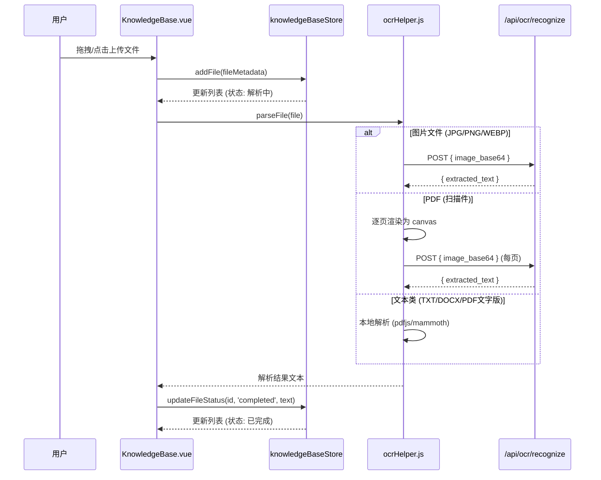
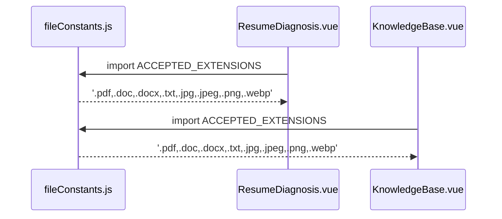

# Design Document: 全局文件格式解禁 & 知识库资产舱搭建

## Overview

本特性将前端所有文件上传组件的格式限制统一扩展为支持文档（PDF/Word/TXT）和图片（JPG/PNG/WEBP），充分释放后端 OCR 的图片识别能力。同时，将现有的 `/files` 占位页面重构为一个赛博朋克风格的"知识库资产管理舱"，提供拖拽上传、文件列表展示、OCR 解析状态追踪等核心功能。

本阶段聚焦于文件上传与 OCR 解析集成，不涉及 RAG 检索增强生成逻辑。所有 UI 保持全站统一的暗黑赛博朋克 + 毛玻璃风格，复用已有的 `CyberGlassCard` 组件。

## Architecture

```mermaid
graph TD
    subgraph Frontend["前端 (Vue 3 + Vite)"]
        A[全局文件格式常量<br/>fileConstants.js] --> B[ResumeDiagnosis.vue]
        A --> C[KnowledgeBase.vue]
        A --> D[其他上传组件]
        C --> E[Pinia Store<br/>knowledgeBaseStore.js]
        C --> F[ocrHelper.js]
    end

    subgraph Backend["后端 (FastAPI)"]
        G[/api/ocr/recognize]
    end

    F -->|POST image_base64| G
    E -->|管理文件状态| C
```

## Sequence Diagrams

### 文件上传 & OCR 解析流程



### 全局格式常量引用流程



## Components and Interfaces

### Component 1: fileConstants.js (全局文件格式常量)

**Purpose**: 统一管理全站允许的文件扩展名和 MIME 类型，消除硬编码

**Interface**:
```javascript
// src/utils/fileConstants.js

export const ACCEPTED_EXTENSIONS = '.pdf,.doc,.docx,.txt,.jpg,.jpeg,.png,.webp'

export const ACCEPTED_MIME_TYPES = [
  'application/pdf',
  'application/msword',
  'application/vnd.openxmlformats-officedocument.wordprocessingml.document',
  'text/plain',
  'image/jpeg',
  'image/png',
  'image/webp'
]

export const FILE_TYPE_MAP = {
  pdf: { label: 'PDF', icon: 'FileText', color: 'text-red-400' },
  doc: { label: 'Word', icon: 'FileText', color: 'text-blue-400' },
  docx: { label: 'Word', icon: 'FileText', color: 'text-blue-400' },
  txt: { label: 'TXT', icon: 'FileText', color: 'text-gray-400' },
  jpg: { label: 'JPG', icon: 'Image', color: 'text-emerald-400' },
  jpeg: { label: 'JPEG', icon: 'Image', color: 'text-emerald-400' },
  png: { label: 'PNG', icon: 'Image', color: 'text-cyan-400' },
  webp: { label: 'WEBP', icon: 'Image', color: 'text-purple-400' }
}

export const MAX_FILE_SIZE = 20 * 1024 * 1024 // 20MB

export function getFileType(filename) {
  const ext = filename.split('.').pop().toLowerCase()
  return FILE_TYPE_MAP[ext] || { label: ext.toUpperCase(), icon: 'File', color: 'text-gray-400' }
}

export function validateFile(file) {
  const ext = file.name.split('.').pop().toLowerCase()
  if (!FILE_TYPE_MAP[ext]) {
    return { valid: false, error: `不支持的文件格式: .${ext}` }
  }
  if (file.size > MAX_FILE_SIZE) {
    return { valid: false, error: `文件大小超过限制 (最大 20MB)` }
  }
  return { valid: true, error: null }
}
```

**Responsibilities**:
- 提供全站统一的文件格式白名单
- 提供文件类型到图标/颜色的映射
- 提供文件校验工具函数

### Component 2: knowledgeBaseStore.js (Pinia Store)

**Purpose**: 管理知识库文件列表状态、上传进度、OCR 解析状态

**Interface**:
```javascript
// src/stores/knowledgeBaseStore.js
import { defineStore } from 'pinia'

export const useKnowledgeBaseStore = defineStore('knowledgeBase', {
  state: () => ({
    files: [],       // Array<FileItem>
    isUploading: false
  }),

  getters: {
    fileCount: (state) => state.files.length,
    parsingFiles: (state) => state.files.filter(f => f.status === 'parsing'),
    completedFiles: (state) => state.files.filter(f => f.status === 'completed')
  },

  actions: {
    addFile(fileMetadata) { /* ... */ },
    updateFileStatus(id, status, extractedText) { /* ... */ },
    removeFile(id) { /* ... */ }
  }
})
```

**Responsibilities**:
- 维护文件列表的响应式状态
- 提供文件增删改查操作
- 追踪每个文件的 OCR 解析状态

### Component 3: KnowledgeBase.vue (知识库资产舱页面)

**Purpose**: 替代 FilesPlaceholder.vue，提供完整的文件上传与管理界面

**Interface**:
```javascript
// Props: 无 (页面级组件)
// Emits: 无

// 内部组合式 API
const { files, addFile, updateFileStatus, removeFile } = useKnowledgeBaseStore()
const isDragging = ref(false)
const isUploading = ref(false)

function handleFileDrop(event) { /* 拖拽上传处理 */ }
function handleFileSelect(event) { /* 点击选择处理 */ }
async function handleFileUpload(file) { /* OCR 解析调度 */ }
```

**Responsibilities**:
- 渲染赛博朋克风格的拖拽上传区域
- 展示文件资产列表（含类型图标、OCR 状态）
- 调用 ocrHelper 进行文件解析
- 通过 Pinia Store 管理状态

## Data Models

### FileItem (文件条目)

```javascript
/**
 * @typedef {Object} FileItem
 * @property {string} id - 唯一标识 (crypto.randomUUID)
 * @property {string} name - 文件名
 * @property {string} ext - 扩展名 (小写)
 * @property {number} size - 文件大小 (bytes)
 * @property {'pending'|'parsing'|'completed'|'failed'} status - OCR 解析状态
 * @property {string} extractedText - OCR 提取的文本内容
 * @property {string} errorMessage - 失败时的错误信息
 * @property {number} createdAt - 上传时间戳
 */
const FileItem = {
  id: '',
  name: '',
  ext: '',
  size: 0,
  status: 'pending',
  extractedText: '',
  errorMessage: '',
  createdAt: 0
}
```

**Validation Rules**:
- `id` 必须为有效 UUID
- `name` 不能为空
- `ext` 必须在 FILE_TYPE_MAP 中存在
- `size` 必须 > 0 且 <= MAX_FILE_SIZE
- `status` 只能为枚举值之一

## Algorithmic Pseudocode

### 文件上传处理算法

```javascript
/**
 * handleFileUpload - 核心上传 & OCR 解析调度
 */
async function handleFileUpload(file) {
  // Precondition: file 非空且通过 validateFile 校验
  const validation = validateFile(file)
  if (!validation.valid) {
    showError(validation.error)
    return
  }

  // Step 1: 创建文件条目并加入 Store
  const fileItem = {
    id: crypto.randomUUID(),
    name: file.name,
    ext: file.name.split('.').pop().toLowerCase(),
    size: file.size,
    status: 'parsing',
    extractedText: '',
    errorMessage: '',
    createdAt: Date.now()
  }
  store.addFile(fileItem)

  // Step 2: 调用 ocrHelper 解析
  try {
    const text = await parseFile(file, {
      onScanDetected: () => { /* 可选: 更新 UI 提示 */ }
    })

    // Step 3: 更新状态为完成
    store.updateFileStatus(fileItem.id, 'completed', text)
  } catch (error) {
    // Step 4: 更新状态为失败
    store.updateFileStatus(fileItem.id, 'failed', '', error.message)
  }
}
```

**Preconditions:**
- `file` 是有效的 File 对象
- `file.name` 包含合法扩展名
- `file.size` <= MAX_FILE_SIZE

**Postconditions:**
- Store 中新增一条 FileItem 记录
- FileItem.status 最终为 'completed' 或 'failed'
- 若 completed，extractedText 包含解析文本
- 若 failed，errorMessage 包含错误描述

### 拖拽上传处理算法

```javascript
/**
 * handleFileDrop - 处理拖拽事件中的多文件
 */
function handleFileDrop(event) {
  // Precondition: event 是合法的 DragEvent
  isDragging.value = false
  const droppedFiles = Array.from(event.dataTransfer.files)

  // Loop invariant: 每个已处理的文件要么被上传要么被跳过(格式不合法)
  for (const file of droppedFiles) {
    const validation = validateFile(file)
    if (validation.valid) {
      handleFileUpload(file)
    } else {
      showError(`${file.name}: ${validation.error}`)
    }
  }
}
```

**Preconditions:**
- `event.dataTransfer.files` 存在且长度 >= 1

**Postconditions:**
- 所有合法文件已进入上传流程
- 所有不合法文件已显示错误提示
- `isDragging` 状态已重置为 false

**Loop Invariants:**
- 已遍历的文件均已被正确分类处理

## Key Functions with Formal Specifications

### Function: validateFile(file)

```javascript
function validateFile(file) → { valid: boolean, error: string | null }
```

**Preconditions:**
- `file` 是 File 对象实例
- `file.name` 是非空字符串

**Postconditions:**
- 返回 `{ valid: true, error: null }` 当且仅当扩展名在白名单中且大小不超限
- 返回 `{ valid: false, error: string }` 当扩展名不在白名单或大小超限
- 不产生副作用

### Function: getFileType(filename)

```javascript
function getFileType(filename) → { label: string, icon: string, color: string }
```

**Preconditions:**
- `filename` 是非空字符串且包含至少一个 `.`

**Postconditions:**
- 返回对应扩展名的类型信息对象
- 若扩展名未知，返回默认灰色配置
- 不产生副作用

### Function: store.addFile(fileMetadata)

```javascript
function addFile(fileMetadata) → void
```

**Preconditions:**
- `fileMetadata.id` 是唯一的 UUID
- `fileMetadata` 包含所有 FileItem 必需字段

**Postconditions:**
- `state.files` 长度增加 1
- 新条目位于数组头部（最新的在前）
- 不影响已有条目

### Function: store.updateFileStatus(id, status, extractedText, errorMessage)

```javascript
function updateFileStatus(id, status, extractedText?, errorMessage?) → void
```

**Preconditions:**
- `id` 对应的 FileItem 存在于 `state.files` 中
- `status` 是合法枚举值

**Postconditions:**
- 对应 FileItem 的 status 被更新
- 若提供 extractedText，对应字段被更新
- 若提供 errorMessage，对应字段被更新
- 其他 FileItem 不受影响

## Example Usage

```javascript
// Example 1: 在 KnowledgeBase.vue 中使用全局常量
import { ACCEPTED_EXTENSIONS, validateFile } from '@/utils/fileConstants.js'

// <input type="file" :accept="ACCEPTED_EXTENSIONS" @change="handleFileSelect" />

// Example 2: 在 ResumeDiagnosis.vue 中替换硬编码
// Before: accept=".txt,.pdf,.docx,image/*"
// After:  :accept="ACCEPTED_EXTENSIONS"

// Example 3: 完整上传流程
import { useKnowledgeBaseStore } from '@/stores/knowledgeBaseStore.js'
import { parseFile } from '@/utils/ocrHelper.js'
import { validateFile } from '@/utils/fileConstants.js'

const store = useKnowledgeBaseStore()

async function handleFileUpload(file) {
  const { valid, error } = validateFile(file)
  if (!valid) return showError(error)

  const item = { id: crypto.randomUUID(), name: file.name, status: 'parsing', ... }
  store.addFile(item)

  try {
    const text = await parseFile(file)
    store.updateFileStatus(item.id, 'completed', text)
  } catch (e) {
    store.updateFileStatus(item.id, 'failed', '', e.message)
  }
}
```

## Correctness Properties

1. **格式一致性**: ∀ 上传组件 C ∈ {ResumeDiagnosis, KnowledgeBase, ...}, C.acceptedFormats === ACCEPTED_EXTENSIONS
2. **状态机完整性**: ∀ FileItem f, f.status ∈ {'pending', 'parsing', 'completed', 'failed'} 且状态转换只能为 pending→parsing→completed 或 pending→parsing→failed
3. **数据完整性**: ∀ FileItem f where f.status === 'completed', f.extractedText.length > 0
4. **错误可追溯**: ∀ FileItem f where f.status === 'failed', f.errorMessage.length > 0
5. **文件校验幂等性**: ∀ File file, validateFile(file) 多次调用结果一致且无副作用
6. **Store 不可变性**: addFile(item) 不修改已有 files 数组中的任何元素

## Error Handling

### Error Scenario 1: 不支持的文件格式

**Condition**: 用户上传了不在白名单中的文件（如 .exe, .zip）
**Response**: validateFile 返回 `{ valid: false, error: '不支持的文件格式: .xxx' }`，UI 显示错误 toast
**Recovery**: 用户可重新选择合法格式文件

### Error Scenario 2: 文件大小超限

**Condition**: 文件大小 > 20MB
**Response**: validateFile 返回 `{ valid: false, error: '文件大小超过限制 (最大 20MB)' }`
**Recovery**: 用户需压缩或裁剪文件后重试

### Error Scenario 3: OCR 解析失败

**Condition**: 后端 `/api/ocr/recognize` 返回 500 或网络超时
**Response**: FileItem.status 更新为 'failed'，errorMessage 记录具体错误
**Recovery**: 用户可点击"重试"按钮重新触发解析

### Error Scenario 4: 拖拽混合文件

**Condition**: 用户一次拖拽了合法和不合法文件的混合
**Response**: 合法文件正常上传，不合法文件逐一显示错误提示
**Recovery**: 无需额外操作，合法文件已正常处理

## Testing Strategy

### Unit Testing Approach

- 测试 `validateFile` 对各种扩展名和文件大小的判断
- 测试 `getFileType` 对已知和未知扩展名的映射
- 测试 Pinia Store 的 addFile / updateFileStatus / removeFile 操作
- 测试状态转换的合法性（不允许从 completed 回退到 parsing）

### Property-Based Testing Approach

**Property Test Library**: fast-check

- 对任意合法扩展名的文件，validateFile 必须返回 valid: true
- 对任意非白名单扩展名的文件，validateFile 必须返回 valid: false
- Store.addFile 后 files.length 严格递增 1
- Store.updateFileStatus 不影响其他 FileItem

### Integration Testing Approach

- 模拟拖拽事件，验证文件从上传到解析完成的完整流程
- 模拟后端 OCR 接口失败，验证错误状态正确传播
- 验证 ResumeDiagnosis 和 KnowledgeBase 使用相同的格式常量

## Performance Considerations

- 大文件（>5MB 的 PDF）OCR 解析可能耗时较长，需在 UI 上明确展示进度状态
- 多文件并发上传时，使用 Promise.allSettled 避免单个失败阻塞全部
- 图片 base64 编码会增大请求体积约 33%，对于大图片需注意网络传输时间
- 文件列表使用虚拟滚动（当文件数量 > 50 时考虑引入）

## Security Considerations

- 前端文件类型校验仅为 UX 优化，后端必须独立校验
- base64 编码的图片数据通过 HTTPS 传输
- 不在前端存储敏感文件内容到 localStorage（仅存储元数据）
- 文件大小限制防止恶意大文件攻击

## Dependencies

- **Vue 3** (^3.5.32) - 框架
- **Pinia** (^3.0.4) - 状态管理
- **lucide-vue-next** (^1.0.0) - 图标库
- **pdfjs-dist** (^5.6.205) - PDF 解析
- **mammoth** (^1.12.0) - DOCX 解析
- **CyberGlassCard.vue** - 已有的毛玻璃卡片组件
- **ocrHelper.js** - 已有的 OCR 工具函数
- 后端 `/api/ocr/recognize` 接口
