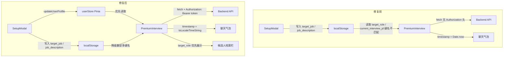

# 设计文档：jwt-context-ui-hotfix

## Overview

多租户架构升级后，前端出现四个相互独立但同等紧急的断层问题：时间戳裸露渲染、JWT Token 未随请求携带、SetupModal 上下文未注入大模型、左侧候选人档案优先级错误。本文档描述每个问题的根因、修复方案及涉及文件，供任务执行时精确定位。

---

## Architecture



---

## Components and Interfaces

### Bug 1：裸露的 Unix 时间戳（PremiumInterview.vue）

**根因**：`sendMessage` 函数推入占位 AI 消息时，直接将 `Date.now()`（毫秒级整数）赋给 `timestamp` 字段，而模板直接渲染该字段，导致用户看到 `1778750883422` 这样的原始数字。

对比 `addMessage` 函数（用于用户消息和初始 AI 消息）已正确使用格式化：

```javascript
// 当前错误代码（sendMessage 内）
const aiMsg = { role: 'ai', content: '', timestamp: Date.now(), isNew: true }

// 修复后（与 addMessage 保持一致）
const aiMsg = {
  role: 'ai',
  content: '',
  timestamp: new Date().toLocaleTimeString('zh-CN', { hour: '2-digit', minute: '2-digit' }),
  isNew: true
}
```

**涉及文件**：`frontend/src/PremiumInterview.vue`，`sendMessage` 函数，单行改动。

---

### Bug 2：全局 JWT Auth 请求头缺失

**根因**：`authService.js` 已提供 `getAuthHeaders()` 工具函数，但以下请求点未调用：

| 文件 | 请求位置 | 问题 |
|------|----------|------|
| `PremiumInterview.vue` | `startInterviewWithDifficulty` | 无 Auth 头 |
| `PremiumInterview.vue` | `initInterview` 恢复历史 | 无 Auth 头 |
| `PremiumInterview.vue` | `endInterview` 评估 | 无 Auth 头 |
| `PremiumInterview.vue` | `endInterview` 评估后 | **缺少保存历史记录调用** |
| `ResumeDiagnosis.vue` | `startDiagnosis` | 无 Auth 头 |
| `ResumeDiagnosis.vue` | `initResume` 恢复历史 | 无 Auth 头 |
| `Dashboard.vue` | `loadHistory` | 无 Auth 头 |
| `Dashboard.vue` | `loadLatestRadarData` | 无 Auth 头 |
| `Dashboard.vue` | `toggleSaveRecord` | 无 Auth 头 |
| `Dashboard.vue` | `deleteHistoryRecord` | 无 Auth 头 |
| `Dashboard.vue` | `sendGeneralChatMessage` | 无 Auth 头 |
| `llm_service.js` | `callAgent` | 无 Auth 头 |
| `llm_service.js` | `streamInterviewChat` | 无 Auth 头 |

**修复方案**：所有 `fetch` 调用的 `headers` 对象使用展开运算符合并 `getAuthHeaders()`：

```javascript
// 通用模式（JSON 请求）
headers: {
  'Content-Type': 'application/json',
  ...getAuthHeaders()
}

// FormData 请求（不设 Content-Type）
headers: {
  ...getAuthHeaders()
}
```

`llm_service.js` 不能 import Vue/Pinia，使用本地工具函数：

```javascript
function getAuthHeaders() {
  const token = localStorage.getItem('token')
  return token ? { Authorization: `Bearer ${token}` } : {}
}
```

面试结束后保存记录（`endInterview` 评估成功后追加）：

```javascript
await fetch(`${API_BASE_URL}/history`, {
  method: 'POST',
  headers: { 'Content-Type': 'application/json', ...getAuthHeaders() },
  body: JSON.stringify({
    category: `interview_${interviewDifficulty.value}`,
    user_input: `面试候选人：${candidateName.value}，岗位：${targetRole.value}`,
    ai_result: mentorComment.value,
    scores: JSON.stringify(radarScores.value),
    chat_history: JSON.stringify(messages.value.map(m => ({ role: m.role, content: m.content }))),
    extra_data: JSON.stringify({
      resume_text: resumeText.value,
      target_role: targetRole.value,
      jd_text: interviewJd.value,
      difficulty: interviewDifficulty.value
    })
  })
})
```

---

### Bug 3：SetupModal 上下文未注入大模型

**根因**：SetupModal 写入 localStorage 的键名与各页面读取的键名不一致：

| SetupModal 写入键 | 含义 | PremiumInterview 读取键 | ResumeDiagnosis 读取键 |
|-------------------|------|------------------------|----------------------|
| `candidate_name` | 姓名 | `candidate_name` ✅ | — |
| `resume_text` | 简历 | `resume_text` ✅ | `resume_text` ✅ |
| `target_job` | 目标岗位 | `target_role` ❌ | `target_role` ❌ |
| `job_description` | JD | `current_interview_jd` ❌ | 未读取 ❌ |

**修复方案**：优先读 `userStore`（Pinia 内存），降级读 `localStorage`，兼容多键名：

```javascript
import { useUserStore } from '@/stores/userStore'
const userStore = useUserStore()

// 目标岗位
const targetRoleValue =
  userStore.targetJob ||
  localStorage.getItem('target_role') ||
  localStorage.getItem('target_job') ||
  ''

// JD
const jdValue =
  userStore.jobDescription ||
  localStorage.getItem('job_description') ||
  localStorage.getItem('current_interview_jd') ||
  localStorage.getItem('jd_content') ||
  ''

// 简历
const resumeValue =
  userStore.resumeText ||
  localStorage.getItem('resume_text') ||
  ''
```

前端确保请求体中同时包含三个字段：

```json
{
  "resume_text": "<简历全文>",
  "target_role": "<目标岗位>",
  "jd_text": "<岗位JD>"
}
```

---

### Bug 4：左侧候选人档案"求职意向"优先级错误

**根因**：左侧档案栏只渲染 `resumeText`（简历原文），`targetRole` 虽被读取但仅用于构建问候语，档案栏没有独立的"求职意向"展示区。

**修复方案**：在简历内容展示块上方新增求职意向展示块，`v-if="targetRole"` 保证空值时不渲染：

```vue
<div v-if="targetRole" class="mb-3 px-3 py-2 rounded-lg border" :class="themeConfig.borderLight">
  <p class="text-[10px] text-gray-500 uppercase tracking-wider mb-0.5">求职意向</p>
  <p class="text-sm font-semibold" :class="themeConfig.text">{{ targetRole }}</p>
</div>
```

---

## Data Models

### 消息对象（Message）

```javascript
// 修复后的统一格式
{
  role: 'user' | 'ai',
  content: String,
  // timestamp 统一为 HH:mm 格式字符串，不再使用毫秒整数
  timestamp: String,  // e.g. "17:22"
  isNew: Boolean
}
```

### 历史记录保存请求体

```javascript
{
  category: String,        // e.g. "interview_standard"
  user_input: String,      // 面试摘要描述
  ai_result: String,       // mentorComment（导师评语）
  scores: String,          // JSON.stringify(radarScores)
  chat_history: String,    // JSON.stringify(messages[])
  extra_data: String       // JSON.stringify({ resume_text, target_role, jd_text, difficulty })
}
```

### 上下文注入请求体（面试/诊断）

```javascript
{
  resume_text: String,   // 简历全文（必填）
  target_role: String,   // 目标岗位（来自 userStore.targetJob 或 localStorage）
  jd_text: String,       // 岗位JD（来自 userStore.jobDescription 或 localStorage）
  // ... 其他字段
}
```

---

## Correctness Properties

Property 1: 时间戳格式一致性 — 任意消息对象的 `timestamp` 字段，其值必须匹配 `/^\d{2}:\d{2}$/` 正则（HH:mm 格式），不得为毫秒整数

Property 2: JWT 请求头完整性 — 所有 `/api/*` 请求，当 `localStorage.getItem('token')` 非空时，Request Headers 中必须包含 `Authorization: Bearer <token>`

Property 3: 上下文读取优先级 — `initInterview` 执行后，`targetRole.value` 的值等于 `userStore.targetJob || localStorage.getItem('target_role') || localStorage.getItem('target_job') || ''`，`interviewJd.value` 等于 `userStore.jobDescription || localStorage.getItem('job_description') || localStorage.getItem('current_interview_jd') || ''`

Property 4: 档案栏条件渲染 — 当 `targetRole.value` 非空时，左侧档案栏必须渲染求职意向展示块；当 `targetRole.value` 为空字符串时，该块不渲染

---

## Error Handling

### JWT Token 缺失

- `getAuthHeaders()` 在 token 不存在时返回空对象 `{}`，不抛出异常，请求正常发出（后端返回 401 由 `authService.handleResponse` 处理）

### 历史记录保存失败

- `endInterview` 中保存历史记录的调用失败时，仅 `console.error` 记录错误，不阻断 UI 流程（雷达图和评估结果正常展示）

### localStorage 键名不存在

- 多键名降级读取链使用 `||` 短路，任意键不存在时自动降级到下一个，最终降级为空字符串，不抛出异常

---

## Testing Strategy

### 手动验证清单

**Bug 1 验证**：
- 发送一条消息后，AI 回复气泡右下角显示 `HH:mm` 格式（如 `17:22`），不再显示毫秒数字

**Bug 2 验证**：
- 打开浏览器 DevTools → Network，发送任意请求，确认 Request Headers 中包含 `Authorization: Bearer xxx`
- 完成一次模拟面试并生成雷达图后，刷新 Dashboard，历史记录中出现本次面试记录
- Dashboard Bento 看板正常加载历史记录和雷达图数据（不再出现 401 错误）

**Bug 3 验证**：
- 在 SetupModal 填写目标岗位"前端工程师"和 JD 后，进入面试，AI 第一条问题应与前端岗位相关
- 进入简历诊断，"目标岗位"和"岗位描述"输入框已预填充 SetupModal 中的内容

**Bug 4 验证**：
- 在 SetupModal 填写目标岗位后，进入面试，左侧档案栏顶部显示"求职意向：<填写的岗位>"
- 若 SetupModal 未填写目标岗位，该展示块不显示（不报错）
