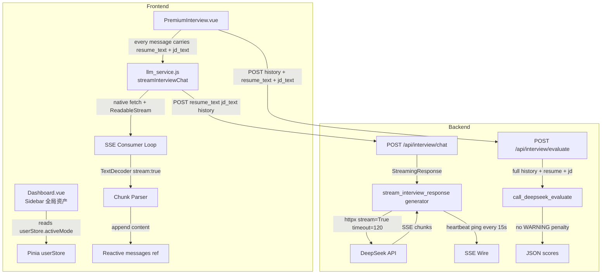
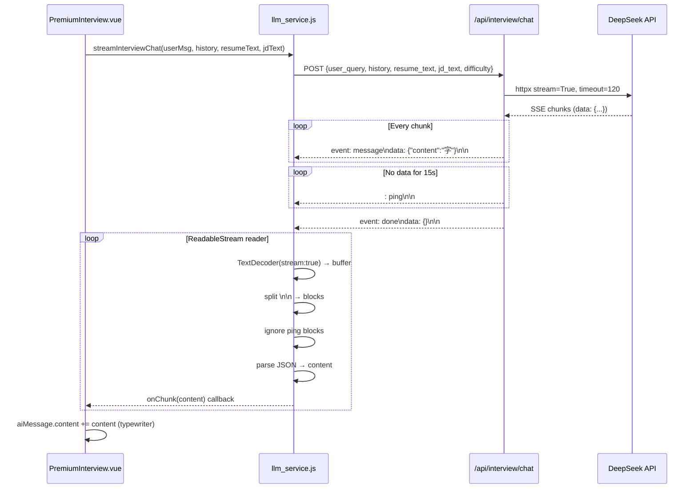
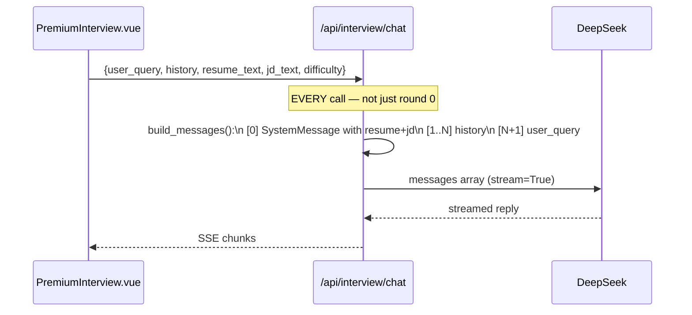

# Design Document: LLM Streaming SSE Refactor

## Overview

This document covers a full-chain refactor of the One-stop AI Career Navigator across five interconnected tasks: fixing the Dashboard sidebar's mode-aware "全局资产" rendering, eliminating interview context amnesia by injecting `resume_text`/`jd_text` on every LLM call, rewriting the evaluation scoring engine to use full context without hardcoded penalties, migrating the backend interview service to true SSE streaming with heartbeat, and replacing the frontend's blocking fetch with a native `ReadableStream` SSE consumer that handles Chinese character truncation and graceful error recovery.

The refactor touches `Dashboard.vue`, `PremiumInterview.vue`, `Router/interview.py`, and `frontend/src/services/llm_service.js`. All changes must remain compatible with the existing FastAPI + Vue 3 `<script setup>` + Pinia architecture.

---

## Architecture



---

## Sequence Diagrams

### Task 4 + 5: SSE Streaming Full Flow



### Task 2: Interview Context Injection (Every Round)



---

## Components and Interfaces

### Component 1: Dashboard.vue — 全局资产 Sidebar Block

**Purpose**: Display mode-aware user asset status in the left sidebar.

**Interface** (template binding):
```typescript
// Reads from Pinia userStore (already loaded via userStore.loadFromStorage() in onMounted)
userStore.activeMode   // 'job' | 'education'
userStore.examType     // 'zhuanchaben' | 'gaokao' | 'kaoyan' | 'kaogong' | 'other'
userStore.estimatedScore  // string, e.g. "580"
// examRank is stored as a separate localStorage key: 'exam_rank'
// Add to userStore.loadFromStorage() and state: examRank: ''
```

**Responsibilities**:
- On `onMounted`, `userStore.loadFromStorage()` already runs — extend it to also read `exam_rank`
- Sidebar "全局资产" block conditionally renders two branches based on `userStore.activeMode`
- 升学模式 branch: shows `examTypeLabel` badge + `分数: {estimatedScore} / 排位: {examRank}`
- 求职模式 branch: shows `targetJob` + resume ready indicator (already implemented, keep as-is)

---

### Component 2: PremiumInterview.vue — sendMessage / startInterviewWithDifficulty

**Purpose**: Interview chat UI that must carry full context on every LLM call.

**Interface**:
```typescript
// Every outbound request payload
interface InterviewChatPayload {
  user_query: string
  history: Array<{ role: string; content: string }>
  resume_text: string   // ALWAYS from resumeText.value (localStorage 'resume_text')
  jd_text: string       // ALWAYS from interviewJd.value (localStorage 'current_interview_jd')
  difficulty: string
}
```

**Responsibilities**:
- `startInterviewWithDifficulty()`: already sends `resume_text` + `jd_text` ✓
- `sendMessage()`: currently sends `resume_text` + `jd_text` ✓ — but uses blocking `fetch` + `response.json()`; must be migrated to SSE streaming consumer
- Replace `const data = await response.json()` with the new `streamInterviewChat()` service call
- Append streamed content to `messages` reactively (typewriter effect)

---

### Component 3: llm_service.js — streamInterviewChat()

**Purpose**: Native fetch SSE consumer for the interview chat endpoint.

**Interface**:
```javascript
/**
 * @param {string} endpoint  - e.g. '/interview/chat'
 * @param {Object} payload   - { user_query, history, resume_text, jd_text, difficulty }
 * @param {Function} onChunk - called with each string content fragment
 * @param {Function} onError - called with error message string on stream failure
 * @returns {Promise<void>}
 */
async function streamInterviewChat(endpoint, payload, onChunk, onError)
```

**Responsibilities**:
- POST with `Content-Type: application/json`
- `response.body.getReader()` + `while(true)` loop
- `new TextDecoder('utf-8')` with `{ stream: true }` to prevent CJK truncation
- Buffer accumulation + split on `\n\n`
- Ignore `event: ping` blocks and `: ping` comment lines
- Parse `data:` line as JSON, extract `content` field, call `onChunk(content)`
- On `event: done` or reader `done === true`: exit loop cleanly
- On any exception: call `onError('[网络连接异常，请重试]')`

---

### Component 4: Router/interview.py — /chat endpoint (SSE Streaming)

**Purpose**: Replace blocking JSON response with true SSE streaming.

**Interface**:
```python
class ChatRequest(BaseModel):
    user_query: str
    history: List[dict] = []
    resume_text: Optional[str] = ""
    jd_text: Optional[str] = ""
    difficulty: Optional[str] = "standard"

# Response: StreamingResponse(media_type="text/event-stream")
# SSE format per chunk:
#   event: message\ndata: {"content": "<token>"}\n\n
# Heartbeat (no data for 15s):
#   : ping\n\n
# Terminal event:
#   event: done\ndata: {}\n\n
```

**Responsibilities**:
- `build_messages(request)`: construct `[SystemMessage, ...history, UserMessage]` on EVERY call
- System message at index 0 always contains `resume_text` + `jd_text`
- `httpx.AsyncClient(timeout=120.0)` with `stream=True` on DeepSeek call
- Async generator `stream_interview_response(request)` yields SSE lines
- Heartbeat: track last-yield timestamp; if `> 15s` with no content, yield `: ping\n\n`
- Return `StreamingResponse(stream_interview_response(request), media_type="text/event-stream")`

---

### Component 5: Router/interview.py — /evaluate endpoint (Scoring Engine)

**Purpose**: Rewrite evaluation to use full context, remove WARNING penalty logic.

**Interface**:
```python
class EvaluateRequest(BaseModel):
    user_query: str
    history: List[dict] = []
    resume_text: Optional[str] = ""
    jd_text: Optional[str] = ""
    difficulty: Optional[str] = "standard"
```

**Responsibilities**:
- Build evaluation prompt with: full `history` + `resume_text` + `jd_text`
- Use the new scoring prompt (see Data Models section)
- Remove all `if warnings > 0: score -= 20` style logic from `EVALUATE_SYSTEM_PROMPT`
- Keep `_extract_json_from_text()` helper unchanged
- Keep `insert_record()` DB write unchanged

---

## Data Models

### SSE Wire Format

```
# Normal content chunk
event: message
data: {"content": "你"}

# Heartbeat (comment line — no event/data parsing needed)
: ping

# Stream complete
event: done
data: {}
```

### Interview System Message (injected every round)

```python
INTERVIEW_SYSTEM_PROMPT_TEMPLATE = (
    "你是一个专业面试官。"
    "这是候选人的简历：{resume_text}。"
    "这是目标岗位 JD：{jd_text}。"
    "请根据这些背景严格进行追问，"
    "绝对不要在对话中要求候选人重新提供简历或JD！"
)
```

This is prepended to the existing difficulty-specific prompt content.

### Evaluation Scoring Prompt (rewritten)

```python
EVALUATE_SYSTEM_PROMPT_V2 = """
你是一个绝对客观、中立的 AI 面试评估分析师。
这是该候选人完整的面试逐字稿。
请根据回答的技术深度、逻辑连贯性、以及与简历/JD的匹配度进行客观打分（0-100）。
不要受任何系统警告信息的干扰，只看用户真实的回答内容！

【强制输出纪律】：只输出合法 JSON，包含且仅包含以下 7 个键：
{"professional": 数字, "logic": 数字, "communication": 数字,
 "problemSolving": 数字, "potential": 数字, "resilience": 数字,
 "comment": "总体评价50字以内"}
"""
```

### userStore State Extension (exam_rank)

```javascript
// In userStore.js state():
examRank: '',   // new field — localStorage key: 'exam_rank'

// In loadFromStorage():
this.examRank = localStorage.getItem('exam_rank') || ''

// In updateUserProfile(payload):
this.examRank = payload.examRank || ''
localStorage.setItem('exam_rank', this.examRank)
```

---

## Algorithmic Pseudocode

### Algorithm 1: SSE Stream Consumer (llm_service.js)

```pascal
PROCEDURE streamInterviewChat(endpoint, payload, onChunk, onError)
  INPUT: endpoint (String), payload (Object), onChunk (Function), onError (Function)
  OUTPUT: void (side effects via callbacks)

  SEQUENCE
    response ← await fetch(API_BASE_URL + endpoint, {
      method: 'POST',
      headers: {'Content-Type': 'application/json'},
      body: JSON.stringify(payload)
    })

    IF NOT response.ok THEN
      onError('[网络连接异常，请重试]')
      RETURN
    END IF

    reader  ← response.body.getReader()
    decoder ← new TextDecoder('utf-8')   // stream mode prevents CJK split
    buffer  ← ''

    WHILE true DO
      { done, value } ← await reader.read()

      IF done THEN BREAK END IF

      buffer ← buffer + decoder.decode(value, { stream: true })

      // Split on double-newline SSE block boundary
      blocks ← buffer.split('\n\n')
      buffer ← blocks.pop()   // last incomplete block stays in buffer

      FOR EACH block IN blocks DO
        IF block starts with ': ' THEN
          CONTINUE   // heartbeat comment line — ignore
        END IF

        lines     ← block.split('\n')
        eventName ← ''
        dataStr   ← ''

        FOR EACH line IN lines DO
          IF line starts with 'event:' THEN
            eventName ← line.substring(6).trim()
          ELSE IF line starts with 'data:' THEN
            dataStr ← line.substring(5).trim()
          END IF
        END FOR

        IF eventName = 'ping' THEN CONTINUE END IF
        IF eventName = 'done' THEN BREAK WHILE END IF

        IF dataStr ≠ '' THEN
          TRY
            parsed  ← JSON.parse(dataStr)
            content ← parsed.content OR ''
            IF content ≠ '' THEN onChunk(content) END IF
          CATCH
            // malformed JSON — skip silently
          END TRY
        END IF
      END FOR
    END WHILE

  CATCH error
    onError('[网络连接异常，请重试]')
  END SEQUENCE
END PROCEDURE
```

**Preconditions:**
- `endpoint` is a valid `/api/*` path string
- `payload` contains `user_query`, `history`, `resume_text`, `jd_text`, `difficulty`
- `onChunk` and `onError` are callable functions

**Postconditions:**
- `onChunk` is called once per content token received
- `onError` is called at most once on failure
- No partial CJK characters are passed to `onChunk` (guaranteed by `stream: true` decoder)

**Loop Invariant:**
- `buffer` always contains at most one incomplete SSE block (no complete `\n\n`-terminated block remains unprocessed)

---

### Algorithm 2: Backend SSE Generator (interview.py)

```pascal
ASYNC GENERATOR stream_interview_response(request: ChatRequest)
  OUTPUT: SSE text lines

  SEQUENCE
    messages ← build_messages(request)
    // messages[0] = SystemMessage with resume_text + jd_text
    // messages[1..N] = history
    // messages[N+1] = user HumanMessage

    last_yield_time ← now()

    ASYNC WITH httpx.AsyncClient(timeout=120.0) AS client
      ASYNC WITH client.stream('POST', DEEPSEEK_BASE_URL,
                               json={model, messages, stream:True, temperature, max_tokens},
                               headers=auth_headers) AS response

        IF response.status_code ≠ 200 THEN
          YIELD 'event: error\ndata: {"content":"模型接口异常"}\n\n'
          RETURN
        END IF

        ASYNC FOR line IN response.aiter_lines() DO
          // Heartbeat: if no data for > 15 seconds, emit ping
          IF (now() - last_yield_time) > 15 THEN
            YIELD ': ping\n\n'
            last_yield_time ← now()
          END IF

          IF NOT line OR NOT line.startswith('data:') THEN CONTINUE END IF

          data_str ← line[5:].strip()
          IF data_str = '[DONE]' THEN BREAK END IF

          TRY
            parsed  ← json.loads(data_str)
            content ← parsed['choices'][0]['delta'].get('content', '')
            IF content THEN
              YIELD f'event: message\ndata: {json.dumps({"content": content})}\n\n'
              last_yield_time ← now()
            END IF
          CATCH JSONDecodeError
            CONTINUE
          END TRY
        END FOR

    YIELD 'event: done\ndata: {}\n\n'

  CATCH httpx.ReadTimeout
    YIELD 'event: error\ndata: {"content":"模型思考超时，请稍后重试"}\n\n'
  CATCH Exception AS e
    YIELD f'event: error\ndata: {json.dumps({"content": str(e)})}\n\n'
  END SEQUENCE
END GENERATOR
```

**Preconditions:**
- `DEEPSEEK_API_KEY` is set in environment
- `request.history` is a list of `{role, content}` dicts
- `request.resume_text` and `request.jd_text` may be empty strings (handled gracefully)

**Postconditions:**
- Every yielded string is a valid SSE block ending with `\n\n`
- `event: done` is always the final yielded block (even on error paths)
- No partial UTF-8 sequences are yielded (httpx handles encoding)

**Loop Invariant:**
- `last_yield_time` is updated on every content yield and every ping yield, ensuring heartbeat interval is measured from the most recent output

---

### Algorithm 3: build_messages() — Context Injection Every Round

```pascal
FUNCTION build_messages(request: ChatRequest) → List[dict]
  INPUT: request with user_query, history, resume_text, jd_text, difficulty
  OUTPUT: messages list for DeepSeek API

  SEQUENCE
    // Always build a fresh system message with resume + jd context
    resume_section ← ''
    jd_section     ← ''

    IF request.resume_text AND request.resume_text.strip() ≠ '' THEN
      resume_section ← f'这是候选人的简历：{request.resume_text.strip()[:4000]}'
    END IF

    IF request.jd_text AND request.jd_text.strip() ≠ '' THEN
      jd_section ← f'这是目标岗位 JD：{request.jd_text.strip()[:3000]}'
    END IF

    context_prefix ← '你是一个专业面试官。' + resume_section + jd_section
                    + '请根据这些背景严格进行追问，绝对不要在对话中要求候选人重新提供简历或JD！'

    difficulty_prompt ← DIFFICULTY_PROMPTS.get(request.difficulty, DIFFICULTY_PROMPTS['standard'])
    system_content    ← context_prefix + '\n\n' + difficulty_prompt

    messages ← [{"role": "system", "content": system_content}]

    // Append conversation history (last 20 turns to stay within context window)
    FOR EACH msg IN request.history[-20:] DO
      IF msg.role IN ('user', 'assistant') THEN
        messages.append({"role": msg.role, "content": msg.content[:2000]})
      END IF
    END FOR

    // Append current user message
    messages.append({"role": "user", "content": request.user_query})

    RETURN messages
  END SEQUENCE
END FUNCTION
```

**Preconditions:**
- `request.difficulty` is one of `'beginner'`, `'standard'`, `'p8'` (defaults to `'standard'`)
- `request.history` is a list (may be empty)

**Postconditions:**
- `messages[0].role === 'system'` always
- `messages[0].content` always contains resume and JD context (if provided)
- `messages[-1].role === 'user'` always
- Total message count ≥ 2

---

## Key Functions with Formal Specifications

### streamInterviewChat (llm_service.js)

```javascript
async function streamInterviewChat(endpoint, payload, onChunk, onError)
```

**Preconditions:**
- `typeof onChunk === 'function'`
- `typeof onError === 'function'`
- `payload.resume_text` and `payload.jd_text` are strings (may be empty)

**Postconditions:**
- If network succeeds: `onChunk` called ≥ 0 times with non-empty string fragments
- If network fails at any point: `onError` called exactly once with `'[网络连接异常，请重试]'`
- `onChunk` is never called after `onError`
- No CJK character is split across two `onChunk` calls

---

### stream_interview_response (interview.py)

```python
async def stream_interview_response(request: ChatRequest) -> AsyncGenerator[str, None]
```

**Preconditions:**
- `DEEPSEEK_API_KEY` is non-empty
- `request` passes Pydantic validation

**Postconditions:**
- Yields only valid SSE-formatted strings (each ends with `\n\n`)
- Always yields `event: done\ndata: {}\n\n` as the last item
- Yields `: ping\n\n` if no content token arrives within 15 seconds

---

### build_messages (interview.py)

```python
def build_messages(request: ChatRequest) -> list[dict]
```

**Preconditions:**
- `request.history` is a list of dicts with `role` and `content` keys

**Postconditions:**
- `len(result) >= 2`
- `result[0]['role'] == 'system'`
- `result[-1]['role'] == 'user'`
- `result[-1]['content'] == request.user_query`

---

### evaluate_interview (interview.py — refactored)

```python
async def evaluate_interview(request: EvaluateRequest) -> dict
```

**Preconditions:**
- `request.history` contains at least one user message

**Postconditions:**
- Returns `{"success": True, "data": {...scores, "comment": str}}` on success
- `data` contains all 6 score keys: `professional`, `logic`, `communication`, `problemSolving`, `potential`, `resilience`
- No score is modified by WARNING count (penalty logic removed)
- Scores reflect only the quality of user's actual answers

---

## Example Usage

### Frontend: Replacing blocking fetch in PremiumInterview.vue

```javascript
// BEFORE (blocking JSON):
const response = await fetch(CHAT_API_URL, { method: 'POST', ... })
const data = await response.json()
addMessage('ai', data.reply)

// AFTER (SSE streaming):
import { streamInterviewChat } from '@/services/llm_service.js'

const aiMsg = { role: 'ai', content: '', timestamp: now(), isNew: true }
messages.value.push(aiMsg)

await streamInterviewChat(
  '/interview/chat',
  {
    user_query: userMessage,
    history: messages.value.slice(0, -1).map(m => ({ role: m.role, content: m.content })),
    resume_text: resumeText.value,   // always from localStorage
    jd_text: interviewJd.value,      // always from localStorage
    difficulty: interviewDifficulty.value
  },
  (chunk) => {
    aiMsg.content += chunk
    scrollToBottom()
  },
  (errMsg) => {
    aiMsg.content += errMsg
    scrollToBottom()
  }
)
```

### Backend: New /chat endpoint

```python
@router.post("/chat")
async def interview_chat(request: ChatRequest):
    return StreamingResponse(
        stream_interview_response(request),
        media_type="text/event-stream",
        headers={
            "Cache-Control": "no-cache",
            "Connection": "keep-alive",
            "X-Accel-Buffering": "no",
        }
    )
```

### Dashboard.vue: Mode-aware 全局资产 sidebar block

```html
<!-- 升学模式 -->
<template v-if="userStore.activeMode === 'education'">
  <span class="text-green-400">
    [{{ examTypeLabel }}]
  </span>
  <p class="text-xs text-gray-400 mt-1">
    分数: {{ userStore.estimatedScore || '未设置' }} /
    排位: {{ userStore.examRank || '未设置' }}
  </p>
</template>

<!-- 求职模式 -->
<template v-else>
  <p class="text-xs text-gray-400 mt-1 truncate">
    {{ userStore.targetJob || '点击完善个人信息' }}
  </p>
  <div v-if="userStore.resumeText" class="flex items-center gap-1.5 mt-1">
    <div class="w-1.5 h-1.5 rounded-full bg-green-400"></div>
    <span class="text-xs text-green-400">简历已就绪</span>
  </div>
</template>
```

---

## Error Handling

### Error Scenario 1: SSE Stream Interrupted Mid-Response

**Condition**: Network drops or server closes connection before `event: done`
**Response**: `reader.read()` resolves with `done: true` or throws a `TypeError`
**Recovery**: `onError('[网络连接异常，请重试]')` is appended to the current AI message bubble; user sees graceful inline error rather than a blank message

### Error Scenario 2: DeepSeek API Timeout (Backend)

**Condition**: `httpx.ReadTimeout` raised after 120 seconds
**Response**: Generator yields `event: error\ndata: {"content":"模型思考超时，请稍后重试"}\n\n` then `event: done`
**Recovery**: Frontend SSE consumer receives the error event, calls `onError` with the message content

### Error Scenario 3: Malformed JSON in SSE Data Line

**Condition**: A `data:` line contains non-JSON content (e.g., upstream proxy error page)
**Response**: `JSON.parse()` throws; caught silently, block is skipped
**Recovery**: Stream continues; subsequent valid chunks are still processed

### Error Scenario 4: Missing resume_text / jd_text

**Condition**: User starts interview without uploading resume or JD
**Response**: `build_messages()` omits the empty sections from the system prompt; interview proceeds in "blind mode"
**Recovery**: The existing `PremiumInterview.vue` `isResumeValid` computed property already shows a warning banner — no additional handling needed

### Error Scenario 5: Evaluation JSON Parse Failure

**Condition**: DeepSeek returns non-JSON or partial JSON for the evaluate endpoint
**Response**: `_extract_json_from_text()` tries multiple extraction strategies; if all fail, returns `{"success": False, "msg": "打分失败，请重试"}`
**Recovery**: Frontend `PremiumInterview.vue` already handles this with `evaluateError.value` and a retry button

---

## Testing Strategy

### Unit Testing Approach

- Test `build_messages()` with empty history, non-empty history, missing resume, missing JD
- Test `_extract_json_from_text()` with markdown-wrapped JSON, bare JSON, partial JSON
- Test `streamInterviewChat()` with a mock `ReadableStream` that emits known SSE chunks
- Verify `TextDecoder({ stream: true })` correctly reassembles split CJK characters across chunk boundaries

### Property-Based Testing Approach

**Property Test Library**: `hypothesis` (Python backend), `fast-check` (JavaScript frontend)

**Backend properties**:
- For any `ChatRequest`, `build_messages(request)[0]['role'] == 'system'` always holds
- For any `ChatRequest`, `build_messages(request)[-1]['content'] == request.user_query` always holds
- For any valid SSE block string, the frontend parser extracts the same `content` value as the raw JSON

**Frontend properties**:
- For any sequence of UTF-8 byte arrays that together form valid CJK text, `TextDecoder({ stream: true })` reassembles them without loss
- For any SSE stream containing `event: ping` blocks, the consumer never calls `onChunk` for those blocks

### Integration Testing Approach

- End-to-end: POST to `/api/interview/chat` with a real `ChatRequest`, verify `Content-Type: text/event-stream`, verify at least one `event: message` block is received
- Verify `/api/interview/evaluate` returns valid 6-key JSON scores when given a realistic history with `resume_text` and `jd_text`
- Verify Dashboard sidebar renders the correct branch when `localStorage.active_mode` is set to `'education'` vs `'job'`

---

## Performance Considerations

- **Heartbeat interval**: 15 seconds balances proxy timeout avoidance (most proxies timeout at 60s) against unnecessary traffic
- **History truncation**: `request.history[-20:]` caps context window usage; each message content is also capped at 2000 chars
- **Resume/JD truncation**: `resume_text[:4000]` and `jd_text[:3000]` prevent token overflow while preserving the most relevant content
- **TextDecoder reuse**: A single `TextDecoder` instance per stream (not recreated per chunk) avoids GC pressure on long interviews
- **httpx timeout=120.0**: Matches the DeepSeek API's maximum generation time for long responses; the heartbeat prevents client-side premature disconnection

---

## Security Considerations

- `resume_text` and `jd_text` are user-supplied strings injected into LLM prompts — they are truncated to prevent prompt injection via extremely long inputs
- SSE responses are streamed directly from the DeepSeek API; no user-supplied content is reflected back as raw HTML (Vue's reactive binding auto-escapes)
- The `X-Accel-Buffering: no` header prevents Nginx from buffering SSE responses, which could cause data to be held in memory server-side

---

## Dependencies

| Layer | Dependency | Purpose |
|-------|-----------|---------|
| Backend | `httpx` (already installed) | Async HTTP client with streaming support |
| Backend | `fastapi.responses.StreamingResponse` (already used in agent_dispatcher.py) | SSE response wrapper |
| Frontend | Native `fetch` + `ReadableStream` (Web API) | SSE consumer — no new npm packages |
| Frontend | `TextDecoder` (Web API) | UTF-8 stream decoding with CJK safety |
| Frontend | `Pinia userStore` (already installed) | `examRank` state extension |


---

## Correctness Properties

The following properties must hold universally across all inputs and runtime conditions:

### Property 1: System message always present
For any `ChatRequest r`, `build_messages(r)[0]['role'] == 'system'` and `'你是一个专业面试官' in build_messages(r)[0]['content']`.

**Validates: Requirements 3.6**

### Property 2: User message always last
For any `ChatRequest r`, `build_messages(r)[-1]['role'] == 'user'` and `build_messages(r)[-1]['content'] == r.user_query`.

**Validates: Requirements 3.7, 3.8**

### Property 3: SSE stream always terminates with done event
For any call to `stream_interview_response(r)`, the generator always yields `event: done\ndata: {}\n\n` as its final item, regardless of whether the DeepSeek call succeeds, times out, or raises an exception.

**Validates: Requirements 6.6, 6.7, 6.8**

### Property 4: No CJK character splitting across chunk boundaries
For any sequence of byte arrays `[b1, b2, ..., bn]` that together encode valid UTF-8 Chinese text, applying `TextDecoder({ stream: true }).decode(bi, { stream: true })` for each `bi` and concatenating results produces the same string as `TextDecoder().decode(concat(b1..bn))`.

**Validates: Requirements 4.9**

### Property 5: Ping blocks never trigger onChunk
For any SSE stream containing blocks of the form `': ping\n\n'` or `'event: ping\ndata: {}\n\n'`, the `streamInterviewChat` consumer never calls `onChunk` for those blocks.

**Validates: Requirements 4.5**

### Property 6: onError called at most once per stream invocation
For any single invocation of `streamInterviewChat`, `onError` is called 0 or 1 times total, never more.

**Validates: Requirements 4.4**

### Property 7: Evaluation scores unaffected by WARNING count
For any `EvaluateRequest` where the history contains `[WARNING]` markers, the returned scores reflect only the semantic quality of user answers; no arithmetic penalty is applied based on warning count.

**Validates: Requirements 7.3**

### Property 8: Resume and JD context present in every LLM call
For any `ChatRequest r` where `r.resume_text` is non-empty, `build_messages(r)[0]['content']` contains a substring of `r.resume_text` (up to the 4000-char truncation limit).

**Validates: Requirements 3.4, 3.5**
