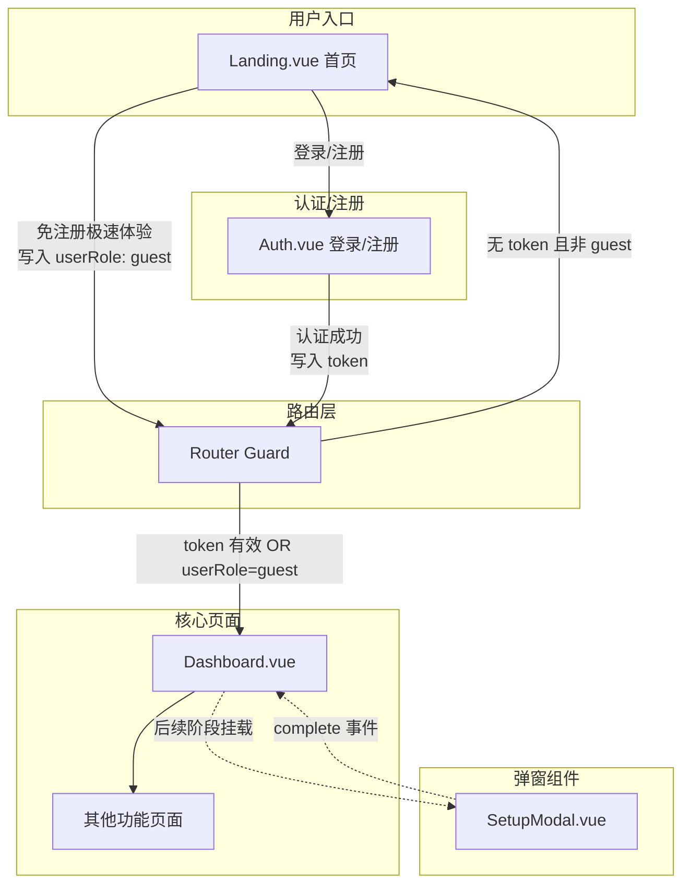
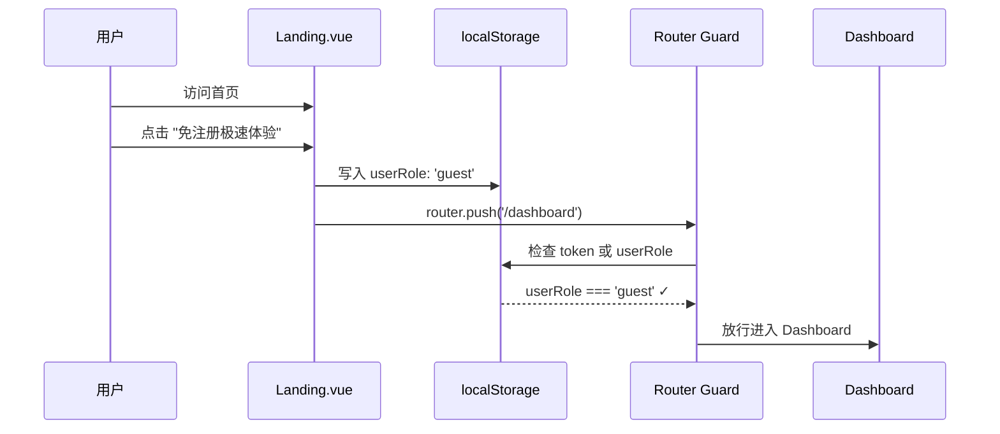
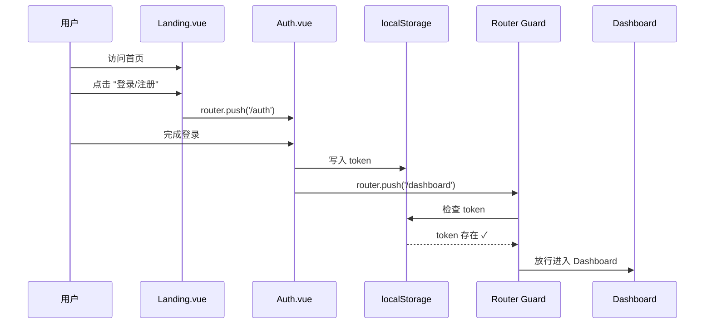
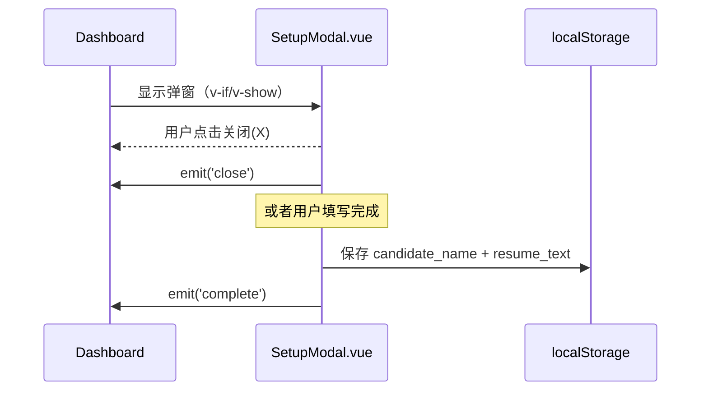

# Design Document: PLG 游客模式重构与首页转化率优化

## Overview

本次重构的核心目标是为产品引入 PLG（Product-Led Growth）模式，通过解除前端路由守卫的强制拦截、引入"游客模式"快速体验入口，以及将 `GlobalSetup.vue` 降维封装为全局可复用弹窗组件，降低用户首次体验门槛，提升首页到 Dashboard 的转化率。

系统当前在 `router/index.js` 中强制要求用户必须在 `/setup` 页面填写姓名和简历后才能进入 `/dashboard`。本次改造将引入 `userRole: 'guest'` 的概念，允许游客无需注册即可直接进入产品核心功能页面，同时保留已注册用户的完整体验路径。

改造涉及三个核心模块：路由守卫逻辑重构、Landing.vue 入口分流改造、GlobalSetup 弹窗化封装。所有新增 UI 元素严格遵循现有赛博朋克深色毛玻璃设计语言。

## Architecture



## Sequence Diagrams

### 游客模式快速体验流程



### 已注册用户登录流程



### SetupModal 弹窗交互流程（后续阶段）



## Components and Interfaces

### Component 1: Router Guard（路由守卫重构）

**Purpose**: 控制页面访问权限，允许持有合法 token 或 guest 角色的用户无条件访问所有功能页面。

**Interface**:
```javascript
// router/index.js - beforeEach guard
router.beforeEach((to, from) => {
  // 返回 true 放行，返回路径字符串重定向
  return boolean | string
})
```

**Responsibilities**:
- 检测 localStorage 中的 `token` 是否存在且合法
- 检测 localStorage 中的 `userRole` 是否为 `'guest'`
- 满足任一条件即放行进入目标页面
- 两者均不满足时重定向至首页 `/`

### Component 2: Landing.vue（入口分流改造）

**Purpose**: 作为产品首页，提供两条清晰的用户入口路径：免注册体验和登录/注册。

**Interface**:
```javascript
// Landing.vue - 新增方法
const enterAsGuest = () => void   // 游客模式进入
const goToAuth = () => void       // 跳转登录/注册页
```

**Responsibilities**:
- Hero 区域主按钮：文案 "免注册极速体验"，点击写入 guest 角色并跳转 Dashboard
- Hero 区域次按钮：文案 "登录 / 注册"，点击跳转 `/auth`
- Navbar 右上角按钮区域同步更新，保持与 Hero 区域逻辑一致
- 保留所有现有视觉效果（暗黑星空、3D 脑神经突触图、视频轮播等）

### Component 3: Auth.vue（登录/注册占位页）

**Purpose**: 提供登录/注册页面的路由占位，为后续真实鉴权迁移做准备。

**Interface**:
```javascript
// Auth.vue - 占位组件
// Props: 无
// Emits: 无（当前阶段为占位）
```

**Responsibilities**:
- 展示赛博朋克风格的占位 UI
- 提供"返回首页"导航
- 为后续接入真实鉴权系统预留结构

### Component 4: SetupModal.vue（全局设置弹窗）

**Purpose**: 将原 GlobalSetup.vue 的表单 UI 封装为居中弹窗组件，支持关闭和完成事件。

**Interface**:
```javascript
// SetupModal.vue
defineProps({
  // 当前阶段无 props，后续可扩展
})

defineEmits(['close', 'complete'])
```

**Responsibilities**:
- 复用 GlobalSetup.vue 的表单 UI（姓名输入、简历上传/粘贴）
- 外层包裹 `fixed inset-0 z-50` 遮罩层，居中展示
- 右上角提供关闭按钮(X)
- 表单提交成功后 emit `complete` 事件
- 关闭按钮点击后 emit `close` 事件
- 遵循 CyberGlassCard 毛玻璃设计风格

## Data Models

### UserRole 状态模型

```javascript
// localStorage 存储结构
const UserState = {
  // 用户角色标识
  userRole: 'guest' | 'registered' | undefined,
  
  // 认证令牌（后续真实鉴权使用）
  token: string | null,
  
  // 用户基础信息（已有）
  candidate_name: string | null,
  resume_text: string | null
}
```

**Validation Rules**:
- `userRole` 仅接受 `'guest'` 或 `'registered'` 两个值
- `token` 存在即视为合法（当前阶段不做 JWT 校验）
- 游客模式下 `candidate_name` 和 `resume_text` 可为空

### 路由 Meta 配置

```javascript
// 路由元信息
const RouteMeta = {
  requiresAuth: boolean  // 替代原有的 requiresSetup
}
```

**Validation Rules**:
- `requiresAuth: true` 的路由需要 token 或 guest 角色
- 未标记 `requiresAuth` 的路由无条件放行


## Key Functions with Formal Specifications

### Function 1: checkAccess() — 路由守卫核心逻辑

```javascript
function checkAccess(to) {
  const token = localStorage.getItem('token')
  const userRole = localStorage.getItem('userRole')
  
  if (!to.meta.requiresAuth) return true
  if (token) return true
  if (userRole === 'guest') return true
  return '/'
}
```

**Preconditions:**
- `to` 是有效的 Vue Router 路由对象
- `to.meta` 存在（可能为空对象）
- `localStorage` API 可用

**Postconditions:**
- 返回 `true` 表示放行
- 返回 `'/'` 表示重定向至首页
- 不修改任何外部状态
- 不抛出异常

**Loop Invariants:** N/A

### Function 2: enterAsGuest() — 游客模式入口

```javascript
function enterAsGuest() {
  localStorage.setItem('userRole', 'guest')
  router.push('/dashboard')
}
```

**Preconditions:**
- `localStorage` API 可用
- `router` 实例已初始化
- `/dashboard` 路由已注册

**Postconditions:**
- `localStorage.getItem('userRole') === 'guest'`
- 页面导航至 `/dashboard`
- 路由守卫检测到 guest 角色后放行

**Loop Invariants:** N/A

### Function 3: goToAuth() — 跳转认证页

```javascript
function goToAuth() {
  router.push('/auth')
}
```

**Preconditions:**
- `router` 实例已初始化
- `/auth` 路由已注册

**Postconditions:**
- 页面导航至 `/auth`
- 不修改 localStorage 中的任何数据

**Loop Invariants:** N/A

### Function 4: SetupModal close/complete handlers

```javascript
// SetupModal.vue 内部
const emit = defineEmits(['close', 'complete'])

function handleClose() {
  emit('close')
}

function handleComplete(formData) {
  localStorage.setItem('candidate_name', formData.name.trim())
  localStorage.setItem('resume_text', formData.resume.trim())
  localStorage.setItem('userRole', 'registered')
  emit('complete')
}
```

**Preconditions:**
- `emit` 函数由 Vue 3 Composition API 提供
- `formData.name` 非空字符串
- `formData.resume` 长度 >= 20 字符

**Postconditions:**
- `handleClose`: 触发 `close` 事件，不修改任何存储
- `handleComplete`: 将用户数据写入 localStorage，触发 `complete` 事件
- `handleComplete` 后 `userRole` 变为 `'registered'`

**Loop Invariants:** N/A

## Algorithmic Pseudocode

### 路由守卫决策算法

```pascal
ALGORITHM routerGuardDecision(targetRoute)
INPUT: targetRoute — Vue Router 目标路由对象
OUTPUT: decision — true (放行) 或 redirectPath (重定向路径)

BEGIN
  // Step 1: 检查目标路由是否需要认证
  IF targetRoute.meta.requiresAuth = false OR targetRoute.meta.requiresAuth = undefined THEN
    RETURN true  // 无需认证的页面直接放行
  END IF

  // Step 2: 检查 token 是否存在
  token ← localStorage.getItem('token')
  IF token IS NOT NULL AND token IS NOT EMPTY THEN
    RETURN true  // 持有合法 token，放行
  END IF

  // Step 3: 检查游客角色
  userRole ← localStorage.getItem('userRole')
  IF userRole = 'guest' THEN
    RETURN true  // 游客模式，放行
  END IF

  // Step 4: 均不满足，重定向至首页
  RETURN '/'
END
```

**Preconditions:**
- localStorage API 可用
- targetRoute 是合法的路由对象

**Postconditions:**
- 返回 true 或重定向路径字符串
- 不产生副作用

### Landing.vue 入口分流算法

```pascal
ALGORITHM handleLandingAction(actionType)
INPUT: actionType — 'guest' 或 'auth'
OUTPUT: 页面导航副作用

BEGIN
  IF actionType = 'guest' THEN
    // 写入游客标识
    localStorage.setItem('userRole', 'guest')
    // 导航至 Dashboard
    router.push('/dashboard')
  ELSE IF actionType = 'auth' THEN
    // 导航至认证页
    router.push('/auth')
  END IF
END
```

**Preconditions:**
- actionType 为 'guest' 或 'auth' 之一
- router 实例可用

**Postconditions:**
- 'guest': localStorage 中 userRole 被设为 'guest'，页面跳转至 /dashboard
- 'auth': 页面跳转至 /auth，无 localStorage 修改

### SetupModal 表单提交算法

```pascal
ALGORITHM handleSetupSubmit(candidateName, resumeText)
INPUT: candidateName — 用户姓名字符串, resumeText — 简历文本
OUTPUT: 成功则 emit('complete')，失败则显示错误

BEGIN
  // Step 1: 验证姓名
  IF candidateName.trim() IS EMPTY THEN
    DISPLAY error "请填写姓名"
    RETURN
  END IF

  // Step 2: 验证简历长度
  IF resumeText.trim().length < 20 THEN
    DISPLAY error "简历内容至少需要 20 个字符"
    RETURN
  END IF

  // Step 3: 持久化数据
  localStorage.setItem('candidate_name', candidateName.trim())
  localStorage.setItem('resume_text', resumeText.trim())
  localStorage.setItem('userRole', 'registered')

  // Step 4: 通知父组件
  emit('complete')
END
```

**Preconditions:**
- candidateName 和 resumeText 为字符串类型
- emit 函数可用

**Postconditions:**
- 验证通过：数据写入 localStorage，触发 complete 事件
- 验证失败：显示错误信息，不修改 localStorage

## Example Usage

```javascript
// Example 1: 游客模式快速进入
// Landing.vue 中的按钮点击处理
const enterAsGuest = () => {
  localStorage.setItem('userRole', 'guest')
  router.push('/dashboard')
}

// Example 2: 路由守卫判断
// router/index.js
router.beforeEach((to, from) => {
  if (!to.meta.requiresAuth) return true
  
  const token = localStorage.getItem('token')
  const userRole = localStorage.getItem('userRole')
  
  if (token || userRole === 'guest') return true
  return '/'
})

// Example 3: SetupModal 在 Dashboard 中的使用（后续阶段）
// Dashboard.vue
<template>
  <SetupModal 
    v-if="showSetupModal"
    @close="showSetupModal = false"
    @complete="handleSetupComplete"
  />
</template>

// Example 4: Auth.vue 占位页面结构
<template>
  <div class="min-h-screen flex items-center justify-center bg-[#050505]">
    <CyberGlassCard title="登录 / 注册">
      <p class="text-gray-400">认证系统即将上线...</p>
      <button @click="router.push('/')">返回首页</button>
    </CyberGlassCard>
  </div>
</template>
```

## Correctness Properties

*A property is a characteristic or behavior that should hold true across all valid executions of a system-essentially, a formal statement about what the system should do. Properties serve as the bridge between human-readable specifications and machine-verifiable correctness guarantees.*

### Property 1: Router Guard Access Decision Correctness

*For any* route object and *for any* localStorage state (token and userRole combination), the Router_Guard SHALL return `true` (allow) if and only if: (a) the route does not have `requiresAuth: true` in its meta, OR (b) localStorage contains a non-empty token, OR (c) localStorage contains `userRole` equal to `'guest'`. In all other cases, the guard SHALL return `'/'` (redirect).

**Validates: Requirements 1.1, 1.2, 1.3, 1.4**

### Property 2: Auth Navigation No Side Effects

*For any* localStorage state prior to invoking `goToAuth()`, the localStorage state after invocation SHALL be identical (no keys added, removed, or modified).

**Validates: Requirement 3.2**

### Property 3: SetupModal Close No Side Effects

*For any* localStorage state prior to triggering the SetupModal close action, the localStorage state after the close event SHALL be identical (no keys added, removed, or modified).

**Validates: Requirement 5.2**

### Property 4: SetupModal Valid Submission Persistence

*For any* valid form data where `candidateName.trim()` is non-empty AND `resumeText.trim().length >= 20`, submitting the form SHALL result in: `localStorage.candidate_name` equal to `candidateName.trim()`, `localStorage.resume_text` equal to `resumeText.trim()`, and `localStorage.userRole` equal to `'registered'`.

**Validates: Requirements 5.3, 5.4, 5.5, 5.6**

### Property 5: SetupModal Invalid Input Rejection

*For any* form data where `candidateName.trim()` is empty OR `resumeText.trim().length < 20`, submitting the form SHALL NOT modify localStorage and SHALL NOT emit a `complete` event.

**Validates: Requirements 5.7, 5.8**

## Error Handling

### Error Scenario 1: localStorage 不可用

**Condition**: 浏览器隐私模式或 localStorage 被禁用
**Response**: 路由守卫默认放行（降级为无拦截模式），控制台输出警告
**Recovery**: 用户刷新页面后重新检测 localStorage 可用性

### Error Scenario 2: 路由跳转失败

**Condition**: `router.push()` 因路由未注册或导航守卫中断而失败
**Response**: 捕获 NavigationFailure，保持当前页面不变
**Recovery**: 用户可手动点击其他导航入口

### Error Scenario 3: SetupModal 表单验证失败

**Condition**: 用户提交空姓名或简历字数不足
**Response**: 显示红色错误提示，3-4 秒后自动消失
**Recovery**: 用户修正输入后重新提交

### Error Scenario 4: 文件解析失败（SetupModal 内）

**Condition**: 上传的文件格式不支持或内容为空
**Response**: 显示错误提示 "文件解析失败，请重试"
**Recovery**: 用户可重新上传或手动粘贴文本

## Testing Strategy

### Unit Testing Approach

- 路由守卫逻辑：模拟不同 localStorage 状态，验证 `beforeEach` 返回值
- `enterAsGuest()`: 验证 localStorage 写入和 router.push 调用
- `goToAuth()`: 验证 router.push 调用参数
- SetupModal 表单验证：验证各种输入组合的验证结果

### Property-Based Testing Approach

**Property Test Library**: fast-check (适用于 JavaScript/TypeScript 项目)

- 对路由守卫进行属性测试：随机生成 token/userRole 组合，验证放行/拦截决策的正确性
- 对 SetupModal 验证逻辑进行属性测试：随机生成字符串输入，验证验证规则的一致性

### Integration Testing Approach

- 端到端流程：从 Landing 点击 "免注册极速体验" → 验证成功进入 Dashboard
- 端到端流程：从 Landing 点击 "登录/注册" → 验证成功进入 Auth 页面
- 路由守卫集成：验证未授权用户无法直接访问 `/dashboard`

## Security Considerations

- **游客模式数据隔离**: 游客用户的 localStorage 数据与注册用户隔离，后续迁移至真实鉴权时需清理游客数据
- **Token 验证**: 当前阶段仅检查 token 存在性，后续需接入 JWT 校验逻辑
- **XSS 防护**: SetupModal 中的用户输入在存储前进行 trim 处理，渲染时使用 Vue 的默认转义机制
- **localStorage 安全**: 敏感数据（如 token）不应长期存储在 localStorage，后续应迁移至 httpOnly cookie

## Performance Considerations

- **路由守卫轻量化**: 守卫逻辑仅涉及 localStorage 同步读取，无异步操作，不影响页面切换性能
- **SetupModal 懒加载**: 弹窗组件使用 `v-if` 条件渲染，未显示时不占用 DOM 和内存
- **Landing.vue 改动最小化**: 仅修改按钮文案和点击事件，不影响现有 Three.js 渲染和视频轮播性能

## Dependencies

- **Vue 3** (^3.5.32) — 组件框架
- **Vue Router** (^5.0.4) — 路由管理
- **Pinia** (^3.0.4) — 状态管理（后续可扩展 userStore）
- **Lucide Vue Next** (^1.0.0) — 图标库（SetupModal 中使用）
- **Tailwind CSS** (^4.2.2) — 样式工具类
- 无新增外部依赖
