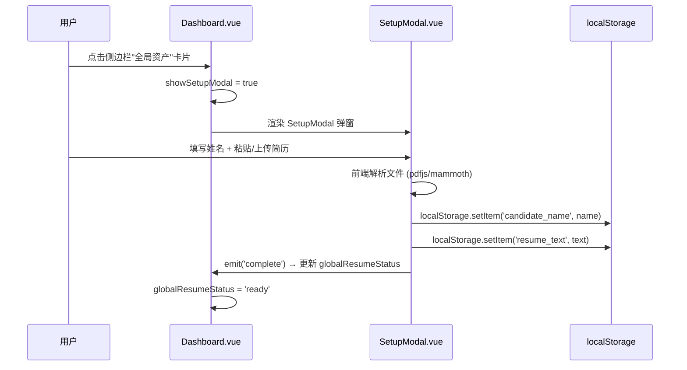
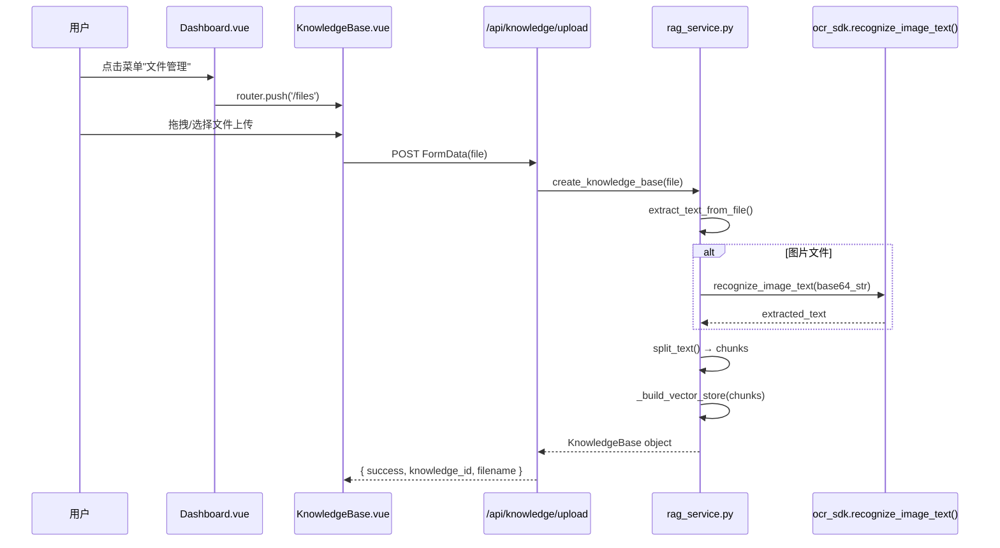
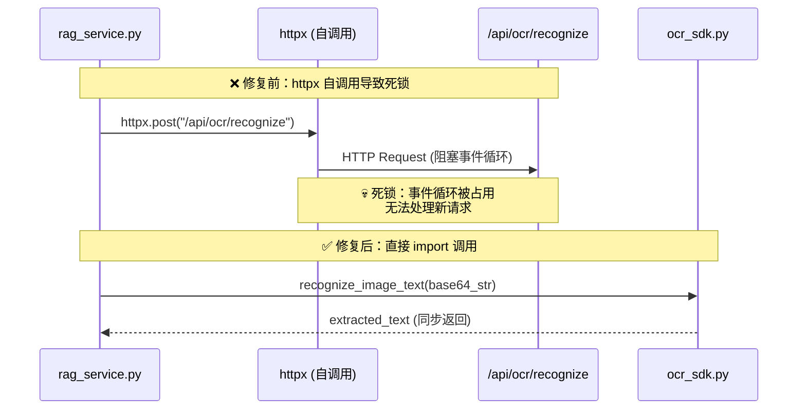

# Design Document: Profile-RAG Decoupling (核心数据架构解耦)

## Overview

本设计文档描述将系统中"轻资产 (Profile)"与"重资产 (RAG)"彻底分离的架构重构方案。当前系统存在严重的数据概念耦合：Dashboard 侧边栏的"全局资产"卡片错误地调用了知识库 (RAG) 的上传接口 (`/api/knowledge/upload`)，导致前端逻辑混乱；同时后端 `rag_service.py` 在处理图片时通过 `httpx` 发起 HTTP 请求调用自身服务的 `/api/ocr/recognize` 端点，在单线程/事件循环环境下造成死锁。

重构目标是建立清晰的数据边界：**Profile（轻资产）** 由 `SetupModal.vue` 管理，数据存储在前端 localStorage 中作为 System Prompt 注入；**RAG（重资产）** 由 `/files` 路由对应的 `KnowledgeBase.vue` 管理，文件上传至后端向量库进行索引和检索。两者各归其位，互不干扰。

## Architecture

```mermaid
graph TD
    subgraph Frontend["前端 (Vue 3 SPA)"]
        Dashboard["Dashboard.vue<br/>侧边栏 + 主工作区"]
        SetupModal["SetupModal.vue<br/>轻资产弹窗"]
        KnowledgeBase["KnowledgeBase.vue<br/>重资产页面 /files"]
        UserStore["userStore (Pinia)"]
        KBStore["knowledgeBaseStore (Pinia)"]
    end

    subgraph Backend["后端 (FastAPI)"]
        RAGService["rag_service.py<br/>知识库服务"]
        OCRRouter["Router/ocr.py<br/>OCR 端点"]
        OCRSDK["Service/Utils/ocr_sdk.py<br/>recognize_image_text()"]
    end

    Dashboard -->|"@click → showSetupModal = true"| SetupModal
    SetupModal -->|"localStorage.setItem('resume_text')"| UserStore
    Dashboard -->|"router.push('/files')"| KnowledgeBase
    KnowledgeBase -->|"POST /api/knowledge/upload"| RAGService
    RAGService -->|"直接 import 调用"| OCRSDK
    OCRRouter -->|"直接 import 调用"| OCRSDK

    style SetupModal fill:#1a1a2e,stroke:#a855f7,stroke-width:2px
    style KnowledgeBase fill:#1a1a2e,stroke:#06b6d4,stroke-width:2px
    style OCRSDK fill:#1a1a2e,stroke:#10b981,stroke-width:2px
```



## Sequence Diagrams

### 轻资产流程：用户完善个人信息



### 重资产流程：知识库文件上传



### 后端 OCR 死锁修复前后对比



## Components and Interfaces

### Component 1: SetupModal.vue (轻资产管理器)

**Purpose**: 管理用户个人信息（姓名、简历文本），数据存储在 localStorage，作为 System Prompt 的一部分注入 LLM 对话。

**Interface**:
```javascript
// Props: 无
// Emits:
defineEmits(['close', 'complete'])

// 内部状态
const candidateName = ref('')      // 用户姓名
const resumeText = ref('')         // 简历纯文本
const uploadedFileName = ref('')   // 上传文件名（展示用）

// 核心方法
function handleSubmit()            // 验证 → 写入 localStorage → emit('complete')
async function processFile(file)   // 前端解析文件 → 填充 resumeText
```

**Responsibilities**:
- 收集用户姓名和简历文本
- 前端本地解析文件（PDF/DOCX/TXT/图片），不调用后端知识库接口
- 验证表单完整性（姓名非空、简历≥20字）
- 写入 localStorage 并通知父组件

### Component 2: Dashboard.vue 侧边栏"全局资产"区域

**Purpose**: 展示用户 Profile 状态，点击后弹出 SetupModal 而非触发文件上传。

**Interface (重构后)**:
```javascript
// 新增
import SetupModal from '@/components/SetupModal.vue'
const showSetupModal = ref(false)

// 移除
// - handleGlobalFileDrop()
// - handleGlobalFileSelect()
// - uploadKnowledgeFile() (从全局资产卡片解绑)
// - <input ref="globalFileInput"> (隐藏文件输入)
// - @dragover, @drop 事件绑定
```

**Responsibilities**:
- 展示 `globalResumeStatus` 状态指示器
- 点击触发 `showSetupModal = true`
- 监听 SetupModal 的 `@complete` 事件更新状态

### Component 3: KnowledgeBase.vue (重资产管理器)

**Purpose**: 独立的知识库文件管理页面，负责文件上传、OCR 解析、向量化索引。

**Interface**:
```javascript
// 路由: /files
// 依赖: knowledgeBaseStore (Pinia)
// API: POST /api/knowledge/upload

// 核心方法
async function handleFileUpload(file)  // 校验 → 调用后端上传 → 更新 store
```

**Responsibilities**:
- 文件拖拽/选择上传
- 调用后端 `/api/knowledge/upload` 进行文件解析和向量化
- 展示文件列表和解析状态
- 管理知识库资产的增删

### Component 4: rag_service.py (后端知识库服务)

**Purpose**: 后端文件解析、文本分块、向量化索引、语义检索。

**Interface (重构后)**:
```python
# 修复: _extract_text_from_image() 直接调用 OCR SDK
from Service.Utils.ocr_sdk import recognize_image_text

def _extract_text_from_image(content: bytes) -> str:
    """从图片中通过 OCR 提取文本 — 直接调用 SDK，不再发 HTTP 请求"""
    base64_str = base64.b64encode(content).decode("utf-8")
    result = recognize_image_text(f"data:image/png;base64,{base64_str}")
    if not result or "图片解析失败" in result:
        raise HTTPException(status_code=400, detail="图片 OCR 识别失败")
    return result
```

**Responsibilities**:
- 解析上传文件（PDF/DOCX/TXT/MD/图片）
- 文本分块 (RecursiveCharacterTextSplitter)
- 构建内存向量库 (DocArrayInMemorySearch)
- 语义检索 (similarity_search)
- 系统知识库初始化

## Data Models

### Model 1: Profile (轻资产 — 前端 localStorage)

```javascript
// localStorage keys
{
  'candidate_name': string,      // 用户姓名，最长 50 字符
  'resume_text': string,         // 简历纯文本，最长 10000 字符
  'resume_file_name': string,    // 上传文件名（展示用）
  'userRole': 'guest' | 'registered'  // 用户角色
}
```

**Validation Rules**:
- `candidate_name`: 非空，≤50 字符
- `resume_text`: ≥20 字符，≤10000 字符
- 数据仅存在于浏览器端，不上传至后端

### Model 2: KnowledgeBase (重资产 — 后端内存)

```python
@dataclass
class KnowledgeBase:
    knowledge_id: str           # UUID 或固定 ID (system_zhangxuefeng)
    filename: str               # 原始文件名
    chunks: List[str]           # 分块后的文本片段
    vector_store: Optional[object]  # 向量索引对象
    created_at: str             # 创建时间
    mode: str                   # "vector" | "keyword_fallback"
    source: str                 # "user" | "system"
```

**Validation Rules**:
- `knowledge_id`: 非空字符串
- `chunks`: 非空列表，每个 chunk ≤ 1500 字符
- 文件大小限制: ≤ 20MB
- 支持格式: PDF, DOCX, TXT, MD, JPG, JPEG, PNG, WEBP

## Algorithmic Pseudocode

### Algorithm 1: 侧边栏全局资产卡片点击处理 (重构后)

```javascript
/**
 * 全局资产卡片点击处理
 * 
 * 前置条件: Dashboard.vue 已挂载，SetupModal 组件已导入
 * 后置条件: SetupModal 弹窗显示，用户可编辑 Profile
 * 
 * 重构要点: 移除所有文件上传逻辑，改为弹窗交互
 */
function handleGlobalAssetClick() {
  // 不再触发 globalFileInput.click()
  // 不再触发 uploadKnowledgeFile()
  showSetupModal.value = true
}

function handleSetupComplete() {
  // SetupModal emit('complete') 后的回调
  showSetupModal.value = false
  globalResumeStatus.value = 'ready'
  // 可选: 更新 userName 显示
  userName.value = localStorage.getItem('candidate_name') || ''
}
```

### Algorithm 2: 后端图片 OCR 提取 (修复死锁)

```python
def _extract_text_from_image(content: bytes) -> str:
    """
    从图片中通过 OCR 提取文本。
    
    前置条件:
      - content 是有效的图片二进制数据 (JPG/PNG/WEBP)
      - len(content) > 0 且 len(content) <= 20MB
      - ocr_sdk 模块可用
    
    后置条件:
      - 返回非空字符串（OCR 识别结果）
      - 或抛出 HTTPException(400) 表示识别失败
      - 不发起任何 HTTP 请求（消除死锁风险）
    
    循环不变量: N/A（无循环）
    """
    import base64
    from Service.Utils.ocr_sdk import recognize_image_text
    
    # 将二进制内容编码为 base64
    base64_str = base64.b64encode(content).decode("utf-8")
    
    # 直接调用 OCR SDK 函数（同步，无网络开销）
    result = recognize_image_text(f"data:image/png;base64,{base64_str}")
    
    # 验证结果
    if not result or "图片解析失败" in result:
        raise HTTPException(
            status_code=400, 
            detail="图片 OCR 识别失败，请确保图片清晰"
        )
    
    return result
```

### Algorithm 3: 幽灵拦截器清除扫描

```javascript
/**
 * 扫描并清除残留的硬编码文件格式拦截逻辑
 * 
 * 前置条件: 项目前端源码目录可访问
 * 后置条件: 所有包含旧版硬编码弹窗字符串的代码被移除
 * 
 * 目标字符串: "仅支持 PDF、TXT 和 MD 文件"
 * 扫描范围: Dashboard.vue, 所有 frontend/src/**/*.js 工具文件
 */
// ALGORITHM: grep -r "仅支持 PDF、TXT 和 MD 文件" frontend/src/
// 对每个匹配项: 删除包含该字符串的条件分支或 alert/toast 调用
```

## Key Functions with Formal Specifications

### Function 1: handleGlobalAssetClick()

```javascript
function handleGlobalAssetClick() {
  showSetupModal.value = true
}
```

**Preconditions:**
- `showSetupModal` 是已声明的 `ref(false)`
- `SetupModal` 组件已在 Dashboard.vue 中导入并注册

**Postconditions:**
- `showSetupModal.value === true`
- SetupModal 弹窗渲染在 DOM 中
- 不触发任何文件上传或网络请求

**Loop Invariants:** N/A

### Function 2: _extract_text_from_image(content)

```python
def _extract_text_from_image(content: bytes) -> str:
```

**Preconditions:**
- `content` 是非空 bytes 对象
- `content` 代表有效的图片格式 (JPG/PNG/WEBP)
- `Service.Utils.ocr_sdk.recognize_image_text` 函数可导入

**Postconditions:**
- 返回非空字符串（OCR 文本结果）
- 或抛出 `HTTPException(status_code=400)`
- 不发起任何 HTTP/网络请求
- 不阻塞事件循环

**Loop Invariants:** N/A

### Function 3: handleSetupComplete()

```javascript
function handleSetupComplete() {
  showSetupModal.value = false
  globalResumeStatus.value = 'ready'
  userName.value = localStorage.getItem('candidate_name') || ''
}
```

**Preconditions:**
- SetupModal 已成功写入 localStorage ('candidate_name', 'resume_text')
- `globalResumeStatus` 和 `userName` 是已声明的响应式变量

**Postconditions:**
- `showSetupModal.value === false`
- `globalResumeStatus.value === 'ready'`
- `userName.value` 反映最新的 localStorage 值
- 侧边栏状态指示器显示绿色"已就绪"

**Loop Invariants:** N/A

## Example Usage

### 重构后的 Dashboard.vue 侧边栏模板

```vue
<script setup>
import SetupModal from '@/components/SetupModal.vue'

const showSetupModal = ref(false)

const handleSetupComplete = () => {
  showSetupModal.value = false
  globalResumeStatus.value = 'ready'
  userName.value = localStorage.getItem('candidate_name') || ''
}
</script>

<template>
  <!-- 全局资产卡片 — 重构后 -->
  <div
    class="p-3 rounded-xl border backdrop-blur-sm transition-all duration-300 cursor-pointer"
    :class="globalResumeStatus === 'ready'
      ? 'bg-green-500/[0.03] border-green-500/15 hover:border-green-500/30'
      : 'bg-red-500/[0.03] border-red-500/15 hover:border-red-500/30'"
    @click="showSetupModal = true"
  >
    <!-- 状态指示器 (保留) -->
    <div class="flex items-center gap-2 mb-1">
      <div class="w-2 h-2 rounded-full"
        :class="globalResumeStatus === 'ready'
          ? 'bg-green-500 animate-pulse'
          : 'bg-red-500 animate-pulse'"></div>
      <span class="text-xs font-medium"
        :class="globalResumeStatus === 'ready' ? 'text-green-400' : 'text-red-400'">
        {{ globalResumeStatus === 'ready' ? '个人信息：已就绪' : '信息缺失' }}
      </span>
    </div>
    <p class="text-[10px] text-gray-600">
      {{ globalResumeStatus === 'ready' ? '点击修改个人信息' : '点击完善个人信息' }}
    </p>
  </div>

  <!-- SetupModal 挂载 -->
  <SetupModal
    v-if="showSetupModal"
    @close="showSetupModal = false"
    @complete="handleSetupComplete"
  />
</template>
```

### 重构后的 rag_service.py 图片处理

```python
# Service/rag_service.py — 修复后
from Service.Utils.ocr_sdk import recognize_image_text

def _extract_text_from_image(content: bytes) -> str:
    """从图片中通过 OCR 提取文本 — 直接调用 SDK，消除死锁"""
    import base64
    
    base64_str = base64.b64encode(content).decode("utf-8")
    result = recognize_image_text(f"data:image/png;base64,{base64_str}")
    
    if not result or "图片解析失败" in result:
        raise HTTPException(
            status_code=400,
            detail="图片 OCR 识别失败，请确保图片清晰"
        )
    return result
```

## Correctness Properties

*A property is a characteristic or behavior that should hold true across all valid executions of a system—essentially, a formal statement about what the system should do. Properties serve as the bridge between human-readable specifications and machine-verifiable correctness guarantees.*

### Property 1: Profile 与 RAG 完全隔离

*For any* user interaction with the "全局资产" card or SetupModal submission, no HTTP request shall be made to any `/api/knowledge` endpoint. The global asset card click only opens SetupModal, and SetupModal submission only writes to localStorage.

**Validates: Requirements 1.2, 1.3, 2.3**

### Property 2: SetupModal 数据持久化 round-trip

*For any* valid form submission (name ≤ 50 chars, 20 ≤ resume_text ≤ 10000 chars), after SetupModal writes to localStorage, reading `candidate_name` and `resume_text` from localStorage shall return the exact values that were submitted.

**Validates: Requirements 2.1, 2.2**

### Property 3: 表单验证拒绝无效输入

*For any* candidate_name that is empty or exceeds 50 characters, or any resume_text shorter than 20 characters or longer than 10000 characters, SetupModal shall reject the submission and the task list (localStorage) shall remain unchanged.

**Validates: Requirements 2.4, 2.5, 2.6**

### Property 4: globalResumeStatus 双向同步

*For any* point in time after Dashboard mounts, `globalResumeStatus === 'ready'` if and only if localStorage contains a non-empty `resume_text` value. This biconditional invariant holds across initialization, SetupModal completion, and any localStorage changes.

**Validates: Requirements 4.1, 4.2, 4.3**

### Property 5: 后端 OCR 无 HTTP 自调用

*For any* image content processed by `rag_service._extract_text_from_image()`, the function shall call `recognize_image_text()` directly via import and shall not issue any HTTP request to `127.0.0.1:8000` or any `/api/ocr/recognize` endpoint.

**Validates: Requirements 6.1, 6.2**

### Property 6: OCR 失败正确抛出异常

*For any* OCR result that is an empty string or contains the substring "图片解析失败", `_extract_text_from_image()` shall raise an HTTPException with status_code 400 and a descriptive error detail message.

**Validates: Requirements 6.3**

### Property 7: 前端文件解析 round-trip

*For any* valid file (PDF, DOCX, or TXT) uploaded in SetupModal, the text extracted by the client-side parser (pdfjs-dist, mammoth, or FileReader) shall be non-empty and shall be placed into the resume text input field without data loss or corruption.

**Validates: Requirements 8.1, 8.2, 8.3**

### Property 8: 菜单唯一重资产入口

*For any* rendered state of the Dashboard menu, there shall be exactly one menu item that routes to the `/files` knowledge base page.

**Validates: Requirements 5.2**

## Error Handling

### Error Scenario 1: OCR 识别失败

**Condition**: `recognize_image_text()` 返回空字符串或包含"图片解析失败"
**Response**: 抛出 `HTTPException(status_code=400, detail="图片 OCR 识别失败，请确保图片清晰")`
**Recovery**: 前端 KnowledgeBase.vue 将文件状态标记为 `failed`，用户可重新上传

### Error Scenario 2: SetupModal 表单验证失败

**Condition**: 姓名为空/超长，或简历文本 < 20 字符
**Response**: 在对应字段下方显示红色错误提示，阻止提交
**Recovery**: 用户修正输入后重新提交

### Error Scenario 3: 知识库上传网络错误

**Condition**: `/api/knowledge/upload` 请求失败 (网络错误/服务端异常)
**Response**: KnowledgeBase.vue 显示错误 toast，文件状态标记为 `failed`
**Recovery**: 用户可重新上传文件

## Testing Strategy

### Unit Testing Approach

- **Dashboard.vue**: 验证点击全局资产卡片后 `showSetupModal` 变为 `true`，不触发任何 HTTP 请求
- **rag_service.py**: 验证 `_extract_text_from_image()` 直接调用 `recognize_image_text()` 而非 httpx
- **SetupModal.vue**: 验证表单验证逻辑和 localStorage 写入

### Property-Based Testing Approach

**Property Test Library**: fast-check (前端), hypothesis (后端)

- 对任意合法的图片 bytes，`_extract_text_from_image()` 不发起 HTTP 请求
- 对任意 `globalResumeStatus` 状态变化，始终与 localStorage 中 `resume_text` 的存在性一致

### Integration Testing Approach

- 端到端验证：点击全局资产 → SetupModal 弹出 → 填写提交 → 状态更新 → 侧边栏显示"已就绪"
- 端到端验证：菜单"文件管理" → 跳转 /files → 上传文件 → 后端解析成功 → 列表更新

## Performance Considerations

- **OCR 直接调用 vs HTTP 调用**: 消除了一次完整的 HTTP 请求-响应周期（包括序列化/反序列化），预计图片处理延迟降低 50-200ms
- **事件循环不再阻塞**: 修复死锁后，后端可正常并发处理多个请求
- **前端文件解析**: SetupModal 使用 pdfjs-dist 和 mammoth 在浏览器端解析，不增加后端负载

## Security Considerations

- Profile 数据仅存储在 localStorage，不传输至后端（除非作为 System Prompt 的一部分在对话时发送）
- 知识库上传保留 20MB 文件大小限制
- OCR SDK 直接调用消除了内部 HTTP 请求的潜在 SSRF 风险

## Dependencies

- **前端**: Vue 3, Pinia, Vue Router, pdfjs-dist, mammoth, lucide-vue-next
- **后端**: FastAPI, rapidocr-onnxruntime, opencv-python, numpy, langchain-community, sentence-transformers
- **无新增依赖**: 本次重构仅调整现有代码的调用关系，不引入新的第三方库
