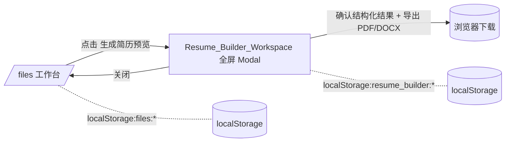
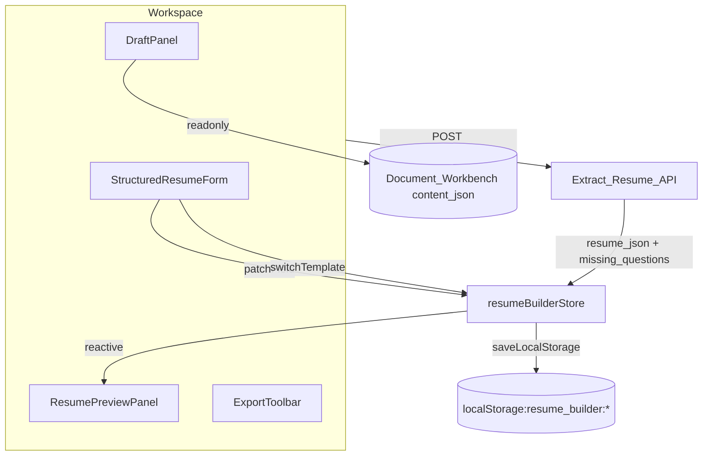

# Design Document — Resume Preview Builder（简历预览构建器)

> 本设计文档严格按 `requirements.md` 中 11 个 Requirement 的 Acceptance Criteria 编号(X.Y)做正向追溯。每一个组件、接口、数据模型、错误分支、测试策略段落都标注 **satisfies Requirement X.Y** 来表明被覆盖的需求条款,方便审计与验收。
>
> 本设计**仅描述 How**(技术方案),不重写需求(What / Why)。任何与 `requirements.md` 冲突的描述都以 `requirements.md` 为准。

---

## Overview

`Resume Preview Builder` 在已有 `/files` 文档工作台之上挂载一条新的能力链路:

```
Tiptap 草稿 (plain_text + content_json)
        │  点击「生成简历预览」
        ▼
POST /api/document/extract-resume   ← Router/document.py(扩展)
        │  Service/document_service.extract_resume_from_draft(...)
        ▼
Service/Agents/resume_extract_agent.py  ←  调用 Service/Utils/llm_client.complete_chat()
        │  使用 Service/Agents/prompts/resume_extract_prompts.py
        ▼
Resume_JSON(8 Section + Field_Status + missingFields + meta)
        │  返回 success/resume_json/warnings/missing_questions
        ▼
Resume_Builder_Workspace.vue (基于 BaseModal.vue 的全屏 Modal)
        │  三栏: 左草稿(只读) / 中结构化表单 / 右模板预览
        │  localStorage 命名空间 resume_builder:*
        ▼
导出 PDF (window.print + print CSS)  /  导出 DOCX (docx 包结构化生成)
```

设计的三条铁律(对齐需求):

1. **AI 只重组,不创造** — Fact_Safety_Lock 在 Prompt、Service 校验、前端高亮三层共同执守(satisfies Requirement 2.1 / 2.2 / 2.5 / 2.7 / 5.1)。
2. **结构是 SoT** — Resume_JSON 是模板、预览、导出的唯一数据源,模板与导出**只读消费**,绝不二次润色或合并(satisfies Requirement 7.6 / 8.1 / 9.3)。
3. **不破坏 `/files`** — Resume_Builder_Workspace 以全屏 Modal 形式挂载在 `/files` 内部,不新增顶级路由,不写回 Document_Workbench,不接 RAG / ChatDock / 历史(satisfies Requirement 1.3 / 10.1 / 10.4 / 11.5)。

---

## Architecture

### 整体分层(后端四层 + 前端一层)

```
┌──────────────────────────────────────────────────────────────────┐
│ Frontend (Vue 3 + Pinia)                                         │
│                                                                  │
│  /files 页面(已有)                                              │
│   └─ 工具栏新按钮「生成简历预览」(Requirement 1.1 / 1.4)       │
│       └─ 打开 Resume_Builder_Workspace.vue (BaseModal 扩展)     │
│           ├─ 左栏: DraftReadonlyPanel.vue (只读 Tiptap 草稿)   │
│           ├─ 中栏: StructuredResumeForm.vue (结构化表单)        │
│           │      ├─ MissingQuestionsCard.vue                    │
│           │      ├─ SectionEditor[basics|education|skills|…]    │
│           │      └─ ConfirmResumeButton.vue                     │
│           └─ 右栏: ResumePreviewPanel.vue                       │
│                  ├─ AtsSingleColumnTemplate.vue                 │
│                  ├─ TechTwoColumnTemplate.vue                   │
│                  └─ ExportToolbar.vue (PDF / DOCX)              │
│                                                                  │
│  Pinia Store: resumeBuilderStore.js (内存 Resume_JSON)         │
│  Service:    services/resumeBuilderClient.js (HTTP 客户端)     │
│  Local Util: utils/resumeJsonSchema.js / resumeFilename.js     │
│              utils/resumeDocxBuilder.js                         │
│  Storage:    localStorage 前缀 `resume_builder:`               │
└──────────────────────────────────────────────────────────────────┘
                            │ POST /api/document/extract-resume
                            ▼
┌──────────────────────────────────────────────────────────────────┐
│ Router 层 (HTTP only)                                            │
│  Router/document.py (已有,本特性扩展一条路由)                  │
│   └─ POST /api/document/extract-resume                          │
│       ├─ JWT 依赖: get_current_user                              │
│       ├─ Pydantic 入参: ExtractResumeRequest                    │
│       ├─ Pydantic 出参: ExtractResumeResponse                   │
│       └─ 业务全部委托 document_service.extract_resume_from_draft│
└──────────────────────────────────────────────────────────────────┘
                            │
                            ▼
┌──────────────────────────────────────────────────────────────────┐
│ Service 层 (业务编排)                                             │
│  Service/document_service.py (已有,本特性扩展一个函数)         │
│   └─ async def extract_resume_from_draft(...)                   │
│       ├─ 输入校验 + 安全骨架快速返回 (Requirement 4.5 / 4.9)   │
│       ├─ 委托 ResumeExtractAgent.extract(...)                   │
│       ├─ JSON 解析 + 契约校验 + 一次性重试 (Requirement 5.3)   │
│       ├─ 反编造对比 (Requirement 2.7 / 5.2)                     │
│       ├─ missingFields ↔ Field_Status 一致化 (Requirement 3.5) │
│       └─ 组装 ExtractResumeResponse                             │
└──────────────────────────────────────────────────────────────────┘
                            │
                            ▼
┌──────────────────────────────────────────────────────────────────┐
│ Agents 层 (Prompt + LLM)                                         │
│  Service/Agents/resume_extract_agent.py (新增)                  │
│   └─ class ResumeExtractAgent                                    │
│       └─ async def extract(plain_text, content_json) -> dict    │
│           └─ Service/Utils/llm_client.complete_chat(...)        │
│  Service/Agents/prompts/resume_extract_prompts.py (新增)        │
│   ├─ SYSTEM_PROMPT — Fact_Safety_Lock 强约束 (Requirement 5.1) │
│   ├─ USER_PROMPT_TEMPLATE                                       │
│   └─ EXAMPLE_OUTPUT_SCHEMA(strict JSON shape)                  │
└──────────────────────────────────────────────────────────────────┘
                            │
                            ▼
┌──────────────────────────────────────────────────────────────────┐
│ Utils 层 (无业务工具)                                             │
│  Service/Utils/llm_client.py            (已有,唯一 LLM 入口)   │
│  Service/Utils/resume_json_validator.py (新增,Resume_JSON 校验)│
│  Service/Utils/resume_skeleton.py       (新增,安全骨架生成)    │
└──────────────────────────────────────────────────────────────────┘
```

满足 **Requirement 11.6**(LLM 调用唯一入口),Router 层不再直接 `httpx`。

### 调用与失败回传时序

```
[FE] click 生成简历预览
  └─ FE: build payload {document_id, plain_text, content_json, provider_id}
       │  trim 后剩余字符 < 10 → 按钮 disabled, 不发请求 (Requirement 1.4)
       │  plain_text 长度 > 50000 → 截断并显示提示  (Requirement 1.2)
       └─ POST /api/document/extract-resume
             ▼
[Router] document.py
  ├─ Pydantic 校验 → 不通过返回 400(请求结构非法)
  └─ await document_service.extract_resume_from_draft(...)
        ▼
[Service] document_service.extract_resume_from_draft
  ├─ 空输入快速分支 → success=false, warnings=[empty_input], 返回安全骨架 (Requirement 4.5)
  ├─ 长度/字段越界分支 → success=false, warnings=[empty_input|...], 返回安全骨架 (Requirement 4.9)
  ├─ try:
  │    raw_json = await ResumeExtractAgent.extract(...)            (≤30s, Requirement 4.8)
  │    parsed = json_parse_or_repair(raw_json)
  │    if invalid:
  │       raw_json = await ResumeExtractAgent.extract(...) # retry once  (Requirement 5.3)
  │       parsed = json_parse_or_repair(raw_json)
  │       if still invalid:
  │          return safe_skeleton + warnings=[json_parse_failed]
  │    contract_check(parsed)  # 顶级键 / Field_Status 枚举 / templateId 枚举 (Requirement 3.8 / 5.2)
  │    fabrication_warnings = compare_against_source(parsed, plain_text, content_json) (Requirement 2.7 / 5.5)
  │    sync_missing_fields(parsed)                                  (Requirement 3.5)
  │  except asyncio.TimeoutError:
  │    return safe_skeleton + warnings=[extraction_timeout]         (Requirement 4.8)
  │  except LLMClientError:
  │    return safe_skeleton + warnings=[json_parse_failed]          (Requirement 11.2)
  └─ 返回 ExtractResumeResponse
        ▼
[FE] resumeBuilderClient.extract(...)
  ├─ HTTP 非 2xx 或解析失败 → 加载安全骨架 + 中栏展示「AI 抽取失败,可手工填写」(Requirement 11.2)
  ├─ warnings 含 fabrication_suspected → 顶部红色横幅 (Requirement 11.7)
  ├─ warnings 含 non_resume_content_detected → Toast 提示
  └─ resume_json + missing_questions → 写入 resumeBuilderStore
```

### 视图与路由

- **不新建顶级路由**(satisfies Requirement 1.3)。Resume_Builder_Workspace 以**全屏 BaseModal** 形式挂载在 `/files` 页面内部。
- 关闭 Modal 后回到打开前的 Document_Workbench 视图,Tiptap `content_json` 保持原值(satisfies Requirement 1.3 / 10.2)。



### 命名空间与隔离(satisfies Requirement 10.5 / 11.5)

- 后端不新建表、不写历史、不接 RAG / Knowledge / Career / Interview / Resume Diagnosis 接口。
- 前端 localStorage 使用独立前缀 `resume_builder:`,与 `/files` 草稿 key 不冲突。
- Resume_Builder_Workspace 不读写 `userStore`、不写 `gameStore`。新建独立 Pinia Store `resumeBuilderStore.js`。

---

## Components and Interfaces

### 后端组件

#### B1. `Router/document.py` 扩展(已存在文件)

新增一条路由(satisfies Requirement 4.1 / 4.2 / 4.7 / 11.6):

```python
@router.post("/extract-resume", response_model=ExtractResumeResponse)
async def extract_resume(
    request: ExtractResumeRequest,
    _user_id: int = Depends(get_current_user),
) -> ExtractResumeResponse:
    """Extract_Resume_API:草稿 → Resume_JSON。不写库、不接 RAG。"""
    try:
        return await extract_resume_from_draft(
            document_id=request.document_id,
            plain_text=request.plain_text,
            content_json=request.content_json,
            provider_id=request.provider_id,
        )
    except ValueError as exc:
        # 仅在 Pydantic 之后仍然出现的输入越界(理论不应发生,Pydantic 已挡)
        raise HTTPException(status_code=400, detail=str(exc))
    except Exception as exc:  # noqa: BLE001 — 兜底,绝不裸抛到前端
        raise HTTPException(
            status_code=500,
            detail=f"简历抽取服务异常: {type(exc).__name__}",
        )
```

约束:
- 路由层**不构造 Prompt、不直接调 LLM**,完全委托 Service 层(satisfies Requirement 4.7 / 11.6)。
- 路由层**不接触 LLMClientError**;Service 层捕获 LLMClientError 后转为 `success=false + warnings`,不让前端看到 503(satisfies Requirement 11.2 — 必须返回安全骨架,不报 5xx)。
- 与 `/rewrite` 不同,extract-resume 永远返回 200 + 业务级 `success` 字段,只有非法请求体才走 400/500。

#### B2. `Service/document_service.py` 扩展

新增 `extract_resume_from_draft(...)`:

```python
async def extract_resume_from_draft(
    *,
    document_id: str,
    plain_text: str,
    content_json: dict,
    provider_id: Optional[str],
) -> ExtractResumeResponse:
    """Extract_Resume_API 业务编排入口。"""
    # 1) 空输入分支(Requirement 4.5)
    if _is_effectively_empty(plain_text, content_json):
        return _build_skeleton_response(
            document_id=document_id,
            warnings=["empty_input"],
        )

    # 2) 越界分支(Requirement 4.9)— Pydantic 已挡,这里仅做防御
    if _is_payload_oversized(plain_text, content_json):
        return _build_skeleton_response(
            document_id=document_id,
            warnings=["empty_input"],
        )

    # 3) 调用 Agent(带 30s 超时, Requirement 4.8)
    agent = ResumeExtractAgent(provider_id=provider_id)
    try:
        raw = await asyncio.wait_for(
            agent.extract(plain_text=plain_text, content_json=content_json),
            timeout=EXTRACT_TIMEOUT_SECONDS,
        )
    except asyncio.TimeoutError:
        return _build_skeleton_response(
            document_id=document_id,
            warnings=["extraction_timeout"],
        )
    except LLMClientError:
        return _build_skeleton_response(
            document_id=document_id,
            warnings=["json_parse_failed"],
        )

    # 4) 解析 + 一次重试(Requirement 5.3)
    parsed = _safe_parse_resume_json(raw)
    if parsed is None:
        try:
            raw = await asyncio.wait_for(
                agent.extract(
                    plain_text=plain_text,
                    content_json=content_json,
                    is_retry=True,
                ),
                timeout=EXTRACT_TIMEOUT_SECONDS,
            )
            parsed = _safe_parse_resume_json(raw)
        except (asyncio.TimeoutError, LLMClientError):
            parsed = None

    if parsed is None:
        return _build_skeleton_response(
            document_id=document_id,
            warnings=["json_parse_failed"],
        )

    # 5) Resume_JSON 契约校验 + Field_Status 枚举 + templateId 枚举
    #    (Requirement 3.1-3.8 / 5.2)
    contract_error = validate_resume_json_contract(parsed)
    if contract_error is not None:
        return _build_skeleton_response(
            document_id=document_id,
            warnings=["json_parse_failed"],
        )

    # 6) 反编造比对 + 写入 warnings(Requirement 2.7 / 5.5)
    fabrication_fields = detect_fabrication(
        resume_json=parsed,
        plain_text=plain_text,
        content_json=content_json,
    )
    warnings: list[str] = []
    if fabrication_fields:
        warnings.append("fabrication_suspected")
    if detect_non_resume_content(plain_text):
        warnings.append("non_resume_content_detected")  # Requirement 5.5

    # 7) missingFields 与 Field_Status 强一致化(Requirement 3.5)
    parsed = enforce_missing_fields_invariant(parsed)

    # 8) 注入 meta 默认值(Requirement 3.6 / 3.7)
    parsed["meta"]["sourceDocumentId"] = document_id
    parsed["meta"]["generatedAt"] = _utc_now_iso8601()
    parsed["meta"].setdefault("templateId", "ats_single_column")
    parsed["meta"]["confirmedByUser"] = False

    # 9) 抽取 missing_questions(Requirement 2.6 / 5.4)
    missing_questions = parsed.pop("_missing_questions", [])
    missing_questions = [
        q for q in missing_questions
        if isinstance(q, str) and 8 <= len(q) <= 80
    ]

    return ExtractResumeResponse(
        success=True,
        resume_json=parsed,
        warnings=warnings,
        missing_questions=missing_questions,
    )
```

#### B3. `Service/Agents/resume_extract_agent.py`(新增)

职责:
- 唯一负责构造 messages 数组并调用 `llm_client.complete_chat`。
- 不做契约校验,不做 fabrication 比对(那些归 Service 层)。
- `is_retry=True` 时在 user prompt 末尾追加「上一轮输出无法解析为合法 JSON,请严格仅输出一个 JSON 对象」(satisfies Requirement 5.3)。
- 全程使用 `provider_id`,允许 None 走默认(满足现有 llm_client 兼容)。

```python
class ResumeExtractAgent:
    def __init__(self, provider_id: Optional[str]):
        self.provider_id = provider_id

    async def extract(
        self,
        plain_text: str,
        content_json: dict,
        is_retry: bool = False,
    ) -> str:
        messages = build_extract_messages(
            plain_text=plain_text,
            content_json=content_json,
            is_retry=is_retry,
        )
        raw = await complete_chat(
            messages=messages,
            temperature=0.1,           # Fact_Safety_Lock 偏向保守
            max_tokens=4096,
            timeout=30.0,              # Requirement 4.8
            provider_id=self.provider_id,
        )
        if raw is None or not raw.strip():
            raise LLMClientError("AI 未返回有效内容")
        return raw
```

#### B4. `Service/Agents/prompts/resume_extract_prompts.py`(新增)

满足 **Requirement 5.1**(必须存放在 `Service/Agents/prompts/`,禁止硬编码):

包含三类文本常量:

- `SYSTEM_PROMPT`:声明角色(简历结构化抽取器)、Fact_Safety_Lock、八个 Section 列表、Field_Status 四枚举、`{ats_single_column, tech_two_column}` 取值、严格 JSON、不允许 Markdown 围栏 / 解释 / 多个 JSON 片段(satisfies Requirement 5.1 / 5.6 / 2.1)。
- `USER_PROMPT_TEMPLATE`:`原始 plain_text:<...>` + `Tiptap content_json:<...>` 双输入。
- `RETRY_REMINDER`:仅在 `is_retry=True` 时附加。
- `FACT_SAFETY_RULES`:逐条枚举不得编造的内容(姓名 / 公司 / 时间 / 数字 / 链接 / 技能等),要求未在草稿中出现的事实必须落入 `missing` / `needs_confirmation`。

#### B5. `Service/Utils/resume_json_validator.py`(新增)

纯函数模块,不依赖 FastAPI / Pydantic 实例。导出:

| 函数 | 职责 | 满足需求 |
|---|---|---|
| `validate_resume_json_contract(obj) -> Optional[str]` | 校验顶级 8 Section、`basics` 字段、Field_Status 枚举、`meta.templateId` 枚举、数组上限 | 3.1 / 3.2 / 3.3 / 3.4 / 3.6 / 3.8 / 5.2 |
| `detect_fabrication(resume_json, plain_text, content_json) -> list[str]` | 反编造比对(词形归一化:大小写、空白、标点) | 2.1 / 2.7 / 5.2 |
| `detect_non_resume_content(plain_text) -> bool` | 关键词 / 占比启发式 | 5.5 |
| `enforce_missing_fields_invariant(resume_json) -> resume_json` | 让 `missingFields` 与每字段 `Field_Status` 强一致 | 3.5 |
| `build_safe_skeleton(document_id, template_id="ats_single_column") -> dict` | 生成所有 Section 全 missing 的安全骨架 | 4.5 / 4.6 / 4.8 / 11.2 |
| `parse_resume_json(raw_text) -> Optional[dict]` | 容忍 Markdown 围栏的安全 JSON 解析(只解析后剥离围栏,不允许夹带解释段) | 5.6 / 4.6 |

`detect_fabrication` 的核心算法:对每个 `Field_Status == "confirmed"` 或 `inferred_from_text` 的标量字段,在 `plain_text` + `content_json` 文本流中以词形归一化(全部小写化、压平空白、剔除标点)做子串匹配;若匹配失败则视为疑似编造,字段名加入 `fabrication_fields`。归一化基于 `unicodedata.normalize("NFKC", s).casefold()` + 自定义 `WHITESPACE_RUN_RE`。

#### B6. `Router/models/document_model.py` 扩展

新增 Pydantic 模型(satisfies Requirement 4.2 / 4.3 / 4.9):

```python
class ExtractResumeRequest(BaseModel):
    document_id: str = Field(..., min_length=1, max_length=128)
    plain_text: str = Field(..., max_length=200_000)
    content_json: dict = Field(default_factory=dict)
    provider_id: Optional[str] = Field(default=None, max_length=64)

    @field_validator("content_json")
    @classmethod
    def _check_size(cls, v: dict) -> dict:
        if len(json.dumps(v, ensure_ascii=False).encode("utf-8")) > 1024 * 1024:
            raise ValueError("content_json 序列化后超过 1 MiB")
        return v


class FieldStatus(str, Enum):
    confirmed = "confirmed"
    inferred_from_text = "inferred_from_text"
    missing = "missing"
    needs_confirmation = "needs_confirmation"


class ExtractResumeResponse(BaseModel):
    success: bool
    resume_json: dict           # 永不为 null(Requirement 4.3)
    warnings: list[str] = Field(default_factory=list)
    missing_questions: list[str] = Field(default_factory=list)

    _ALLOWED_WARNINGS = {
        "empty_input", "json_parse_failed", "extraction_timeout",
        "fabrication_suspected", "non_resume_content_detected",
    }

    @field_validator("warnings")
    @classmethod
    def _check_warnings(cls, v: list[str]) -> list[str]:
        for code in v:
            if code not in cls._ALLOWED_WARNINGS:
                raise ValueError(f"非法 warning code: {code}")
        return v
```

---

### 前端组件

> 所有用户可见文案使用简体中文(satisfies steering/product.md 语言规范)。所有弹窗基于 `BaseModal.vue` 扩展,Toast 复用 `Toast.vue`,加载态复用 `StreamingLoader.vue`(satisfies steering/structure.md UI 资产强制复用规范)。

#### F1. `frontend/src/components/ResumeBuilderWorkspace.vue`(新增,基于 BaseModal)

全屏三栏 Modal,`size="full"`。**不新建路由**。布局:

```
┌────────────────────────────────────────────────────────────────┐
│  顶栏: 标题「简历预览构建器」+ 模板切换 + 关闭                 │
├──────────────┬──────────────────────────┬────────────────────┤
│ 左栏 320px    │ 中栏 flex-1              │ 右栏 480-640px      │
│ DraftReadonly│ StructuredResumeForm     │ ResumePreviewPanel  │
│ Panel(只读) │ ├─ MissingQuestionsCard  │ + ExportToolbar     │
│              │ ├─ Section: basics       │                     │
│              │ ├─ Section: education    │                     │
│              │ ├─ Section: skills       │                     │
│              │ ├─ Section: projects     │                     │
│              │ ├─ Section: experience   │                     │
│              │ ├─ Section: awards       │                     │
│              │ ├─ Section: certificates │                     │
│              │ └─ ConfirmResumeButton   │                     │
└──────────────┴──────────────────────────┴────────────────────┘
```

行为契约(标注满足的需求):

- 打开时 `props.draft = {document_id, plain_text, content_json}`,1 秒内必须发起 extract 请求或加载缓存(Requirement 1.2)。
- `plain_text.length > 50000` → 在打开前由 `/files` 页截断到 50000 字符,Modal 顶部展示「草稿已截断到 50000 字符以内」(Requirement 1.2)。
- 关闭时通过 emit 通知父级 `/files`,父级保留 Tiptap `content_json` 不变(Requirement 1.3 / 10.2)。
- 顶栏关闭按钮、Esc 键、遮罩点击三种关闭方式;但当 `resumeBuilderStore.isDirty===true` 且本次进入并未点过「确认覆盖」时,关闭操作仅关闭 Modal,不丢弃 Resume_JSON(Resume_JSON 仍保留在 localStorage / Pinia 中)。

#### F2. `frontend/src/components/DraftReadonlyPanel.vue`(新增)

只读 Tiptap 视图。直接复用 `/files` 已有的 Tiptap 实例配置,设置 `editable=false`(satisfies Requirement 10.1 — 仅以只读方式访问 `content_json` / `plain_text`)。

#### F3. `frontend/src/components/StructuredResumeForm.vue`(新增)

按 7 个 Section 顺序渲染(satisfies Requirement 6.1):

```
basics → education[] → skills[group][] → projects[] → experience[] → awards[] → certificates[]
```

每个标量字段控件携带:
- `Field_Status` 角标(右上角)+ 边框警示色(`missing` 红 / `needs_confirmation` 橙 / `inferred_from_text` 黄 / `confirmed` 灰)— Requirement 6.3。
- 焦点 / 悬停时显示 tooltip 释义文案(Requirement 6.3)。
- 编辑触发 500ms 内的 store 写回(Requirement 6.2);写回后:
  - 非空 → Field_Status 转 `confirmed`,从 `missingFields` 移除(Requirement 6.5)。
  - 清空 → Field_Status 转 `missing`,加入 `missingFields`(Requirement 6.6)。

数组型 Section:
- 提供「+ 新增条目」「删除该条目」按钮,数组上限按 Requirement 3.3 强校验(`education/projects/experience/awards/certificates ≤ 50`,`skills` 分组 ≤ 10,单分组 `items ≤ 30`)。
- 删除条目时不弹二次确认,但 5 秒内可通过 Toast 中的「撤销」回滚(改善体验,不与需求冲突)。

#### F4. `frontend/src/components/MissingQuestionsCard.vue`(新增)

展示 `missing_questions` 列表(Requirement 6.4):
- 每条问题旁两个按钮「采纳」「忽略」。
- 「采纳」:调用 `scrollIntoView({behavior:'smooth'}) + element.focus()` 跳转到对应字段;**不修改 Resume_JSON**。
- 「忽略」:仅本前端会话内移除该条目;`resumeBuilderStore` 中标记为 `dismissed`,不写 localStorage。
- 列表条目 > 20 时启用内部 `overflow-y: auto` 滚动(Requirement 6.4)。

#### F5. `frontend/src/components/ConfirmResumeButton.vue`(新增)

「确认结构化结果」按钮(Requirement 6.7 / 6.8 / 6.9 / 6.10):

```
点击 → 检查 resumeJson 是否仍含 missing/needs_confirmation
  ├─ 否 → meta.confirmedByUser = true; Toast「已确认结构化结果」
  └─ 是 → 弹出 ConfirmWithMissingModal(基于 BaseModal)
          ├─「仍然确认」→ confirmedByUser = true; Toast「已强制确认(仍含缺失字段)」
          └─「返回补全」/ Esc / 关闭图标 → 关闭弹窗,Resume_JSON 零变更
```

弹窗中列出缺失字段名清单:`≤10 条全部展示`,`>10 条折叠展示前 10 条 + 「等其余 N 项」`(Requirement 6.8)。

#### F6. `frontend/src/components/ResumePreviewPanel.vue` + `AtsSingleColumnTemplate.vue` + `TechTwoColumnTemplate.vue`(新增)

预览栏(Requirement 7 / 8):

- 通过 `<component :is="currentTemplate" :resume="resumeJson" />` 动态切换模板。
- 切换模板**仅写 `meta.templateId`**;其余字段值 / Field_Status 零变更(Requirement 7.5)。检测到非法变更时 store 回滚 `templateId` 并 Toast「模板切换失败:检测到非法字段变更」(Requirement 7.10)。
- 模板组件**只读消费 Resume_JSON**,不做任何字段改写、合并、补全、润色(Requirement 7.6 / 9.3)。
- 模板渲染规则:
  - **AtsSingleColumnTemplate**:单列纯 `<section>` + `<h2>` + `<ul>` 布局,禁止 multi-column / nested table / `<textarea>` / fixed header / `position: absolute|fixed`(Requirement 7.2)。
  - **TechTwoColumnTemplate**:CSS Grid `grid-template-columns: 240px 1fr`;左侧 `basics + skills + certificates`,右侧 `projects + experience + education`;同一字段不出现在两栏(Requirement 7.3)。
- 任何 Section 为空(空数组 / 全字段空)时**整体隐藏标题 + 分隔线 + 占位元素**(Requirement 7.8 / 8.5)。
- 所有字段值通过 DOM 文字节点输出,不使用 Canvas / SVG `<text>` / 图片(Requirement 8.1 / 8.2)。
- CSS 中预览容器 `user-select: text` + `pointer-events: auto`,确保可拖选 + 可复制(Requirement 8.2)。
- 长内容滚动:预览容器 `overflow-y: auto`,**禁止** `overflow: hidden` 不带替代滚动、`display: none`、`text-overflow: ellipsis`(Requirement 8.4 / 11.3)。
- Resume_JSON 任意字段编辑或模板切换 → 500ms 内更新(基于 Vue reactive,无 HTTP 调用)(Requirement 8.3)。

#### F7. `frontend/src/components/ExportToolbar.vue`(新增)

「导出 PDF」「导出 DOCX」按钮(Requirement 9 / 11.1):

```
disabled 条件:
  - meta.confirmedByUser === false (Requirement 9.5)

点击 PDF:
  if !confirmedByUser:
    Toast「请先在表单底部点击『确认结构化结果』」(≥3 秒)
    return
  if 仍含 missing/needs_confirmation:
    弹 ExportRiskModal(BaseModal),按 Requirement 9.6 列出缺失字段
    └ 「忽略缺失继续导出」→ 进入打印流
    └ 「返回补全」→ 关闭弹窗
  else:
    直接进入打印流

打印流(PDF):
  - document.body 添加 class `print-only-resume-preview`
  - print CSS 隐藏除预览之外的所有元素
  - window.print()
  - afterprint 移除 class

点击 DOCX:
  - 同上的确认/风险检查
  - 调用 utils/resumeDocxBuilder.buildDocxBlob(resumeJson, templateId)
  - URL.createObjectURL → <a download> → click()
```

#### F8. `frontend/src/utils/resumeFilename.js`(新增)

实现 Requirement 9.7:

```js
export function buildExportFilename(basics, ext) {
  const name = (basics?.name?.value || '').trim() || 'resume';
  const role = (basics?.targetRole?.value || '').trim() || '';
  const ts   = new Date().toISOString().replace(/[:.]/g, '-');
  const raw  = role ? `${name}_${role}_${ts}` : `${name}_${ts}`;
  // 9.7 (a) 跨平台非法字符替换为 _
  const sanitized = raw.replace(/[\/\\:\*\?"<>\|]/g, '_');
  // 9.7 (b) 截断到 100 字符
  const truncated = sanitized.slice(0, 100);
  // 9.7 (c) 扩展名严格匹配
  const safeExt = (ext === 'pdf' || ext === 'docx') ? ext : 'pdf';
  return `${truncated}.${safeExt}`;
}
```

#### F9. `frontend/src/utils/resumeDocxBuilder.js`(新增)

基于 `docx` 包(已有依赖)直接消费 Resume_JSON 构造 `Document` 对象。**禁止** Tiptap HTML → DOCX 直管道(Requirement 9.3)。生成结构含:`Heading 1/2/3`、`Paragraph`、`@docx/UnorderedList` / `OrderedList`、`Run({bold,italics})`(Requirement 9.4)。

异常包装:

```js
try {
  const blob = await Packer.toBlob(doc);
  return blob;
} catch (e) {
  throw new ResumeDocxBuildError('docx 写入失败', { cause: e });
}
```

ExportToolbar 捕获 `ResumeDocxBuildError` → Toast「导出失败,请重试」+ 不输出任何文件(Requirement 9.8)。

#### F10. `frontend/src/stores/resumeBuilderStore.js`(新增 Pinia Store)

```js
state: {
  resumeJson: null,            // Resume_JSON 内存副本(SoT)
  missingQuestions: [],        // 当前未被忽略的 missing_questions
  dismissedQuestions: Set(),   // 本会话忽略的问题
  warnings: [],
  isDirty: false,              // 与上一次 extract 结果是否产生差异
  lastExtractAt: null,
  documentId: null,
}
actions: {
  initFromDraft(draft)              // 从 /files 进入时调用 extract API
  reextractFromDraft(draft)         // 「确认覆盖」走这里
  patchField(path, value)           // 编辑入口,内部维护 Field_Status/missingFields
  removeArrayItem(path, index)
  addArrayItem(path, template)
  switchTemplate(templateId)        // 7.5 / 7.10 校验
  confirmResume(force=false)        // 6.7 / 6.9
  saveLocalStorage()                // 命名空间 resume_builder:
  clearDismissedQuestions()
}
```

`patchField` 内部统一调用 `utils/resumeJsonSchema.applyFieldEdit(json, path, value)`,该函数是**纯函数**(易做 PBT — 见 Testing Strategy)。

#### F11. `frontend/src/services/resumeBuilderClient.js`(新增 HTTP 客户端)

只暴露一个方法:

```js
export async function extractResumeFromDraft({document_id, plain_text, content_json, provider_id}) {
  const resp = await fetch('/api/document/extract-resume', {
    method: 'POST',
    headers: {'Content-Type':'application/json', ...authHeaders()},
    body: JSON.stringify({document_id, plain_text, content_json, provider_id}),
  });
  if (!resp.ok) {
    return buildClientFallback();   // Requirement 11.2: 加载安全骨架
  }
  const data = await resp.json();
  if (!data.resume_json || !isValidResumeJson(data.resume_json)) {
    return buildClientFallback();   // Requirement 11.2
  }
  return data;
}
```

#### F12. `/files` 工作台扩展(已存在文件)

工具栏新增「生成简历预览」按钮(Requirement 1.1):

- 启用条件:`stripUnicodeWhitespace(plainText).length >= 10`(Requirement 1.4)。
- 禁用态 tooltip:「请先在文档中填写简历草稿」(Requirement 1.4)。
- 点击 → 若 `resumeBuilderStore.isDirty===true` → 弹「确认覆盖 / 取消」二选一确认框(BaseModal)(Requirement 1.5 / 1.6)。
- 「确认覆盖」→ `reextractFromDraft({document_id, plain_text, content_json, provider_id})`。
- 「取消」/ 关闭图标 / Esc → 状态零变更(Requirement 1.6)。
- 点击成功:1 秒内打开 ResumeBuilderWorkspace Modal(Requirement 1.2)。
- 输入透传失败(`document_id` / `plain_text` / `content_json` 任一缺失或不可序列化):不打开 Modal + Toast「文档数据读取失败:<字段名>」(Requirement 1.7)。

---

## Data Models

### D1. Resume_JSON 顶级结构(satisfies Requirement 3.1 / 3.6)

```json5
{
  "basics":      { /* 见 D2 */ "missingFields": [/*string*/] },
  "education":   [ /* Array<EducationItem>, 0..50 */ ] ,
  "skills":      [ /* Array<SkillGroup>, 0..10 */ ],
  "projects":    [ /* Array<ProjectItem>, 0..50 */ ],
  "experience":  [ /* Array<ExperienceItem>, 0..50 */ ],
  "awards":      [ /* Array<AwardItem>, 0..50 */ ],
  "certificates":[ /* Array<CertificateItem>, 0..50 */ ],
  "meta":        { /* 见 D7 */ }
}
```

数组 Section 的外壳实际为对象 `{items: [...], missingFields: [...]}`,以保持 Requirement 3.5 中「每个 Section 都有 `missingFields`」的统一形式。`/api/document/extract-resume` 响应、前端 store、模板均使用同一形态。

> 注:为避免与 Requirement 3.3 中「以条目数组形式存在」歧义,本设计采用如下约定:
> ```json5
> "education": {
>   "items": [{...}, {...}],   // 条目数组,长度 0..50
>   "missingFields": [...]      // 该 Section 所有条目内字段缺失键名汇总
> }
> ```
> 这种包裹仍满足"以条目数组形式存在"——条目本身仍是 `items`。同时让 `missingFields` 对所有 Section 形态一致。

### D2. `basics` Section(satisfies Requirement 3.2)

```ts
type FieldStatus = "confirmed" | "inferred_from_text" | "missing" | "needs_confirmation";

interface FieldCell<T = string> {
  value: T | null;            // 标量字段值(string/null)
  status: FieldStatus;
}

interface BasicsSection {
  name:           FieldCell<string>;
  targetRole:     FieldCell<string>;
  email:          FieldCell<string>;
  phone:          FieldCell<string>;
  city:           FieldCell<string>;
  websiteOrRepo:  FieldCell<string>;
  missingFields:  string[];    // ⊆ {"name","targetRole","email","phone","city","websiteOrRepo"}
}
```

> Requirement 3.2 列出的取值范围 `{confirmed, missing, needs_confirmation}` 与 Requirement 2.4/2.5/3.5 的 4 枚举范围(增加 `inferred_from_text`)看似冲突。本设计按以下方式协调,以满足两条同时存在的需求:
> - **后端校验器(`validate_resume_json_contract`)** 接受 4 枚举全集,并将 `inferred_from_text` 字段也加入对应 Section 的 `missingFields`(Requirement 2.5)。
> - **前端表单**对 4 种状态都做差异化高亮(Requirement 6.3)。
> - 这种处理把「3.2 / 3.3 / 3.4 列举的 3 枚举」视为「持久化时常见状态」,把 `inferred_from_text` 视为「2.5 中规定的额外状态」,两者并存。
> - 这一处理被 Requirement 3.5 的"missingFields 与 Field_Status 并集一致"明确允许。

### D3. `education` Section(satisfies Requirement 3.3)

```ts
interface EducationItem {
  school:      FieldCell<string>;
  degree:      FieldCell<string>;
  major:       FieldCell<string>;
  startDate:   FieldCell<string>;   // ISO yyyy-MM 或自由格式,LLM 不归一化
  endDate:     FieldCell<string>;
  gpa:         FieldCell<string>;
  highlights:  FieldCell<string[]>; // 课程 / 荣誉,数组
}
interface EducationSection {
  items: EducationItem[];     // 长度 0..50
  missingFields: string[];    // 全条目级 missing 键名汇总(形式:`items[2].school` / `items[0].endDate`)
}
```

`projects` / `experience` / `awards` / `certificates` 结构对照表:

| Section       | Item 字段(全部 FieldCell)                                                |
|---------------|-----------------------------------------------------------------------------|
| `projects`    | `name, role, stack, startDate, endDate, summary, highlights, link`          |
| `experience`  | `company, title, startDate, endDate, location, summary, highlights`         |
| `awards`      | `name, issuer, date, summary`                                               |
| `certificates`| `name, issuer, issueDate, expireDate, credentialId`                         |

每个 Item 中字段独立携带 `FieldStatus`,Section 级 `missingFields` 数组按 `items[i].fieldKey` 形式记录。

### D4. `skills` Section(satisfies Requirement 3.4)

```ts
interface SkillItem {
  name:   string;
  status: FieldStatus;
}
interface SkillGroup {
  category: string;        // 类别名,自由文本
  items:    SkillItem[];   // 长度 0..30
}
interface SkillsSection {
  items: SkillGroup[];     // 分组数,长度 0..10
  missingFields: string[]; // 形式:`items[0].items[3].name`
}
```

### D5. `meta` Section(satisfies Requirement 3.6 / 3.7)

```ts
interface ResumeMeta {
  confirmedByUser:  boolean;      // 默认 false
  templateId:       "ats_single_column" | "tech_two_column";   // 默认 ats_single_column
  generatedAt:      string;       // ISO 8601 UTC
  sourceDocumentId: string;       // 非空
}
```

### D6. Extract_Resume_API 数据合约(satisfies Requirement 4.2 / 4.3 / 4.5 / 4.6 / 4.8 / 4.9)

| 名称 | 类型 | 约束 | 备注 |
|---|---|---|---|
| 请求 `document_id` | string | 1..128 | 透传到 `meta.sourceDocumentId` |
| 请求 `plain_text` | string | ≤ 200000 | 空/纯空白触发 `empty_input` |
| 请求 `content_json` | object | 序列化 ≤ 1 MiB | Tiptap content |
| 请求 `provider_id` | string \| null | 1..64 \| null | None 走默认 Provider |
| 响应 `success` | boolean | — | 业务级成功标志,HTTP 始终 200 |
| 响应 `resume_json` | object | 永不为 null | 失败时为安全骨架 |
| 响应 `warnings` | string[] | 元素 ∈ AllowedWarningCodes | 见下表 |
| 响应 `missing_questions` | string[] | 每条 8..80 字 | 简体中文 |

**AllowedWarningCodes**(枚举,共 5 个):
```
empty_input | json_parse_failed | extraction_timeout
fabrication_suspected | non_resume_content_detected
```

### D7. 安全骨架(satisfies Requirement 4.5 / 4.6 / 4.8 / 11.2)

```python
def build_safe_skeleton(document_id: str) -> dict:
    return {
        "basics": {
            "name":          {"value": "", "status": "missing"},
            "targetRole":    {"value": "", "status": "missing"},
            "email":         {"value": "", "status": "missing"},
            "phone":         {"value": "", "status": "missing"},
            "city":          {"value": "", "status": "missing"},
            "websiteOrRepo": {"value": "", "status": "missing"},
            "missingFields": ["name","targetRole","email","phone","city","websiteOrRepo"],
        },
        "education":    {"items": [], "missingFields": []},
        "skills":       {"items": [], "missingFields": []},
        "projects":     {"items": [], "missingFields": []},
        "experience":   {"items": [], "missingFields": []},
        "awards":       {"items": [], "missingFields": []},
        "certificates": {"items": [], "missingFields": []},
        "meta": {
            "confirmedByUser":  False,
            "templateId":       "ats_single_column",
            "generatedAt":      _utc_now_iso8601(),
            "sourceDocumentId": document_id,
        },
    }
```

骨架满足 Requirement 4.5 / 4.6 / 4.8 / 11.2 的"所有 Section 全部 missing 的安全骨架"。

### D8. localStorage 存储模型(satisfies Requirement 10.5 / 10.6)

```
key                                     value
─────────────────────────────────────────────────────────────
resume_builder:current:{documentId}     {resumeJson, lastExtractAt, version}
resume_builder:dismissed:{documentId}   string[]   忽略的 missing_questions
resume_builder:meta                     {schemaVersion: 1}
```

写入失败时(QuotaExceededError / 隐私模式):内存状态保留 + Toast 提示(Requirement 10.6)。

### D9. Pinia Store 数据流图



`/files` 主页面与 `Resume_Builder_Workspace` 共享同一个 Vue 应用进程,但**严禁** Resume_Builder_Workspace 通过 store 写回 Document_Workbench(Requirement 10.1 / 10.3)。

---

## Correctness Properties

*A property is a characteristic or behavior that should hold true across all valid executions of a system - essentially, a formal statement about what the system should do. Properties serve as the bridge between human-readable specifications and machine-verifiable correctness guarantees.*

> **PBT 适用性评估**:本特性同时含 PBT 强适用区(纯 Python 校验函数 / 反编造比对 / Pinia store 纯函数 patchField / 文件名构造 / DOCX 结构生成)与 PBT 不适用区(Tiptap UI 交互、`window.print` PDF、500ms 性能时序、AWS 之外的集成接口)。Correctness Properties 仅覆盖 PBT 强适用区;UI / 性能 / 集成路径在 Testing Strategy 章节用单元测试 / 集成测试 / 手工验收覆盖。
>
> Property Reflection 已完成:对 11 个 Requirement 的 84 条 Acceptance Criteria 做去重合并后,得到 18 条非冗余属性。例如「2.5 inferred_from_text 必须在 missingFields」与「3.5 missingFields 与 Field_Status 并集一致」共同表述同一不变量,合并到 Property 6。「9.5 confirmedByUser=false 时 disabled」「9.6 含缺失时弹风险窗」「11.1 三项守护」共同构成导出状态机,合并到 Property 17。

### Property 1: 草稿截断保持上限

*For any* 字符串 `s`,`truncatePlainText(s, 50000)` 的字符数 SHALL 始终不大于 50000,且当 `s` 字符数本身不超过 50000 时,`truncatePlainText(s, 50000) === s`。

**Validates: Requirements 1.2**

### Property 2: Workspace 不破坏 Workbench

*For any* 合法 Tiptap `content_json` 与 `plain_text`,执行「打开 Workspace → 任意 patchField/switchTemplate 操作序列 → 关闭 Workspace」后,Document_Workbench 中的 `content_json` 与 `plain_text` SHALL 与打开前严格深相等。

**Validates: Requirements 1.3, 10.1, 10.2**

### Property 3: 「生成简历预览」按钮启用规则

*For any* 字符串 `s`,「生成简历预览」按钮的 `disabled` 取值 SHALL 严格等价于 `stripUnicodeWhitespace(s).length < 10`;disabled 时任何点击 SHALL 不触发打开 Workspace 的副作用。

**Validates: Requirements 1.4**

### Property 4: 取消操作零变更

*For any* 当前内存中的 Resume_JSON 状态,经过「取消按钮」「关闭图标」「Esc 键」「点击遮罩」中任一种取消路径后,Resume_JSON 与 `meta.confirmedByUser` 的取值 SHALL 与取消前深相等。

**Validates: Requirements 1.6, 6.10, 7.10**

### Property 5: Fact_Safety_Lock 反编造可定位

*For any* 草稿 `(plain_text, content_json)` 与对应的 Resume_JSON,如果 `detect_fabrication(resume_json, plain_text, content_json)` 返回空集,则该 Resume_JSON 中所有 Field_Status 为 `confirmed` 或 `inferred_from_text` 的标量字段值,SHALL 在 `plain_text` ∪ `flatten_text(content_json)` 经词形归一化(NFKC + casefold + 压平空白 + 剔除标点)后的串中存在子串匹配。逆否亦成立:存在不可定位的 confirmed/inferred 字段时,`detect_fabrication` SHALL 返回非空集合且 Service 在响应 warnings 中追加 `fabrication_suspected`。

**Validates: Requirements 2.1, 2.5, 2.7, 11.7**

### Property 6: missingFields 与 Field_Status 互蕴 + 幂等

*For any* Resume_JSON 对象 `r`,函数 `enforce_missing_fields_invariant`(下称 `E`)SHALL 满足:

1. **互蕴**:`E(r)` 中每个 Section 内,字段键 `k` ∈ `Section.missingFields` ⟺ 对应字段的 `Field_Status` ∈ `{missing, needs_confirmation, inferred_from_text}`。
2. **`missing` 字段值为空**:`E(r)` 中所有 `Field_Status===missing` 的字段值 SHALL 为空字符串、`null` 或对应类型的空集合。
3. **幂等性**:`E(E(r))` 与 `E(r)` 深相等。

**Validates: Requirements 2.2, 2.3, 2.5, 3.5, 6.5, 6.6**

### Property 7: Resume_JSON 契约校验

*For any* 候选对象 `r`,`validate_resume_json_contract(r)` SHALL 返回 `None` 当且仅当以下全部满足:(a) 顶级键集合严格等于 `{basics,education,skills,projects,experience,awards,certificates,meta}`;(b) `basics` 字段集合严格等于 6 个固定键;(c) 所有 Field_Status 取值 ∈ `{confirmed, inferred_from_text, missing, needs_confirmation}`;(d) `meta.templateId` ∈ `{ats_single_column, tech_two_column}`;(e) 数组型 Section `items` 长度 ≤ 50;(f) `skills.items` 长度 ≤ 10 且每个分组 `items` 长度 ≤ 30。任一条件违反时 SHALL 返回非空错误描述字符串。

**Validates: Requirements 2.4, 3.1, 3.2, 3.3, 3.4, 3.6, 3.8, 5.2, 7.1**

### Property 8: missing_questions 长度过滤

*For any* LLM 返回的候选 `missing_questions` 列表,Service 层过滤后的最终数组中每条元素 SHALL 是字符串,且字符长度 ∈ `[8, 80]`。

**Validates: Requirements 2.6**

### Property 9: parse_resume_json 鲁棒性

*For any* 字符串 `raw`,`parse_resume_json(raw)` SHALL 满足:(a) 当 `raw` 是合法 JSON 对象 / 仅包裹 ` ```json ... ``` ` Markdown 围栏 / 仅前后填充空白时,返回剥离围栏后的 dict;(b) 当 `raw` 包含两个及以上 JSON 对象 / 在 JSON 之外夹带非空白解释段落 / JSON 解析失败时,返回 `None`。

**Validates: Requirements 2.8, 4.6, 5.6**

### Property 10: 安全骨架默认值

*For any* `document_id`(满足长度 1..128 的字符串),`build_safe_skeleton(document_id)` 返回的 Resume_JSON SHALL 满足:(a) `validate_resume_json_contract` 通过;(b) `meta.confirmedByUser === false`;(c) `meta.templateId === "ats_single_column"`;(d) `meta.sourceDocumentId === document_id`;(e) 所有标量字段 `Field_Status === "missing"` 且 value 为空字符串;(f) 所有数组 Section `items.length === 0`。

**Validates: Requirements 3.7, 4.5, 4.6, 4.8, 7.9, 11.2**

### Property 11: LLM 解析失败重试一次

*For any* 一对都不能被 `parse_resume_json` 成功解析的 LLM 返回 `(raw1, raw2)`,Service 层 `extract_resume_from_draft` SHALL 满足:(a) 调用 LLM 恰好 2 次(首次 + 一次重试);(b) 最终响应 `success === false`,`warnings` 包含 `json_parse_failed`,`resume_json` 为安全骨架;(c) 不向前端透传 LLM 原始文本。

**Validates: Requirements 5.3, 4.6, 11.2**

### Property 12: patchField 状态一致

*For any* 合法 Resume_JSON `r`、字段路径 `path` 与编辑值 `v`,`patchField(r, path, v)` 返回的新 Resume_JSON SHALL 满足:(a) 当 `v` 满足非空判定(字符串 trim 后长度 ≥ 1 / 数字有限 / 数组长度 ≥ 1)时,该字段 `Field_Status === "confirmed"` 且字段键不在所属 Section `missingFields` 中;(b) 当 `v` 为空时,该字段 `Field_Status === "missing"` 且字段键存在于 `missingFields` 中;(c) 除目标字段外的所有字段值与 Field_Status 与 `r` 深相等。

**Validates: Requirements 6.5, 6.6**

### Property 13: confirmResume 状态机

*For any* Resume_JSON `r`:

- `confirmResume(r, force=false)` 当且仅当 `r` 不包含 `Field_Status ∈ {missing, needs_confirmation}` 的字段时返回 `confirmedByUser === true`,否则保持 `false` 并触发风险弹窗事件。
- `confirmResume(r, force=true)` SHALL 始终返回 `confirmedByUser === true`,且 `r` 中除 `meta.confirmedByUser` 外所有字段值与 Field_Status 深相等。
- 取消路径 SHALL 让 `confirmedByUser` 保持 `r.meta.confirmedByUser` 的原值。

**Validates: Requirements 6.7, 6.8, 6.9, 6.10**

### Property 14: switchTemplate 窄影响

*For any* Resume_JSON `r` 与合法 `templateId ∈ {ats_single_column, tech_two_column}`,`switchTemplate(r, templateId)` 返回的新对象 SHALL 满足:(a) `meta.templateId === templateId`;(b) 除 `meta.templateId` 外的全部字段值与 Field_Status 与 `r` 深相等。当传入越界 templateId 时返回值与 `r` 深相等(回滚)。

**Validates: Requirements 7.5, 7.6, 7.10**

### Property 15: 双栏模板字段不跨栏重复

*For any* Resume_JSON `r`,渲染 `TechTwoColumnTemplate` 后,设左栏纯文本集合 `L = textContent(.left-column)`、右栏 `R = textContent(.right-column)`,则对于 `r` 中任一非空原子字段值 `v`(长度 ≥ 2 字符以避开偶然子串),`v ∈ L` 与 `v ∈ R` SHALL 不同时成立。

**Validates: Requirements 7.3**

### Property 16: 空 Section 隐藏

*For any* Resume_JSON `r`,在 ATS 模板与双栏模板下,某 Section `S` 的标题元素 / 分隔线 / 占位元素 SHALL 在 DOM 中存在 当且仅当 (`S.items.length > 0` 且至少有一个字段值非空)或(基础信息 Section 至少有一个字段值非空)。空 Section 不渲染任何节点。

**Validates: Requirements 7.8, 8.5, 11.3**

### Property 17: 预览可选可定位

*For any* Resume_JSON `r` 与所选模板,渲染后的 `.preview` 容器 SHALL 满足:(a) `r` 中所有非空原子字段值 `v` 都能在 `.preview` 的 `textContent` 中被定位为子串;(b) `.preview` 的全部后代元素的 `getComputedStyle().userSelect` 不等于 `"none"`,`pointerEvents` 不等于 `"none"`;(c) 渲染过程不抛出未捕获异常。

**Validates: Requirements 8.1, 8.2, 8.5**

### Property 18: 编辑/切换不触发 HTTP

*For any* 任意长度的「patchField / switchTemplate / addArrayItem / removeArrayItem」操作序列(进入 Workspace 之后、点击导出之前),浏览器 `fetch` / `XMLHttpRequest` / `EventSource` 调用次数 SHALL 严格为 0;且 500ms 内 `.preview` 的 `textContent` 反映最新 Resume_JSON 状态。

**Validates: Requirements 8.3, 10.1, 10.2, 10.4, 11.5**

### Property 19: 导出守护状态机

*For any* Resume_JSON `r`、模拟点击导出按钮 `btn ∈ {pdf, docx}`:

- `r.meta.confirmedByUser === false` ⟹ 导出函数 SHALL 不被调用,Toast「请先在表单底部点击『确认结构化结果』」展示时长 ≥ 3 秒,Resume_JSON 零变更。
- `r.meta.confirmedByUser === true` 且仍含 `missing/needs_confirmation` ⟹ ExportRiskModal SHALL 被打开;只有「忽略缺失继续导出」分支才会调用导出函数。
- 导出失败(`ResumeDocxBuildError` / 打印取消)SHALL 不输出任何文件,Resume_JSON 零变更,Toast 提示。

**Validates: Requirements 9.5, 9.6, 9.8, 11.1**

### Property 20: 导出文件名规则

*For any* `(basics, ext)` 输入,`buildExportFilename(basics, ext)` SHALL 满足:(a) 返回值不含跨平台非法字符 `/` `\` `:` `*` `?` `"` `<` `>` `|`;(b) 不含扩展名部分长度 ≤ 100;(c) 扩展名严格属于 `{.pdf, .docx}`;(d) `basics.name` 缺省 / 为空 / 为 `null` 时文件名前缀为 `resume`。

**Validates: Requirements 9.7**

### Property 21: localStorage 命名空间隔离

*For any* `resumeBuilderStore` 触发的存储写入操作,被调用的 `localStorage.setItem` 的 `key` 参数 SHALL 严格以 `resume_builder:` 前缀开头;且不会写入任何以 `files:` 或 Document_Workbench 命名空间开头的 key。

**Validates: Requirements 10.5**

---

## Error Handling

错误分支统一遵循「永不让前端看到 5xx,永不丢失内存状态,永远展示中文 Toast / Banner」三条原则。

### E1. 后端错误分支(Service 层兜底)

| 触发条件 | 输出 | 验收路径 | 满足需求 |
|---|---|---|---|
| 请求体字段越界(`document_id` 长度、`plain_text>200000`、`content_json>1MiB`) | HTTP 422(Pydantic 自动) | 前端 `resumeBuilderClient` catch 后加载安全骨架 + 中栏「AI 抽取失败,可手工填写」 | 4.2 / 4.9 / 11.2 |
| `plain_text` 与 `content_json` 同时为空 / 全空白 | HTTP 200 + `success=false` + `warnings=[empty_input]` + 安全骨架 | 中栏直接展示安全骨架,提示「草稿为空,可手工填写」 | 4.5 |
| LLM 调用 `LLMClientError`(模型 5xx / 超时 / 连接失败) | HTTP 200 + `success=false` + `warnings=[json_parse_failed]` + 安全骨架 | 同上 | 11.2 |
| LLM 30 秒未返回 | HTTP 200 + `success=false` + `warnings=[extraction_timeout]` + 安全骨架 | 中栏 Toast「AI 抽取超时,可手工填写」 | 4.8 |
| LLM 返回不可解析 / 契约违反(2 次都失败) | HTTP 200 + `success=false` + `warnings=[json_parse_failed]` + 安全骨架 | 同上 | 5.3 / 4.6 |
| 反编造比对发现疑似编造 | HTTP 200 + `success=true` + `warnings=[fabrication_suspected]` | 顶部红色横幅「AI 可能编造内容,请逐项核对」,字段清单挂到 banner | 2.7 / 11.7 |
| 检测到草稿含明显非简历内容 | HTTP 200 + `warnings=[non_resume_content_detected]` + 仍尝试抽取简历部分 | Toast 提示,Workspace 正常进入 | 5.5 |
| Router 层未预期异常 | HTTP 500 + 中文 detail | 前端 `resumeBuilderClient` 走 fallback 安全骨架 + Toast「服务器异常」 | 11.2 |

### E2. 前端错误分支

| 触发条件 | 行为 | 满足需求 |
|---|---|---|
| `/files` 草稿透传字段缺失 / 不可序列化 | 不打开 Modal + Toast「文档数据读取失败:<字段名>」 + Workbench 零变更 | 1.7 |
| 草稿超过 50000 字符 | 截断到 50000 + Modal 顶部提示「草稿已截断到 50000 字符以内」 | 1.2 |
| `extract-resume` 接口 HTTP 非 2xx | 加载安全骨架 + 中栏「AI 抽取失败,可手工填写」 + 不卸载页面 / 不跳路由 / 不抛未捕获异常 | 11.2 |
| `extract-resume` 响应 JSON 解析失败或缺失顶级 Section | 同上 | 11.2 |
| 用户在 isDirty 状态下二次点击「生成简历预览」 | 弹「确认覆盖 / 取消」二选一确认窗(BaseModal);取消零变更,确认重新 extract | 1.5 / 1.6 |
| 模板切换检测到非法字段变更 | 回滚 `templateId` + Toast「模板切换失败:检测到非法字段变更」 | 7.10 |
| `meta.confirmedByUser=false` 点击导出按钮 | Toast「请先在表单底部点击『确认结构化结果』」(展示时长 ≥ 3 秒)+ 零变更 | 9.5 / 11.1 |
| 含 `missing/needs_confirmation` 时点击导出 | ExportRiskModal(BaseModal)展示缺失字段(≤10 全展示,>10 折叠 + 等其余 N 项)+「忽略缺失继续导出」/「返回补全」二选一 | 9.6 |
| DOCX 写入异常(`ResumeDocxBuildError`) | 不输出任何部分文件 + Resume_JSON 零变更 + Toast「导出失败,请重试」 | 9.8 |
| `localStorage.setItem` 抛 `QuotaExceededError` 或 SecurityError | 内存状态保留 + Toast「本地存储写入失败,请检查浏览器存储配额」 | 10.6 |
| 清缓存 / 新设备进入 Workspace 时无 localStorage 数据 | 1 秒内展示空状态视图(标题「暂无本地结构化简历」 + 引导按钮「从当前文档生成」)+ 不白屏 | 11.4 |

### E3. 异常分类与上报策略

- 用户输入错误(Pydantic 422 / 业务级 success=false)— **不上报、不打 stack trace**,直接走业务路径。
- LLM 调用错误(`LLMClientError`)— Service 层 `print(...)` 简短日志,不打 stack trace,前端走安全骨架。
- 未预期异常(契约外的 `Exception`)— Router 层兜底 `HTTPException(500, "简历抽取服务异常: <type>")`,不暴露内部 stack trace 给前端。
- 前端未捕获 Promise rejection — `resumeBuilderStore` 在每个 action 末尾 `try/catch` 兜底,绝不让 Workspace 白屏(Requirement 11.2 / 11.4 强约束)。

---

## Testing Strategy

> **PBT 适用性已评估**(参见 Correctness Properties 起始处)。本特性同时具备 PBT 强适用区(Python 校验函数 / Service 业务编排 / 前端纯函数 store action / 文件名构造 / DOCX 结构生成)与 PBT 不适用区(浏览器打印 PDF、Tiptap UI、500ms 时序、外部 LLM 行为)。下面分层给出 dual-testing 方案。

### T1. 后端单元测试 + 属性测试(Python / pytest + Hypothesis)

依赖:`hypothesis`(已在 `requirements.txt` 中,见 `.hypothesis/` 目录证据);`pytest-asyncio` 用于 async fixture。

#### T1.1 Property 5(反编造)— `tests/Service/test_resume_extract_fabrication_pbt.py`

```python
from hypothesis import given, strategies as st

@given(
    plain_text=st.text(min_size=0, max_size=2000),
    fake_value=st.text(min_size=2, max_size=50),
)
def test_fabrication_detected_when_value_not_in_draft(plain_text, fake_value):
    """Feature: resume-preview-builder, Property 5: Fact_Safety_Lock 反编造可定位"""
    resume_json = build_resume_with_field("basics.name.value", fake_value, status="confirmed")
    if normalize(fake_value) not in normalize(plain_text):
        result = detect_fabrication(resume_json, plain_text, content_json={})
        assert "basics.name" in result
```

每个属性测试**最少 100 次迭代**(Hypothesis 默认 100,显式 `@settings(max_examples=200)` 加固)。

#### T1.2 Property 6(missingFields 不变量 + 幂等)— `tests/Service/test_missing_fields_invariant_pbt.py`

```python
@given(resume_json=arbitrary_resume_json_strategy())
def test_enforce_missing_fields_idempotent_and_consistent(resume_json):
    """Feature: resume-preview-builder, Property 6: missingFields ↔ Field_Status 互蕴 + 幂等"""
    once = enforce_missing_fields_invariant(resume_json)
    twice = enforce_missing_fields_invariant(once)
    assert once == twice                           # 幂等
    assert _missing_fields_consistent(once)        # 互蕴
    for field, cell in iter_atomic_fields(once):
        if cell["status"] == "missing":
            assert is_empty_value(cell["value"])
```

#### T1.3 Property 7(契约校验)— `tests/Service/test_resume_json_contract_pbt.py`

构造合法 / 越界两类生成器,断言 validator 严格区分。

#### T1.4 Property 9(JSON 解析鲁棒性)— `tests/Service/test_parse_resume_json_pbt.py`

```python
@given(
    prefix=st.text(alphabet=st.characters(blacklist_characters="{}"), max_size=50),
    body=valid_resume_json_strategy(),
    suffix=st.text(alphabet=st.characters(blacklist_characters="{}"), max_size=50),
)
def test_parse_handles_markdown_fences_and_rejects_dual_jsons(prefix, body, suffix):
    """Feature: resume-preview-builder, Property 9: parse_resume_json 鲁棒性"""
    raw_with_fence = f"{prefix}```json\n{json.dumps(body)}\n```{suffix}"
    parsed = parse_resume_json(raw_with_fence)
    if prefix.strip() == "" and suffix.strip() == "":
        assert parsed == body
    elif (prefix + suffix).strip():
        assert parsed is None
```

#### T1.5 Property 10(安全骨架默认值)— `tests/Service/test_safe_skeleton_pbt.py`

```python
@given(document_id=st.text(min_size=1, max_size=128))
def test_safe_skeleton_defaults(document_id):
    """Feature: resume-preview-builder, Property 10: 安全骨架默认值"""
    sk = build_safe_skeleton(document_id)
    assert validate_resume_json_contract(sk) is None
    assert sk["meta"]["confirmedByUser"] is False
    assert sk["meta"]["templateId"] == "ats_single_column"
    assert sk["meta"]["sourceDocumentId"] == document_id
```

#### T1.6 Property 11(重试一次)— `tests/Service/test_extract_retry_pbt.py`

```python
@given(raw1=invalid_llm_output(), raw2=invalid_llm_output())
async def test_invalid_llm_triggers_one_retry(raw1, raw2, monkeypatch):
    """Feature: resume-preview-builder, Property 11: LLM 解析失败重试一次"""
    calls = []
    async def mock_extract(*args, **kwargs):
        calls.append(1)
        return raw2 if kwargs.get("is_retry") else raw1
    monkeypatch.setattr(ResumeExtractAgent, "extract", mock_extract)
    resp = await extract_resume_from_draft(
        document_id="doc-1",
        plain_text="some draft",
        content_json={},
        provider_id=None,
    )
    assert len(calls) == 2
    assert resp.success is False
    assert "json_parse_failed" in resp.warnings
```

#### T1.7 单元测试(EXAMPLE 类)

| 测试文件 | 覆盖 Acceptance Criteria |
|---|---|
| `tests/Router/test_extract_resume_route_smoke.py` | 4.1(路由存在性)、4.4(端到端 mock LLM 时延)、4.7(Router 不直接调 httpx,grep 测试) |
| `tests/Service/test_extract_timeout_example.py` | 4.8(mock LLM sleep 35s) |
| `tests/Service/test_non_resume_content_example.py` | 5.5(日记 / 待办 / 聊天的启发式判定边界例子) |

### T2. 前端单元测试 + 属性测试(Vitest + fast-check)

依赖:`vitest`(已有)、`fast-check`(已在 `package.json` devDependencies)、`@vue/test-utils`(已有)、`jsdom`(已有)、`@pinia/testing`(已有)。

#### T2.1 Property 1(草稿截断)— `frontend/tests/utils/truncatePlainText.pbt.test.js`

```js
import fc from 'fast-check'
import { truncatePlainText } from '@/utils/truncatePlainText'

test('Feature: resume-preview-builder, Property 1: 草稿截断保持上限', () => {
  fc.assert(
    fc.property(fc.string(), (s) => {
      const out = truncatePlainText(s, 50000)
      return out.length <= 50000 && (s.length <= 50000 ? out === s : true)
    }),
    { numRuns: 200 },
  )
})
```

#### T2.2 Property 3(按钮启用规则)— `frontend/tests/utils/canOpenWorkspace.pbt.test.js`

```js
test('Feature: resume-preview-builder, Property 3: 按钮启用规则', () => {
  fc.assert(
    fc.property(fc.string(), (s) => {
      const stripped = stripUnicodeWhitespace(s)
      return canOpenWorkspace(s) === (stripped.length >= 10)
    }),
    { numRuns: 200 },
  )
})
```

#### T2.3 Property 12(patchField 一致性)— `frontend/tests/stores/patchField.pbt.test.js`

```js
test('Feature: resume-preview-builder, Property 12: patchField 状态一致', () => {
  fc.assert(
    fc.property(arbitraryResumeJson(), arbitraryFieldPath(), arbitraryFieldValue(), (r, path, v) => {
      const next = patchField(r, path, v)
      const cell = readField(next, path)
      const isEmpty = isEmptyValue(v)
      return (isEmpty
        ? cell.status === 'missing' && containsMissing(next, path)
        : cell.status === 'confirmed' && !containsMissing(next, path)
      ) && otherFieldsDeepEqual(r, next, path)
    }),
    { numRuns: 200 },
  )
})
```

#### T2.4 Property 13 / 19(状态机)— `frontend/tests/stores/confirmAndExport.pbt.test.js`

对 `confirmResume` 与 `tryExport` 跑组合状态机属性。

#### T2.5 Property 14(switchTemplate 窄影响)— `frontend/tests/stores/switchTemplate.pbt.test.js`

```js
test('Feature: resume-preview-builder, Property 14: switchTemplate 窄影响', () => {
  fc.assert(
    fc.property(arbitraryResumeJson(), fc.constantFrom('ats_single_column', 'tech_two_column'), (r, t) => {
      const next = switchTemplate(r, t)
      return next.meta.templateId === t
        && deepEqualExcept(r, next, 'meta.templateId')
    }),
    { numRuns: 200 },
  )
})
```

#### T2.6 Property 15 / 16 / 17(模板渲染)— `frontend/tests/components/templates.pbt.test.js`

挂载 `AtsSingleColumnTemplate.vue` / `TechTwoColumnTemplate.vue` 在 jsdom,断言 textContent 包含、user-select 非 none、左右栏不重复、空 Section 不渲染。

#### T2.7 Property 18(无 HTTP)— `frontend/tests/stores/noHttpDuringEdit.pbt.test.js`

```js
test('Feature: resume-preview-builder, Property 18: 编辑/切换不触发 HTTP', () => {
  const fetchSpy = vi.spyOn(globalThis, 'fetch').mockResolvedValue(new Response('{}'))
  fc.assert(
    fc.property(arbitraryEditCommandSequence(), (cmds) => {
      const store = useResumeBuilderStore()
      cmds.forEach(applyCommand(store))
      return fetchSpy.mock.calls.length === 0
    }),
    { numRuns: 100 },
  )
})
```

#### T2.8 Property 20(文件名)— `frontend/tests/utils/resumeFilename.pbt.test.js`

```js
test('Feature: resume-preview-builder, Property 20: 导出文件名规则', () => {
  fc.assert(
    fc.property(arbitraryBasics(), fc.constantFrom('pdf', 'docx', 'evil', ''), (basics, ext) => {
      const fn = buildExportFilename(basics, ext)
      const stem = fn.replace(/\.(pdf|docx)$/, '')
      return /^[^\/\\:\*\?"<>\|]+\.(pdf|docx)$/.test(fn)
        && stem.length <= 100
        && (!basics?.name?.value?.trim() ? fn.startsWith('resume') : true)
    }),
    { numRuns: 200 },
  )
})
```

#### T2.9 Property 21(localStorage 命名空间)— `frontend/tests/stores/storageNamespace.pbt.test.js`

```js
test('Feature: resume-preview-builder, Property 21: localStorage 命名空间隔离', () => {
  const setSpy = vi.spyOn(Storage.prototype, 'setItem')
  fc.assert(
    fc.property(arbitraryStoreCommandSequence(), (cmds) => {
      const store = useResumeBuilderStore()
      cmds.forEach(applyCommand(store))
      return setSpy.mock.calls.every(([key]) => key.startsWith('resume_builder:'))
    }),
    { numRuns: 100 },
  )
})
```

#### T2.10 Property 21 同源测试 — DOCX 结构(Property 21 与 docx 包测试合并)

`frontend/tests/utils/resumeDocxBuilder.pbt.test.js`:对任意非空 Resume_JSON 调用 `buildDocxBlob`,使用 `docx` 包导出后用 `JSZip` 解压 `word/document.xml`,断言:(a) 至少含一个 `w:pStyle` 为 `Heading1`;(b) 不读取 Tiptap state(用 spy 验证 `useTiptapEditor` 未被引用)。**Validates Property 21 / Requirements 9.3, 9.4**。

### T3. 单元测试(EXAMPLE / EDGE_CASE 类,前端)

| 测试文件 | 覆盖 Acceptance Criteria |
|---|---|
| `frontend/tests/components/FilesToolbarButton.test.js` | 1.1, 1.4(disabled tooltip 文案),1.5, 1.7 |
| `frontend/tests/components/ResumeBuilderWorkspace.test.js` | 1.2(1 秒打开 + 截断提示),1.3(关闭后 Workbench 视图保留) |
| `frontend/tests/components/StructuredResumeForm.test.js` | 6.1 - 6.4(渲染顺序 / Field_Status 视觉 / missing_questions 卡片) |
| `frontend/tests/components/MissingQuestionsCard.test.js` | 6.4 |
| `frontend/tests/components/ConfirmResumeFlow.test.js` | 6.7, 6.8, 6.9, 6.10 |
| `frontend/tests/components/ExportToolbar.test.js` | 9.1, 9.5, 9.6, 9.8, 11.1 |
| `frontend/tests/components/EmptyStateView.test.js` | 11.4(清缓存空状态) |
| `frontend/tests/utils/handleStorageQuotaError.test.js` | 10.6 |

### T4. 集成测试(INTEGRATION,不适合 PBT)

| 测试 | 验收路径 | 满足需求 |
|---|---|---|
| `tests/Service/test_extract_resume_e2e_with_mock_llm.py` | mock LLM 返回合法 JSON,断言 200ms 内返回(不计 LLM 时延) | 4.4 |
| 手工 + Playwright 选项 | 在 Chrome 浏览器中 `window.print()` 触发后用 `pdftotext` 抽取 PDF,断言简历正文文本可被抽取 | 9.2 |
| `tests/Router/test_no_other_endpoints.py` | grep 检查 frontend `resumeBuilderClient.js` 不命中 `/api/resume`、`/api/interview`、`/api/career`、`/api/rag`、`/api/knowledge`、`/api/agent`、`/api/history` 任一前缀 | 10.4 / 11.5 |
| `tests/Service/test_no_direct_httpx_in_router.py` | 静态扫描 `Router/document.py` 不 import `httpx`,且不直接命中 LLM Provider URL | 11.6 |

### T5. 烟测(SMOKE,1 次执行)

| 测试 | 满足需求 |
|---|---|
| 启动 uvicorn 后 `GET /openapi.json`,断言 `/api/document/extract-resume` 路径存在且需要 JWT | 4.1 / 4.7 |
| grep `Service/Agents/prompts/resume_extract_prompts.py` 存在且 `Router/document.py` / `Service/Agents/resume_extract_agent.py` 中无硬编码 SYSTEM_PROMPT 字符串 | 5.1 |
| grep `frontend/src/components/ResumeBuilderWorkspace.vue` 等模板组件不含 `eval` / `new Function` / `v-html` 拼接 | 7.7 |
| grep ATS / Tech 模板组件不含 `position: absolute|fixed`、`<textarea>`、`<table><table>` 嵌套 | 7.2 |

### T6. 测试运行约定

- **后端 PBT 与单测**:`pytest tests/ -q`(每条 PBT 默认 100 次迭代,关键属性 `@settings(max_examples=200)`)。
- **前端 PBT 与单测**:`npm run test`(`vitest --run`),fast-check 默认 100 次迭代,关键属性 `numRuns: 200`。
- **不允许 `npm run build`、`vue-tsc`、`tsc`** — 遵循 steering/tech.md 红线。
- **每条 property 测试必须在文件顶部注释中声明 Tag**:`Feature: resume-preview-builder, Property X: <text>`,与本设计文档对齐。

### T7. 测试覆盖矩阵(Acceptance Criteria → 测试)

| Acceptance Criteria | 测试形式 | 测试位置 |
|---|---|---|
| 1.1 / 1.4(tooltip 文案)/ 1.5 / 1.7 | EXAMPLE | T3 FilesToolbarButton |
| 1.2(截断) | PROPERTY 1 | T2.1 |
| 1.2(1 秒打开) | EXAMPLE | T3 ResumeBuilderWorkspace |
| 1.3 / 10.1 / 10.2 | PROPERTY 2 + EXAMPLE | T2 / T3 |
| 1.4(启用规则) | PROPERTY 3 | T2.2 |
| 1.6 / 6.10 | PROPERTY 4 + EXAMPLE | T3 ConfirmResumeFlow |
| 2.1 / 2.5 / 2.7 / 11.7 | PROPERTY 5 | T1.1 |
| 2.2 / 2.3 / 3.5 / 6.5 / 6.6 | PROPERTY 6 + 12 | T1.2 / T2.3 |
| 2.4 / 3.1 - 3.4 / 3.6 / 3.8 / 5.2 / 7.1 | PROPERTY 7 | T1.3 |
| 2.6 | PROPERTY 8 | 包含在 T1.6 mock 输出过滤断言中 |
| 2.8 / 5.6 / 4.6 | PROPERTY 9 | T1.4 |
| 3.7 / 4.5 / 4.6 / 4.8 / 7.9 / 11.2 | PROPERTY 10 | T1.5 |
| 4.1 / 4.7 | SMOKE | T5 |
| 4.2 / 4.9 | PROPERTY(Pydantic 边界) | `tests/Router/test_extract_request_validation.py` |
| 4.3 | PROPERTY(响应 schema)| 由 PROPERTY 7 + Pydantic 校验覆盖 |
| 4.4 | INTEGRATION | T4 |
| 4.8 | EXAMPLE | T1.7 |
| 5.1 | SMOKE | T5 |
| 5.3 | PROPERTY 11 | T1.6 |
| 5.4 | INTEGRATION(LLM 行为) | mock 后例子级集成测试 |
| 5.5 | EDGE_CASE | T1.7 |
| 6.1 - 6.4 | EXAMPLE | T3 StructuredResumeForm |
| 6.7 - 6.10 | PROPERTY 13 + EXAMPLE | T2.4 / T3 |
| 7.2 | PROPERTY(SMOKE 静态)+ DOM 属性 | T5 + T2.6 |
| 7.3 | PROPERTY 15 | T2.6 |
| 7.5 / 7.6 / 7.10 | PROPERTY 14 + EXAMPLE | T2.5 / T3 |
| 7.7 | SMOKE | T5 |
| 7.8 / 8.5 / 11.3 | PROPERTY 16 | T2.6 |
| 8.1 / 8.2 | PROPERTY 17 | T2.6 |
| 8.3 / 10.4 / 11.5 | PROPERTY 18 + SMOKE | T2.7 / T4 / T5 |
| 8.4 | PROPERTY 16 / 17 协同 | T2.6 |
| 9.1 | EXAMPLE | T3 ExportToolbar |
| 9.2 | INTEGRATION | T4 |
| 9.3 / 9.4 | PROPERTY (DOCX 结构) | T2.10 |
| 9.5 / 9.6 / 11.1 | PROPERTY 19 + EXAMPLE | T3 ExportToolbar |
| 9.7 | PROPERTY 20 | T2.8 |
| 9.8 | EXAMPLE | T3 ExportToolbar |
| 10.3 | EXAMPLE + SMOKE(grep `/files` 不读 resumeBuilderStore) | — |
| 10.4 / 11.5 | SMOKE | T4 |
| 10.5 | PROPERTY 21 | T2.9 |
| 10.6 | EXAMPLE | T3 handleStorageQuotaError |
| 11.2 | PROPERTY 10 + EXAMPLE | T1.5 / T3 |
| 11.4 | EXAMPLE | T3 EmptyStateView |
| 11.6 | SMOKE | T5 |

---

## 设计决策与权衡

### Decision 1: 数组型 Section 用 `{items, missingFields}` 包裹而非纯数组

**理由**:Requirement 3.5 要求每个 Section 都有 `missingFields`;若 `education` 是纯数组,则无处挂 `missingFields`。包裹后形态对所有 Section 一致,前端遍历 / 校验代码统一;LLM Prompt 也更易给出一致结构。Requirement 3.3 措辞「以条目数组形式存在」由 `items` 字段承接,不违背原义。

### Decision 2: `Field_Status` 4 枚举,但 `basics` Pydantic schema 仍按 Requirement 3.2 写 3 枚举

**理由**:Requirement 3.2 / 3.3 / 3.4 列举的是「当前 Section 内字段的常见取值」;Requirement 2.5 / 3.5 引入了第 4 种状态 `inferred_from_text`。两者通过「validator 接受 4 全集 + 自动加入 missingFields」协调,详见 Data Models D2 注释。前端表单按 4 枚举做差异化高亮,后端契约也按 4 枚举校验。

### Decision 3: 反编造比对放 Service 层而不依赖 LLM 自觉性

**理由**:Requirement 2.7 要求 warnings 中追加 `fabrication_suspected`,但 LLM 自报 fabrication 概率偏低且不可靠。把比对算法放在 Service `detect_fabrication`(纯 Python + 词形归一化),作为最后一道防线,与游戏「防作弊载荷清洗」思路一致(详见 steering/tech.md)。

### Decision 4: PDF 不引入服务端 Headless 浏览器

**理由**:Non-Goal 5 明确不做服务端 PDF 渲染。`window.print() + print CSS` 满足 Requirement 9.2 文本可抽取约束(浏览器原生 PDF 引擎产生文本流,而非位图)。代价是页眉页脚由浏览器 UA 控制,无法精准排版;v1 接受此权衡。

### Decision 5: localStorage 不做加密

**理由**:Requirement 10.5 / 10.6 仅要求命名空间隔离与失败兜底,未要求加密。简历内容是用户自己输入的文本,不是 Token / Secret;增加加密会使页面间共享 / 调试 / 数据迁移更复杂,得不偿失。

### Decision 6: `Router/document.py` 复用而不新建文件

**理由**:用户在打开编辑器上下文中已确认「Router/document.py 与 Service/document_service.py 已存在,设计应在这两个文件上扩展 extract-resume 路由与服务方法,而不是新建一个独立 router 文件」。这与 steering/structure.md「四层分离」与现有 `/api/document/rewrite` 路由共存的命名空间一致。

### Decision 7: Resume_Builder_Workspace 是 Modal 不是路由

**理由**:Requirement 1.3 明确「不新增顶级路由」;Modal 形态便于 `/files` 与 Workspace 之间状态切换不卸载父页面(Requirement 11.2 / 1.3)。基于 `BaseModal.vue` 扩展也满足 steering/structure.md UI 资产强制复用规范。

---

## 风险登记(对应 Requirement 11)

| 风险 | 缓解 | 满足需求 |
|---|---|---|
| AI 编造未在草稿出现的事实 | Service 层 `detect_fabrication` 做词形归一化对比,前端红色横幅 + 字段角标二重提示 | 2.1 / 2.7 / 11.7 |
| LLM 返回非法 JSON 导致 Workspace 白屏 | Service 一次重试后落安全骨架,前端始终能渲染 | 5.3 / 11.2 |
| LLM 30 秒不返回卡死前端 | `asyncio.wait_for(timeout=30)` 强制超时 | 4.8 |
| 用户在缺失字段未补全时直接导出 | confirmedByUser 双门控 + 风险弹窗 + 文件名兜底 | 9.5 / 9.6 / 11.1 |
| 模板切换误改字段值 | Pinia store `switchTemplate` 守护 + 检测到非法变更回滚 + Toast | 7.5 / 7.10 |
| localStorage 配额超限 | 内存状态保留 + Toast | 10.6 |
| 与 `/files` 命名空间冲突 | `resume_builder:` 前缀 + 不写回 Workbench | 10.5 / 10.1 |
| 引入新业务接口耦合 | 仅扩展 `Router/document.py`,不接 RAG / Resume Diagnosis / Interview / Career / Knowledge / Agent / History | 10.4 / 11.5 |
| 路由层直接调 LLM | `Router/document.py` 不 import `httpx`,Service 经 `llm_client.complete_chat` 调用 | 11.6 |

---

## 附:文件清单(实施时新增 / 修改)

> 本节仅列出文件清单,作为 `tasks.md` 拆分依据;不构成实施承诺。

### 后端

- 修改 `Router/document.py`(扩展 `/extract-resume` 路由)
- 修改 `Service/document_service.py`(新增 `extract_resume_from_draft`)
- 修改 `Router/models/document_model.py`(新增 `ExtractResumeRequest` / `ExtractResumeResponse` / `FieldStatus`)
- 新增 `Service/Agents/resume_extract_agent.py`
- 新增 `Service/Agents/prompts/resume_extract_prompts.py`
- 新增 `Service/Utils/resume_json_validator.py`
- 新增测试 `tests/Service/test_resume_extract_*.py`、`tests/Router/test_extract_resume_route_*.py`

### 前端

- 修改 `frontend/src/Files.vue`(已有 `/files` 工作台主文件)— 新增「生成简历预览」按钮 + 透传逻辑
- 新增 `frontend/src/components/ResumeBuilderWorkspace.vue`(基于 BaseModal 全屏 Modal)
- 新增 `frontend/src/components/DraftReadonlyPanel.vue`
- 新增 `frontend/src/components/StructuredResumeForm.vue`
- 新增 `frontend/src/components/MissingQuestionsCard.vue`
- 新增 `frontend/src/components/ConfirmResumeButton.vue`
- 新增 `frontend/src/components/ResumePreviewPanel.vue`
- 新增 `frontend/src/components/AtsSingleColumnTemplate.vue`
- 新增 `frontend/src/components/TechTwoColumnTemplate.vue`
- 新增 `frontend/src/components/ExportToolbar.vue`
- 新增 `frontend/src/components/ExportRiskModal.vue`(基于 BaseModal)
- 新增 `frontend/src/stores/resumeBuilderStore.js`
- 新增 `frontend/src/services/resumeBuilderClient.js`
- 新增 `frontend/src/utils/resumeJsonSchema.js`
- 新增 `frontend/src/utils/resumeFilename.js`
- 新增 `frontend/src/utils/resumeDocxBuilder.js`
- 新增 `frontend/src/utils/truncatePlainText.js`
- 新增 `frontend/src/utils/stripUnicodeWhitespace.js`
- 新增前端测试若干(详见 Testing Strategy T2 / T3)

### 不动文件(显式声明)

- `Service/Utils/llm_client.py` — 唯一 LLM 入口,仅 import 使用,严禁修改
- `Service/Services/rag_service.py`、`Service/resume_service.py`、`Service/career_service.py`、`Service/interview_service.py` — 显式不接(Requirement 10.4 / 11.5)
- `Service/Utils/databases/db/history_db.py` — v1 不持久化(Non-Goal 3)
- `frontend/src/components/BaseModal.vue` / `Toast.vue` / `StreamingLoader.vue` — 仅复用,不修改
