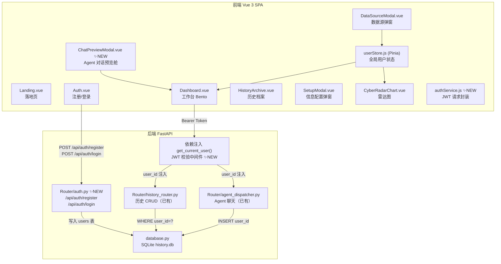
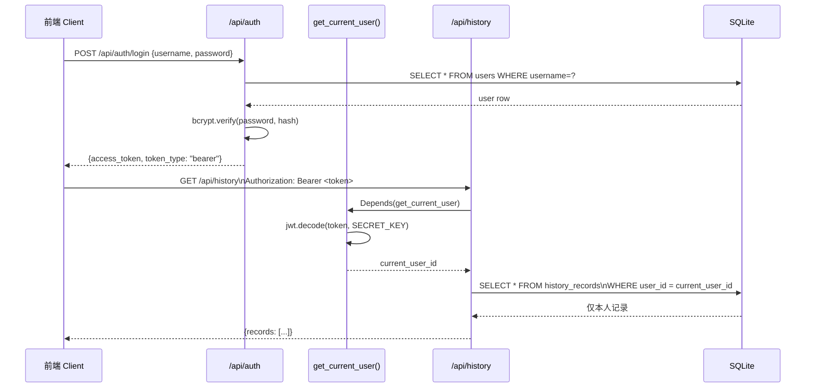
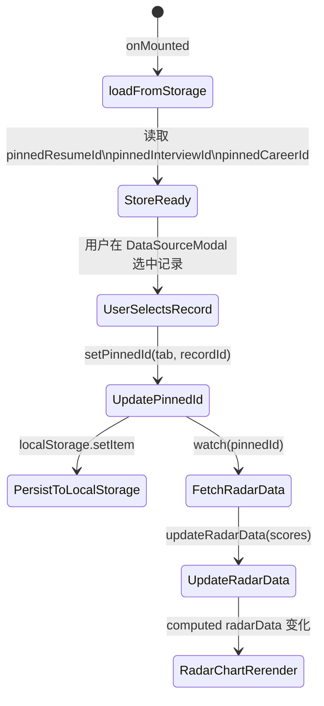
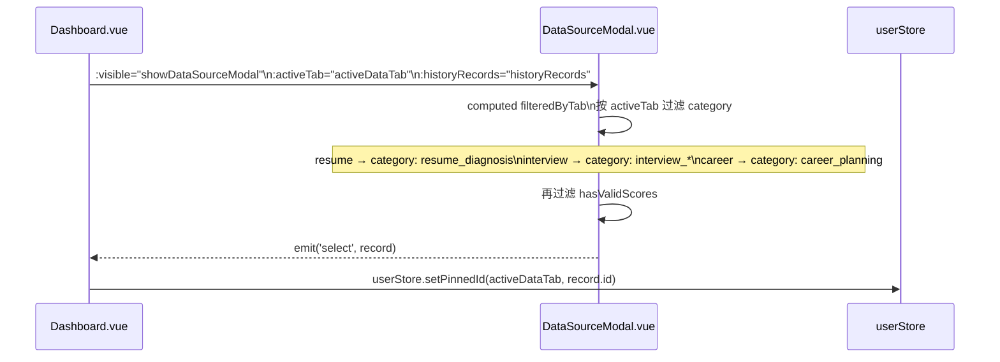
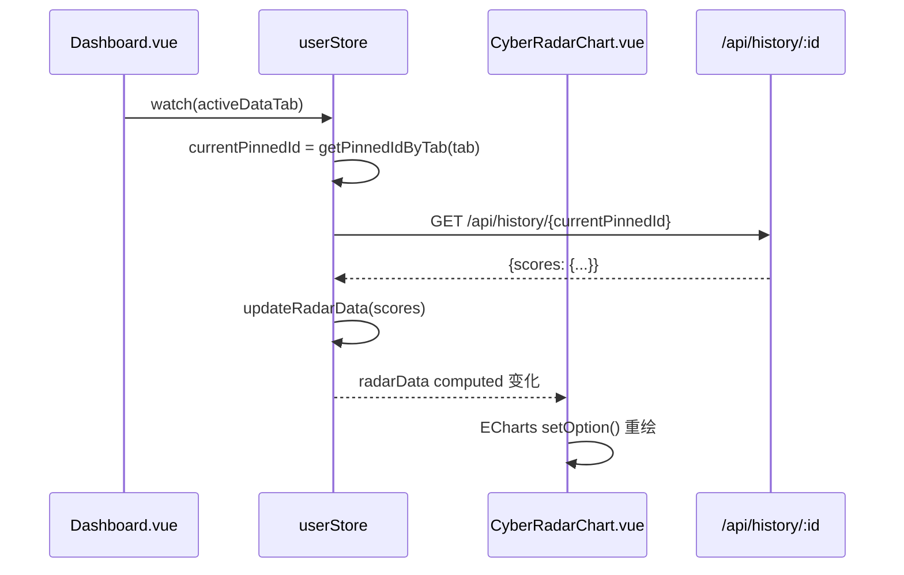
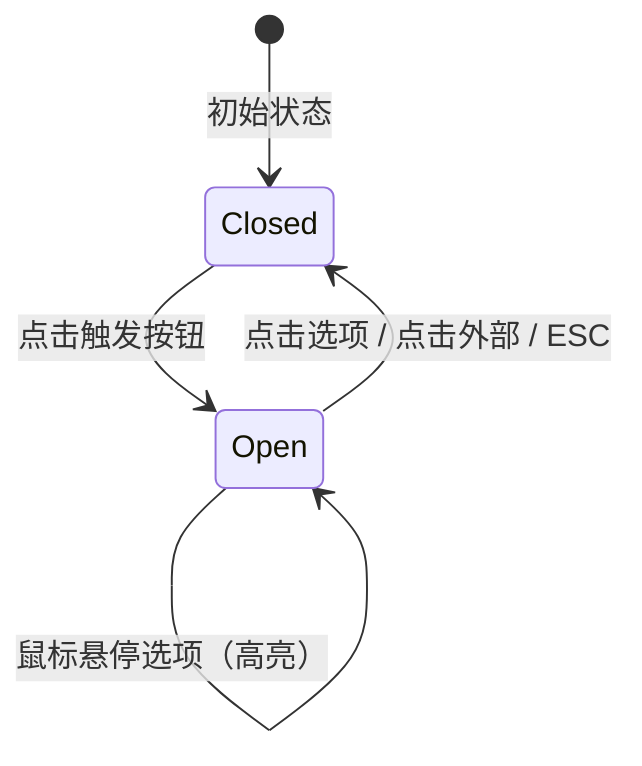
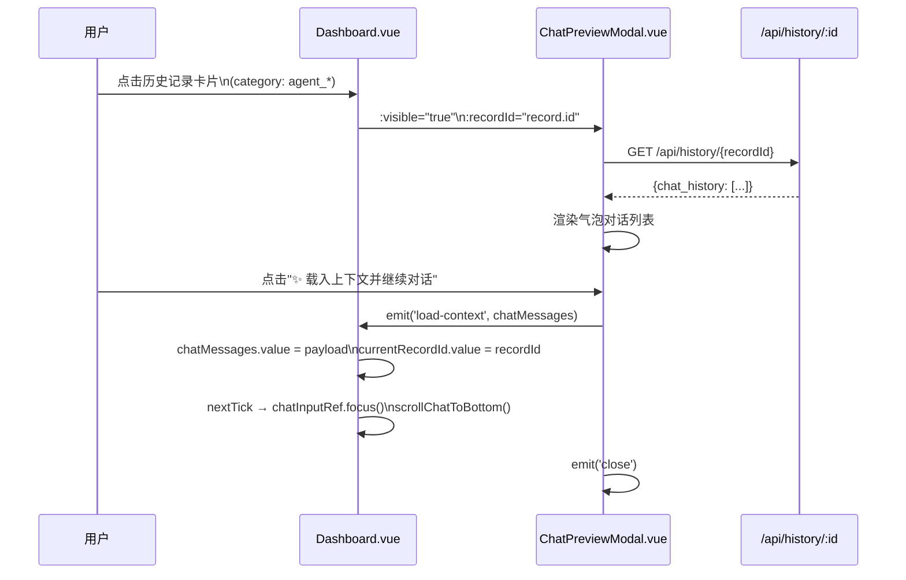
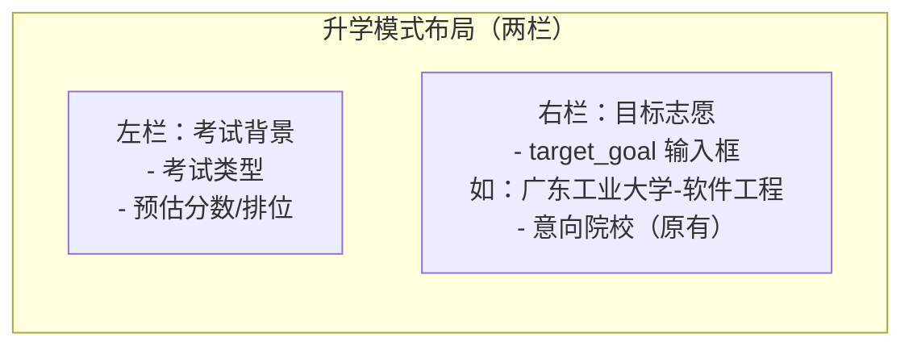

# 设计文档：SaaS 多租户隐私隔离 + Bento UI 响应式数据链路

## Overview

本次重构分三个阶段，将系统从"单用户无隔离"状态升级为具备 JWT 鉴权的多租户 SaaS 架构，同时修复 Bento 面板的数据链路断层，并补全若干 UI/UX 体验细节。核心目标是：**后端数据绝对隔离（每条查询强制附加 `WHERE user_id = current_user_id`）**，**前端状态精确绑定（雷达图随 pinned ID 动态响应）**，**UI 组件全面深色化（废弃原生 `<select>`，统一自定义下拉）**。

---

## Architecture



---

## 阶段一：后端鉴权与隐私隔离

### 1.1 数据库 Schema 变更

在现有 `database.py` 中新增 `users` 表，并为 `history_records` 表添加 `user_id` 外键列。

```mermaid
erDiagram
    users {
        INTEGER id PK
        TEXT username UNIQUE
        TEXT password_hash
        TEXT email
        TEXT created_at
    }
    history_records {
        INTEGER id PK
        INTEGER user_id FK
        TEXT category
        TEXT user_input
        TEXT ai_result
        TEXT scores
        TEXT extra_data
        TEXT chat_history
        INTEGER is_saved
        TEXT created_at
    }
    users ||--o{ history_records : "owns"
```

**迁移策略**：`init_db()` 使用 `CREATE TABLE IF NOT EXISTS` + `ALTER TABLE ... ADD COLUMN IF NOT EXISTS` 模式，对存量数据 `user_id` 默认为 `NULL`（向后兼容，不破坏现有记录）。

### 1.2 JWT 鉴权流程



### 1.3 路由守卫升级

前端 `router/index.js` 的 `beforeEach` 守卫已有 `token` 检查逻辑，本次升级将 `userRole === 'guest'` 的放行路径收窄：登录后写入真实 JWT token，guest 模式仅允许访问 Landing 和 Auth 页面，不再放行 Dashboard 等需鉴权页面。

---

## 阶段二：Bento 面板响应式数据链路

### 2.1 Store 结构扩展

在 `userStore.js` 中新增三个 Tab 的独立 pinned ID 状态，并与 `localStorage` 双向绑定。



**新增 Store 字段**（`userStore.js`）：

```javascript
// 三个 Tab 各自的 pinned 历史记录 ID（null 表示未选中）
pinnedResumeId: null,       // localStorage key: 'pinned_resume_id'
pinnedInterviewId: null,    // localStorage key: 'pinned_interview_id'
pinnedCareerId: null,       // localStorage key: 'pinned_career_id'
```

**新增 Store Actions**：

```javascript
// 设置指定 Tab 的 pinned ID 并持久化
setPinnedId(tab: 'resume' | 'interview' | 'career', recordId: number | null): void

// 根据当前激活 Tab 返回对应的 pinned ID
getPinnedIdByTab(tab: string): number | null

// 从 localStorage 恢复三个 pinned ID（在 loadFromStorage 中调用）
loadPinnedIds(): void
```

### 2.2 DataSourceModal 按 Tab 过滤



**Tab → Category 映射规则**：

| activeDataTab | 允许的 category 前缀/值 |
|---|---|
| `resume` | `resume_diagnosis` |
| `interview` | `interview_*`（所有 interview 开头） |
| `career` | `career_planning` |

### 2.3 雷达图动态绑定

`CyberRadarChart.vue` 通过 `computed` 深度监听当前激活 Tab 的 `pinnedId`，当 ID 变化时自动拉取对应记录的 scores 并更新图表。



**空状态处理**：若 `pinnedId === null` 或 API 返回无效 scores，调用 `userStore.resetRadarData()` 显示全零空状态，并在图表中心渲染"暂无数据"提示文字。

---

## 阶段三：UI/UX 体验补全

### 3.1 HistoryArchive 深色自定义下拉菜单

废弃原生 `<select>` 标签，改用 Vue 状态驱动的自定义下拉组件。



**组件接口**（提取为 `CustomDropdown.vue`）：

```javascript
// Props
defineProps({
  modelValue: String,           // v-model 绑定值
  options: Array,               // [{ value, label }]
  placeholder: String           // 未选中时的占位文字
})

// Emits
defineEmits(['update:modelValue'])
```

**样式规范**：
- 触发按钮：`bg-white/5 border border-white/10 rounded-lg`
- 下拉面板：`bg-gray-900 border border-white/10 rounded-xl shadow-[0_8px_32px_rgba(0,0,0,0.5)]`
- 选项悬停：`hover:bg-white/5 hover:text-white`
- 选中项：`text-purple-300 bg-purple-500/10`
- 过渡动画：`transition: opacity 0.2s, transform 0.2s; transform-origin: top`

**过滤逻辑修正**：
- "面试评估" → `category.startsWith('interview')`（原逻辑仅匹配 `interview_evaluate`，需修正）
- "Agent 对话" → `category.startsWith('agent_')`（原标签 "职场助理" 重命名）
- 所有分类标签统一使用 `font-bold`（黑体）

### 3.2 Agent 对话 ChatPreviewModal

新增 `ChatPreviewModal.vue` 组件，在首页点击 Agent 对话历史卡片时弹出预览舱，而非直接跳转。



**组件接口**：

```javascript
// Props
defineProps({
  visible: Boolean,
  recordId: { type: Number, default: null }
})

// Emits
defineEmits(['close', 'load-context'])
// load-context payload: { messages: Array, recordId: Number }
```

**气泡样式规范**：
- 用户气泡：右对齐，`bg-purple-500/20 border border-purple-500/30 rounded-2xl rounded-tr-sm`
- AI 气泡：左对齐，`bg-white/5 border border-white/10 rounded-2xl rounded-tl-sm`
- 主按钮：`bg-gradient-to-r from-cyan-500 to-purple-600`，带 `shadow-[0_0_20px_rgba(6,182,212,0.3)]`

### 3.3 升学模式志愿打通

**SetupModal.vue 变更**：升学模式下新增 `target_goal` 字段（目标志愿），采用左右两栏布局。



**localStorage key**：`target_goal`（新增，与现有 `target_school` 并存，语义更精确）

**Dashboard.vue 变更**：在"智能预测(冲稳保)"看板顶部同步显示 `target_goal`。

```javascript
// computed 属性
const targetGoalDisplay = computed(() => {
  const goal = localStorage.getItem('target_goal') || userStore.targetGoal || ''
  return goal.trim() || null  // null 时显示提示文字
})
```

**userStore.js 变更**：新增 `targetGoal` 字段，在 `updateUserProfile` 和 `loadFromStorage` 中同步处理。

---

## Components and Interfaces

### 后端新增接口

#### `Router/auth.py`

```python
# POST /api/auth/register
class RegisterRequest(BaseModel):
    username: str          # 3-50 字符，唯一
    password: str          # 明文，后端 bcrypt hash
    email: Optional[str]   # 可选

class AuthResponse(BaseModel):
    access_token: str
    token_type: str = "bearer"
    user_id: int
    username: str

# POST /api/auth/login
class LoginRequest(BaseModel):
    username: str
    password: str          # 明文，后端校验
```

#### JWT 中间件（依赖注入）

```python
# Router/dependencies.py (新文件)
async def get_current_user(
    token: str = Depends(oauth2_scheme)
) -> int:
    """
    解码 JWT，返回 user_id。
    失败时抛出 HTTP 401 Unauthorized。
    
    前置条件：token 非空且格式合法
    后置条件：返回值为正整数 user_id
    """
    ...

async def get_optional_user(
    token: Optional[str] = Depends(optional_oauth2_scheme)
) -> Optional[int]:
    """
    可选鉴权：token 存在则校验，不存在返回 None。
    用于兼容 guest 模式的接口。
    """
    ...
```

#### `database.py` 新增函数

```python
def create_user(username: str, password_hash: str, email: str = None) -> int:
    """
    插入新用户记录。
    前置条件：username 唯一（调用方需先检查）
    后置条件：返回新用户的 id
    """

def get_user_by_username(username: str) -> Optional[dict]:
    """
    按用户名查询用户。
    后置条件：返回 dict 或 None（不存在时）
    """

def get_recent_records_by_user(user_id: int, limit: int = 10, **filters) -> list:
    """
    查询指定用户的历史记录。
    关键约束：SQL 必须包含 WHERE user_id = ?，严禁越权。
    """
```

### 前端新增/修改组件

#### `authService.js`（新文件）

```javascript
// src/services/authService.js

/**
 * 注册新用户
 * @param {string} username
 * @param {string} password
 * @param {string} [email]
 * @returns {Promise<{access_token, user_id, username}>}
 */
export async function registerUser(username, password, email = '') { ... }

/**
 * 用户登录，成功后将 token 写入 localStorage
 * @param {string} username
 * @param {string} password
 * @returns {Promise<{access_token, user_id, username}>}
 */
export async function loginUser(username, password) { ... }

/**
 * 获取带 Authorization 头的 fetch 配置
 * @returns {Object} headers 对象
 */
export function getAuthHeaders() {
  const token = localStorage.getItem('token')
  return token ? { 'Authorization': `Bearer ${token}` } : {}
}

/**
 * 登出：清除 localStorage 中的 token 和用户信息
 */
export function logout() { ... }
```

#### `ChatPreviewModal.vue`（新文件）

```javascript
// Props
defineProps({
  visible: { type: Boolean, required: true },
  recordId: { type: Number, default: null }
})

// Emits
defineEmits(['close', 'load-context'])
// 'load-context' payload: { messages: ChatMessage[], recordId: number }

// 内部状态
const chatHistory = ref([])       // 从 API 加载的历史消息
const isLoading = ref(false)      // 加载状态
const errorMessage = ref('')      // 错误提示

// 关键方法
async function fetchChatHistory(id: number): Promise<void>
function handleLoadContext(): void  // emit load-context 并关闭弹窗
```

#### `CustomDropdown.vue`（新文件，提取自 HistoryArchive）

```javascript
// Props
defineProps({
  modelValue: { type: String, default: '' },
  options: {
    type: Array,  // [{ value: string, label: string }]
    required: true
  },
  placeholder: { type: String, default: '请选择' }
})

// Emits
defineEmits(['update:modelValue'])

// 内部状态
const isOpen = ref(false)
const dropdownRef = ref(null)  // 用于 onClickOutside 检测
```

---

## Data Models

### localStorage 键名规范（完整清单）

| 键名 | 类型 | 用途 | 阶段 |
|---|---|---|---|
| `token` | string | JWT access token | 阶段一 |
| `user_id` | string | 当前登录用户 ID | 阶段一 |
| `candidate_name` | string | 用户姓名 | 已有 |
| `resume_text` | string | 简历文本 | 已有 |
| `active_mode` | string | job / education | 已有 |
| `target_job` | string | 目标岗位 | 已有 |
| `job_description` | string | JD 文本 | 已有 |
| `exam_type` | string | 考试类型 | 已有 |
| `estimated_score` | string | 预估分数 | 已有 |
| `exam_rank` | string | 排位 | 已有 |
| `target_school` | string | 意向院校 | 已有 |
| `target_goal` | string | 目标志愿（精确，如"广工-软件工程"） | 阶段三 |
| `pinned_resume_id` | string | 简历 Tab pinned 记录 ID | 阶段二 |
| `pinned_interview_id` | string | 面试 Tab pinned 记录 ID | 阶段二 |
| `pinned_career_id` | string | 规划 Tab pinned 记录 ID | 阶段二 |
| `dashboard_knowledge_id` | string | 知识库文件 ID | 已有 |
| `dashboard_knowledge_file_name` | string | 知识库文件名 | 已有 |
| `current_interview_jd` | string | 当前面试 JD | 已有 |
| `userRole` | string | guest / registered | 已有 |

---

## Error Handling

### 后端错误场景

| 场景 | HTTP 状态码 | 响应体 |
|---|---|---|
| 用户名已存在 | 409 Conflict | `{"detail": "用户名已被占用"}` |
| 密码错误 | 401 Unauthorized | `{"detail": "用户名或密码错误"}` |
| Token 缺失 | 401 Unauthorized | `{"detail": "未提供认证凭据"}` |
| Token 过期/无效 | 401 Unauthorized | `{"detail": "Token 已失效，请重新登录"}` |
| 越权访问（user_id 不匹配） | 403 Forbidden | `{"detail": "无权访问此资源"}` |

### 前端错误处理

- JWT 过期（401 响应）：`authService.js` 统一拦截，清除 localStorage token，跳转 `/auth`
- 网络错误：Toast 提示，不阻断 UI 渲染
- 空状态（无 pinned 数据）：雷达图显示全零 + 提示文字，不报错

---

## Testing Strategy

### 单元测试重点

- `get_current_user()` 依赖注入：有效 token → 返回正确 user_id；无效 token → 抛出 401
- `get_recent_records_by_user()` SQL 隔离：user_id=1 的查询不返回 user_id=2 的记录
- `userStore.setPinnedId()` + `loadPinnedIds()`：写入 localStorage 后重新加载能正确恢复
- `CustomDropdown.vue`：点击外部关闭、ESC 关闭、v-model 双向绑定

### 属性测试（Property-Based Testing）

使用 **Hypothesis**（Python）验证：
- 对任意合法 `user_id`，`get_recent_records_by_user(user_id)` 返回的所有记录的 `user_id` 字段均等于输入值（隔离不变量）
- 对任意 `scores` 字典，`updateRadarData(scores)` 后 `radarData.values` 中每个值均在 `[0, 100]` 范围内（clamp 不变量）

### 集成测试重点

- 注册 → 登录 → 获取历史记录全流程（token 正确传递）
- 两个不同用户的历史记录互不可见
- DataSourceModal 按 Tab 过滤后，选中记录能正确更新雷达图

---

## Correctness Properties

*A property is a characteristic or behavior that should hold true across all valid executions of a system — essentially, a formal statement about what the system should do. Properties serve as the bridge between human-readable specifications and machine-verifiable correctness guarantees.*

以下属性在整个系统生命周期内必须恒成立：

### Property 1: 用户数据隔离不变量

*For any* 已登录用户 `u`，`GET /api/history` 返回的所有记录满足 `record.user_id == u.id`。对任意两个不同用户 `u1 ≠ u2`，`u1` 的请求永远无法读取到 `user_id == u2.id` 的记录。

**Validates: Requirements 4.3, 4.4**

### Property 2: 密码安全不变量

*For any* 用户注册请求，数据库中存储的 `password_hash` 永远不等于明文密码。前端 localStorage 中永远不存储明文密码。`bcrypt.verify(plain, hash)` 是唯一合法的密码校验路径。

**Validates: Requirements 1.4, 16.4**

### Property 3: 雷达图数值 clamp 不变量

*For any* `scores` 字典，`updateRadarData(scores)` 后 `radarData.values` 中每个值 `v` 满足 `0 ≤ v ≤ 100`。

**Validates: Requirements 10.4**

### Property 4: 空状态不变量

*For any* 激活 Tab，当 `pinnedId === null` 且所有分值为零时，`radarData.values` 必须为 `[0, 0, 0, 0, 0, 0]`（空状态），雷达图不显示任何历史数据，且显示"暂无数据"提示文字。

**Validates: Requirements 10.3**

### Property 5: Tab 数据绑定不变量

*For any* `activeDataTab` 切换操作，雷达图数据必须对应新 Tab 的 `pinnedId` 所指向的记录，不得显示其他 Tab 的数据。

**Validates: Requirements 10.2**

### Property 6: localStorage 键名隔离不变量

*For any* 对单个 Tab 的 `setPinnedId` 调用，三个 Tab 的 pinned ID 使用独立键名（`pinned_resume_id` / `pinned_interview_id` / `pinned_career_id`），互不覆盖。`target_goal` 与 `target_school` 语义不同，分别独立存储，不合并。

**Validates: Requirements 8.4, 14.4**

### Property 7: 自定义下拉关闭不变量

*For any* 处于打开状态的 CustomDropdown，在点击外部区域或按下 ESC 键后，`isOpen` 状态必须变为 `false`，下拉面板不再可见。

**Validates: Requirements 11.3, 11.4**

### Property 8: JWT 签发与解码往返不变量

*For any* 合法的 `user_id`，由 Auth_Router 签发的 JWT token 经 Auth_Middleware 解码后必须返回相同的 `user_id`。

**Validates: Requirements 2.3, 3.1**

### Property 9: Pinned ID 持久化往返不变量

*For any* tab 和 recordId，调用 `setPinnedId(tab, recordId)` 后再调用 `loadPinnedIds()`，对应 tab 的 `pinnedId` 必须等于原始 `recordId`。

**Validates: Requirements 8.3, 8.5**

### Property 10: DataSourceModal Tab 过滤不变量

*For any* 历史记录集合和任意 `activeTab` 值，DataSourceModal 过滤后显示的所有记录的 `category` 字段必须符合该 Tab 的映射规则（resume → `resume_diagnosis`；interview → `startsWith('interview')`；career → `career_planning`）。

**Validates: Requirements 9.1, 9.2**

---

## 安全考量

- **密码存储**：使用 `bcrypt`（`passlib[bcrypt]`）哈希，前端绝不存储明文密码
- **JWT 密钥**：从 `.env` 读取 `JWT_SECRET_KEY`，不硬编码
- **Token 有效期**：默认 7 天（`exp` claim），可通过 `.env` 配置
- **SQL 注入防护**：所有查询使用参数化 `?` 占位符，禁止字符串拼接
- **越权防护**：所有业务接口的 SQL 查询必须包含 `WHERE user_id = ?`，由 `get_current_user()` 依赖注入保证

---

## 性能考量

- `history_records` 表新增 `CREATE INDEX idx_history_user_id ON history_records(user_id)` 索引，避免全表扫描
- `users` 表 `username` 字段加 `UNIQUE` 约束，同时作为查询索引
- 前端 `pinnedId` 变化时的 API 请求使用防抖（300ms），避免快速切换 Tab 时的重复请求

---

## Dependencies

### 后端新增

```
passlib[bcrypt]>=1.7.4
python-jose[cryptography]>=3.3.0
```

### 前端新增

无新增 npm 包（`@vueuse/core` 已有 `onClickOutside` 可用于自定义下拉的外部点击检测）。
