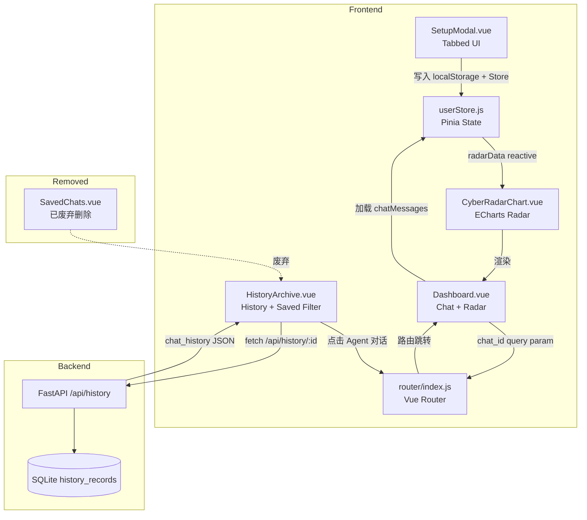
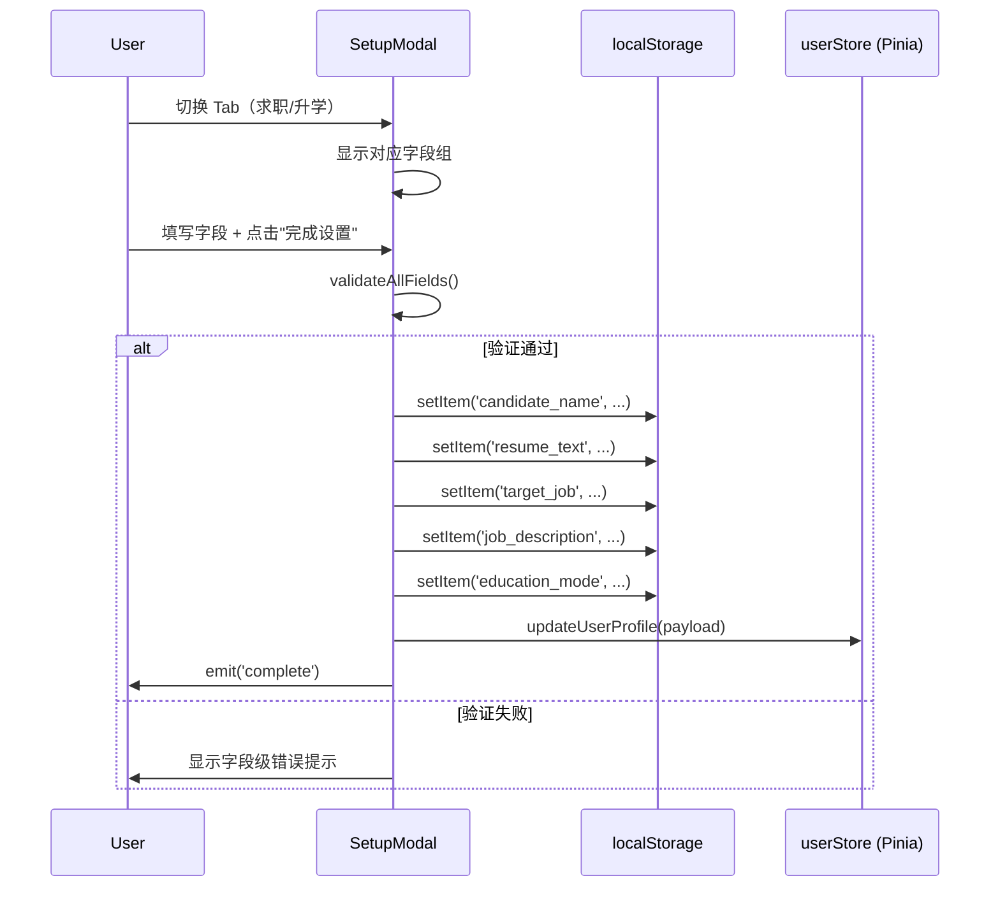
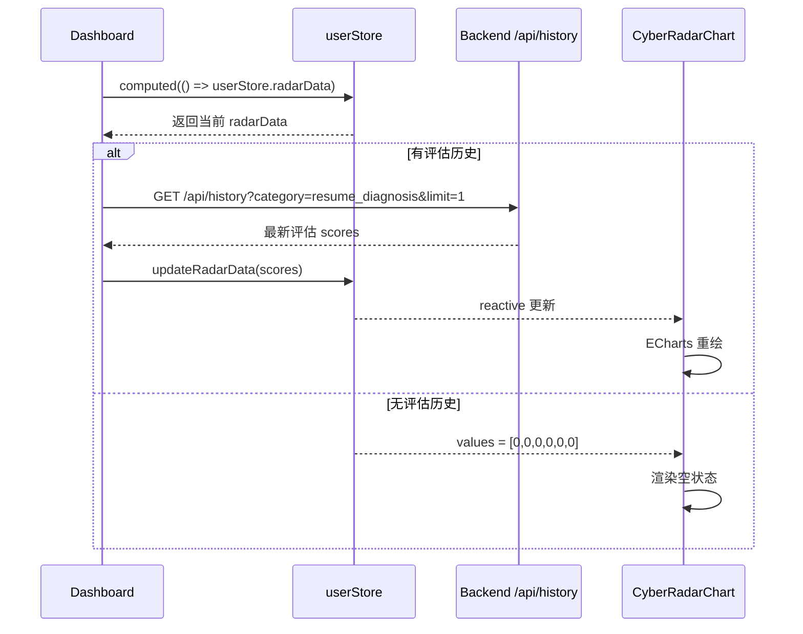
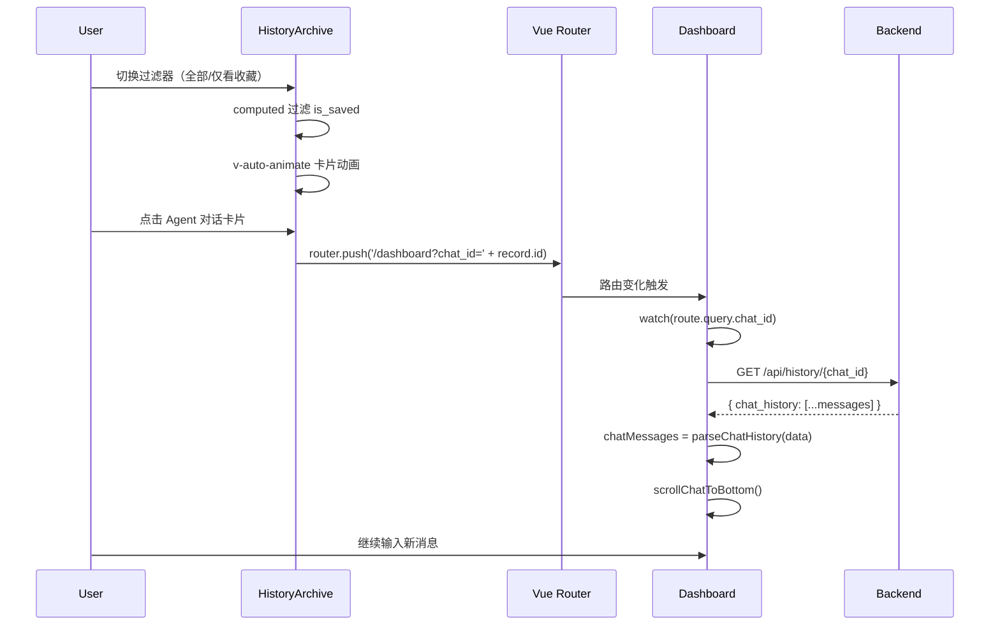
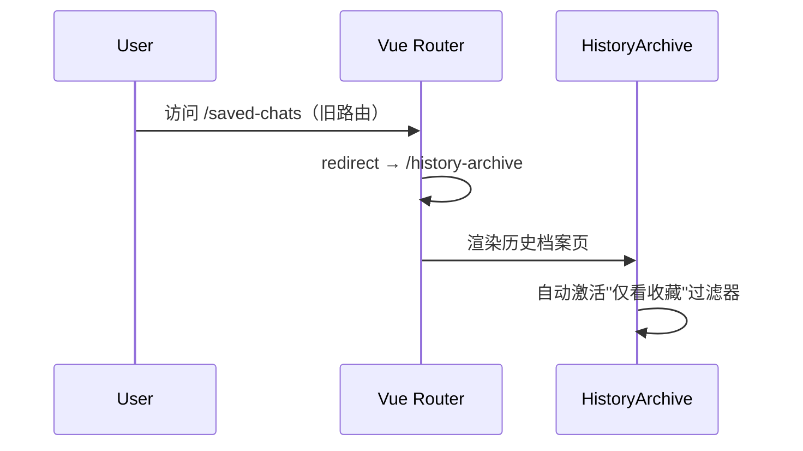

# Design Document: 核心业务组件扩容与交互体验(UX)闭环重构

## Overview

本次重构围绕"做减法"的产品理念，解决系统中功能冗余和体验断层问题：

1. **废弃冗余页面（做减法）**：当前"历史记录"与"保存的对话"分属两个独立页面（`HistoryArchive.vue` + `SavedChats.vue`），增加用户认知负担。将"收藏"从独立页面降维为历史档案内的状态过滤器，彻底删除 `SavedChats.vue` 及其路由/菜单入口。

2. **HistoryArchive 状态过滤重构**：在历史档案页面顶部新增状态切换器（`全部记录` / `🌟 仅看收藏`），使用 `computed` 纯前端过滤 `is_saved` 状态，配合 `v-auto-animate` 实现卡片平滑动画。

3. **SetupModal 多维扩容**：引入 Tab 切换卡（求职模式 / 升学模式），新增目标岗位、JD、考试类型、预估分数、意向院校等字段。

4. **Dashboard 雷达图动态化**：将 `userStore.radarData` 从硬编码 mock 数据改为绑定 Pinia Store 真实评估结果，空状态默认 `[0,0,0,0,0,0]`。修正 Bento 面板"历史档案 >"入口命名歧义。

5. **Agent 对话恢复闭环**：修复 `HistoryArchive.vue` 中 Agent 对话卡片点击失效 Bug，实现从历史记录（无论全部/收藏状态）一键恢复对话上下文到 Dashboard 聊天区。

## Architecture




## Sequence Diagrams

### Flow 1: SetupModal 多维数据提交



### Flow 2: 雷达图动态数据绑定



### Flow 3: 历史记录 → 继续对话（含收藏过滤）



### Flow 4: 废弃 SavedChats 的迁移路径




## Components and Interfaces

### Component 1: SetupModal.vue (重构 — Tabbed UI)

**Purpose**: 多维用户画像采集弹窗，支持求职/升学双模式 Tab 切换

**Interface**:
```javascript
// Emits (不变)
defineEmits(['close', 'complete'])

// 新增响应式状态
const activeTab = ref('job')  // 'job' | 'education'

// 求职模式字段
const targetJob = ref('')       // 目标岗位
const jobDescription = ref('')  // 岗位描述 JD

// 升学模式字段
const examType = ref('')        // 考试类型
const estimatedScore = ref('')  // 预估分数/排位
const targetSchool = ref('')    // 意向院校

// 考试类型选项
const examTypeOptions = [
  { value: 'zhuanchaben', label: '专插本' },
  { value: 'gaokao', label: '普通高考' },
  { value: 'kaoyan', label: '考研' },
  { value: 'kaogong', label: '考公' },
  { value: 'other', label: '其他' }
]
```

**Responsibilities**:
- 保留原有姓名 + 简历输入功能
- 新增 Tab 切换 UI（求职模式 / 升学模式），暗黑赛博朋克 + 毛玻璃风格
- 表单验证（各字段独立校验）
- 数据持久化到 localStorage + Pinia Store
- 切换 Tab 不清除另一个 Tab 已填写的数据

### Component 2: HistoryArchive.vue (重构 — 合并收藏功能)

**Purpose**: 统一的历史记录页面，内置收藏状态过滤器，替代原 SavedChats.vue

**Interface**:
```javascript
// 新增：状态过滤器
const filterSaved = ref('all')  // 'all' | 'saved'

// 修改：filteredRecords 增加 is_saved 过滤
const filteredRecords = computed(() => {
  let records = historyRecords.value

  // 收藏过滤
  if (filterSaved.value === 'saved') {
    records = records.filter(r => r.is_saved)
  }

  // 类型过滤（保留原有）
  if (filterCategory.value !== 'all') {
    records = records.filter(r => r.category === filterCategory.value)
  }

  // 搜索过滤（保留原有）
  if (searchQuery.value.trim()) {
    const query = searchQuery.value.toLowerCase()
    records = records.filter(r =>
      String(r.user_input || '').toLowerCase().includes(query) ||
      String(r.ai_result || '').toLowerCase().includes(query)
    )
  }

  return records
})

// 修复：goToRecord 增加 Agent 对话处理
const goToRecord = (record) => {
  if (record.category === 'resume_diagnosis')
    router.push(`/resume-diagnosis?id=${record.id}`)
  else if (record.category?.startsWith?.('interview'))
    router.push(`/interview?id=${record.id}`)
  else if (record.category === 'career_planning')
    router.push(`/career-planning?id=${record.id}`)
  // 新增：Agent 对话 + 通用聊天 → Dashboard 恢复上下文
  else if (record.category?.startsWith?.('agent_') || record.category === 'general_chat')
    router.push(`/dashboard?chat_id=${record.id}`)
}
```

**Responsibilities**:
- 顶部新增 Segmented Control：`[ 全部记录 ]` / `[ 🌟 仅看收藏 ]`
- 使用 `v-auto-animate` 实现卡片过滤时的平滑消失/补齐动画
- 星号图标及激活态使用 Purple 主色调 + Cyberpunk Glow 特效
- 统一所有 category 的点击行为（含 Agent 对话恢复）
- 完全替代原 SavedChats.vue 的功能

### Component 3: userStore.js (扩展)

**Purpose**: 全局用户状态管理，新增多维画像字段和雷达图动态更新

**Interface**:
```javascript
export const useUserStore = defineStore('user', {
  state: () => ({
    candidateName: '',
    resumeText: '',

    // 新增：求职模式
    targetJob: '',
    jobDescription: '',

    // 新增：升学模式
    activeMode: 'job',  // 'job' | 'education'
    examType: '',
    estimatedScore: '',
    targetSchool: '',

    // 雷达图数据（动态化，默认空状态）
    radarData: {
      indicators: [
        { name: '技术能力', max: 100 },
        { name: '沟通表达', max: 100 },
        { name: '项目经验', max: 100 },
        { name: '学习能力', max: 100 },
        { name: '团队协作', max: 100 },
        { name: '职业规划', max: 100 }
      ],
      values: [0, 0, 0, 0, 0, 0]  // 默认空状态
    },

    panelLayout: { /* 保持不变 */ }
  }),

  actions: {
    loadFromStorage() { /* 从 localStorage 恢复所有字段 */ },
    updateUserProfile(payload) { /* SetupModal 提交时调用 */ },
    updateRadarData(scores) { /* 根据评估结果更新雷达图 */ },
    resetRadarData() { /* 重置为 [0,0,0,0,0,0] */ }
  }
})
```

### Component 4: Dashboard.vue (修改)

**Purpose**: 监听路由 query 恢复对话上下文；修正 Bento 面板入口；移除"保存的对话"菜单入口

**Interface**:
```javascript
import { useRoute } from 'vue-router'
const route = useRoute()

// 监听 chat_id 参数，恢复历史对话
watch(() => route.query.chat_id, async (chatId) => {
  if (!chatId) return
  await restoreChatContext(chatId)
}, { immediate: true })

async function restoreChatContext(chatId) { /* ... */ }
async function loadLatestRadarData() { /* ... */ }
```

**修改点**:
- 左侧菜单移除"保存的对话"入口
- Bento 面板右上角"历史档案 >"更名为"数据面板设置 >"或移除
- `onMounted` 中调用 `loadLatestRadarData()` 获取真实雷达图数据
- 新增 `watch(route.query.chat_id)` 实现对话恢复

### Component 5: router/index.js (修改)

**Purpose**: 移除 SavedChats 路由，添加重定向兼容

**Interface**:
```javascript
// 删除 SavedChats 导入和路由定义
// 新增重定向：旧路由 → 历史档案
{
  path: '/saved-chats',
  redirect: '/history-archive'
}
```


## Data Models

### Model 1: UserProfile (localStorage 结构)

```javascript
const UserProfileSchema = {
  candidate_name: String,    // 必填，1-50 字符
  resume_text: String,       // 必填，20-10000 字符
  target_job: String,        // 可选，求职模式下的目标岗位，≤100 字符
  job_description: String,   // 可选，求职模式下的 JD，≤5000 字符
  active_mode: String,       // 'job' | 'education'
  exam_type: String,         // 可选，枚举值
  estimated_score: String,   // 可选，≤50 字符
  target_school: String,     // 可选，≤200 字符
  userRole: String           // 'registered' | 'guest'
}
```

**Validation Rules**:
- `candidate_name`: 非空，trim 后 1-50 字符
- `resume_text`: trim 后 ≥ 20 字符，≤ 10000 字符
- `target_job`: 可选，最大 100 字符
- `job_description`: 可选，最大 5000 字符
- `exam_type`: 必须为 `['zhuanchaben','gaokao','kaoyan','kaogong','other']` 之一
- `estimated_score`: 可选，最大 50 字符
- `target_school`: 可选，最大 200 字符

### Model 2: RadarData (Pinia State)

```javascript
const RadarDataSchema = {
  indicators: [{ name: String, max: Number }],  // 固定 6 项
  values: [Number]  // 长度 6，每项 0-100
}
```

**Validation Rules**:
- `values.length === indicators.length === 6`
- `∀ i: 0 ≤ values[i] ≤ indicators[i].max`
- 空状态：所有 values 为 0

### Model 3: HistoryRecord (后端 API 响应)

```javascript
const HistoryRecordSchema = {
  id: Number,
  category: String,       // 'resume_diagnosis' | 'interview_*' | 'career_planning' | 'agent_*' | 'general_chat'
  user_input: String,
  ai_result: String,
  scores: String,         // JSON string: { dimension: score }
  extra_data: String,     // JSON string
  chat_history: String,   // JSON string: [{ role: 'user'|'assistant', content: String }]
  is_saved: Number,       // 0 | 1
  created_at: String      // 'YYYY-MM-DD HH:MM:SS'
}
```

### Model 4: FilterState (HistoryArchive 内部状态)

```javascript
const FilterState = {
  filterSaved: 'all' | 'saved',     // 收藏过滤
  filterCategory: String,            // 类型过滤
  searchQuery: String                // 搜索关键词
}
```

## Algorithmic Pseudocode

### Algorithm 1: SetupModal 表单提交

```javascript
function handleSubmit() {
  clearAllErrors()
  let hasError = false

  // Step 1: 验证公共字段（姓名 + 简历）
  const trimmedName = candidateName.value.trim()
  if (!trimmedName) { nameError.value = '请填写姓名'; hasError = true }
  else if (trimmedName.length > 50) { nameError.value = '姓名不能超过 50 个字符'; hasError = true }

  const trimmedResume = resumeText.value.trim()
  if (trimmedResume.length < 20) { resumeError.value = '简历内容至少需要 20 个字符'; hasError = true }
  else if (resumeText.value.length > 10000) { resumeError.value = '简历内容不能超过 10000 个字符'; hasError = true }

  // Step 2: 验证模式特定字段
  if (activeTab.value === 'job') {
    if (jobDescription.value.length > 5000) { jdError.value = 'JD 不能超过 5000 字符'; hasError = true }
  }

  if (hasError) return

  // Step 3: 持久化到 localStorage
  localStorage.setItem('candidate_name', trimmedName.slice(0, 50))
  localStorage.setItem('resume_text', trimmedResume.slice(0, 10000))
  localStorage.setItem('active_mode', activeTab.value)
  localStorage.setItem('userRole', 'registered')

  if (activeTab.value === 'job') {
    localStorage.setItem('target_job', targetJob.value.trim())
    localStorage.setItem('job_description', jobDescription.value.trim())
  } else {
    localStorage.setItem('exam_type', examType.value)
    localStorage.setItem('estimated_score', estimatedScore.value.trim())
    localStorage.setItem('target_school', targetSchool.value.trim())
  }

  // Step 4: 同步到 Pinia Store
  userStore.updateUserProfile({ /* all fields */ })
  emit('complete')
}
```

**Preconditions:** SetupModal 已挂载，所有 ref 已初始化
**Postconditions:** 验证通过 → localStorage + Store 已更新 + emit('complete')；验证失败 → error ref 已设置

### Algorithm 2: 雷达图动态数据加载

```javascript
async function loadLatestRadarData() {
  try {
    const response = await fetch(`${API_BASE_URL}/history?category=resume_diagnosis&limit=1`)
    if (!response.ok) return

    const data = await response.json()
    const records = data.records || []

    if (records.length === 0) {
      userStore.resetRadarData()  // [0,0,0,0,0,0]
      return
    }

    const scores = parseScores(records[0].scores)
    if (Object.keys(scores).length > 0) {
      userStore.updateRadarData(scores)
    } else {
      userStore.resetRadarData()
    }
  } catch (error) {
    console.error('加载雷达图数据失败:', error)
  }
}
```

**Preconditions:** API 可达，userStore 已初始化
**Postconditions:** 成功 → radarData 反映最新评估；无数据 → [0,0,0,0,0,0]；失败 → 状态不变

### Algorithm 3: 历史对话上下文恢复

```javascript
async function restoreChatContext(chatId) {
  if (!chatId) return

  try {
    const response = await fetch(`${API_BASE_URL}/history/${chatId}`)
    if (!response.ok) throw new Error(`HTTP ${response.status}`)

    const record = await response.json()
    let chatHistory = record.chat_history

    if (typeof chatHistory === 'string') {
      chatHistory = JSON.parse(chatHistory)
    }

    if (!Array.isArray(chatHistory) || chatHistory.length === 0) {
      // 降级：从 user_input + ai_result 构建最小上下文
      chatMessages.value = []
      if (record.user_input) {
        chatMessages.value.push({ role: 'user', content: record.user_input, timestamp: record.created_at })
      }
      if (record.ai_result) {
        chatMessages.value.push({ role: 'ai', content: record.ai_result, timestamp: record.created_at })
      }
    } else {
      chatMessages.value = chatHistory.map(msg => ({
        role: msg.role === 'user' ? 'user' : 'ai',
        content: msg.content || '',
        timestamp: record.created_at,
        isNew: false
      }))
    }

    currentRecordId.value = Number(chatId)
    scrollChatToBottom()
  } catch (error) {
    console.error('恢复对话上下文失败:', error)
    chatMessages.value = []
  }
}
```

**Preconditions:** chatId 对应数据库中存在的记录
**Postconditions:** 成功 → chatMessages 含历史消息 + currentRecordId 已设置；失败 → chatMessages 为空

### Algorithm 4: HistoryArchive 收藏过滤

```javascript
// 纯前端 computed 过滤，无额外 API 调用
const filteredRecords = computed(() => {
  let records = historyRecords.value

  // 收藏状态过滤
  if (filterSaved.value === 'saved') {
    records = records.filter(r => r.is_saved === 1 || r.is_saved === true)
  }

  // 类型过滤
  if (filterCategory.value !== 'all') {
    records = records.filter(r => r.category === filterCategory.value)
  }

  // 搜索过滤
  if (searchQuery.value.trim()) {
    const query = searchQuery.value.toLowerCase()
    records = records.filter(r =>
      String(r.user_input || '').toLowerCase().includes(query) ||
      String(r.ai_result || '').toLowerCase().includes(query)
    )
  }

  return records
})
```

**Preconditions:** historyRecords 已从 API 加载
**Postconditions:** 返回满足所有过滤条件的记录子集
**Loop Invariants:** 每次过滤操作不修改原始 historyRecords 数组


## Key Functions with Formal Specifications

### Function: userStore.updateRadarData(scores)

```javascript
function updateRadarData(scores) {
  const dimensionMap = {
    '技术能力': 0, '沟通表达': 1, '项目经验': 2,
    '学习能力': 3, '团队协作': 4, '职业规划': 5
  }
  const newValues = [0, 0, 0, 0, 0, 0]
  for (const [key, value] of Object.entries(scores)) {
    const index = dimensionMap[key]
    if (index !== undefined) {
      newValues[index] = Math.max(0, Math.min(100, Number(value) || 0))
    }
  }
  this.radarData = { ...this.radarData, values: newValues }
}
```

**Preconditions:** scores 是对象类型（可能为空）
**Postconditions:** radarData.values 长度恒为 6，每项 ∈ [0, 100]，indicators 不变

### Function: userStore.resetRadarData()

```javascript
function resetRadarData() {
  this.radarData = { ...this.radarData, values: [0, 0, 0, 0, 0, 0] }
}
```

**Preconditions:** Store 已初始化
**Postconditions:** radarData.values 全为 0，indicators 不变

### Function: userStore.updateUserProfile(payload)

```javascript
function updateUserProfile(payload) {
  this.candidateName = payload.candidateName || ''
  this.resumeText = payload.resumeText || ''
  this.activeMode = payload.activeMode || 'job'
  this.targetJob = payload.targetJob || ''
  this.jobDescription = payload.jobDescription || ''
  this.examType = payload.examType || ''
  this.estimatedScore = payload.estimatedScore || ''
  this.targetSchool = payload.targetSchool || ''
}
```

**Preconditions:** payload 是对象类型
**Postconditions:** 所有 state 字段已更新，缺失字段默认空字符串

### Function: userStore.loadFromStorage()

```javascript
function loadFromStorage() {
  this.candidateName = localStorage.getItem('candidate_name') || ''
  this.resumeText = localStorage.getItem('resume_text') || ''
  this.activeMode = localStorage.getItem('active_mode') || 'job'
  this.targetJob = localStorage.getItem('target_job') || ''
  this.jobDescription = localStorage.getItem('job_description') || ''
  this.examType = localStorage.getItem('exam_type') || ''
  this.estimatedScore = localStorage.getItem('estimated_score') || ''
  this.targetSchool = localStorage.getItem('target_school') || ''
}
```

**Preconditions:** localStorage 可用
**Postconditions:** Store 状态与 localStorage 同步

## Example Usage

```javascript
// Example 1: SetupModal 求职模式提交
handleSubmit()
// → localStorage: candidate_name='张三', resume_text='...', active_mode='job',
//   target_job='前端工程师', job_description='负责...'
// → userStore 同步更新
// → emit('complete')

// Example 2: HistoryArchive 切换收藏过滤
filterSaved.value = 'saved'
// → filteredRecords 自动过滤出 is_saved === true 的记录
// → v-auto-animate 触发卡片消失/补齐动画

// Example 3: Agent 对话恢复
goToRecord({ id: 42, category: 'agent_general' })
// → router.push('/dashboard?chat_id=42')
// → Dashboard watch 触发 restoreChatContext(42)
// → chatMessages 加载历史消息，用户可继续对话

// Example 4: 旧路由兼容
// 用户访问 /saved-chats → 自动重定向到 /history-archive

// Example 5: 雷达图空状态
// 新用户首次登录，无评估记录
// → loadLatestRadarData() → resetRadarData()
// → radarData.values = [0,0,0,0,0,0]
// → CyberRadarChart 渲染空状态多边形
```

## Correctness Properties

*A property is a characteristic or behavior that should hold true across all valid executions of a system—essentially, a formal statement about what the system should do. Properties serve as the bridge between human-readable specifications and machine-verifiable correctness guarantees.*

### Property 1: Filter composition produces correct subset

*For any* set of history records and any combination of filter states (saved/all, category, search query), the filtered result SHALL be exactly the intersection of records satisfying all active filter conditions (AND logic), and switching from "saved" back to "all" SHALL restore the complete unfiltered set.

**Validates: Requirements 2.2, 2.3, 2.5**

### Property 2: Tab switching preserves field data

*For any* data entered in any field of any tab in SetupModal, switching to the other tab and switching back SHALL preserve all previously entered data unchanged.

**Validates: Requirements 3.4**

### Property 3: Form submission round-trip persistence

*For any* valid user profile (name non-empty, resume ≥ 20 chars), after SetupModal submission, reading the same fields from localStorage and Pinia userStore SHALL return values equivalent to what was submitted.

**Validates: Requirements 3.5**

### Property 4: Invalid input rejection

*For any* name that is empty (after trim) or any resume text shorter than 20 characters (after trim), the SetupModal SHALL reject submission and the localStorage and userStore SHALL remain unchanged.

**Validates: Requirements 3.7**

### Property 5: RadarData invariant

*For any* input to `updateRadarData(scores)`, the resulting `radarData.values` array SHALL have length exactly 6, and every value SHALL be in the range [0, 100].

**Validates: Requirements 4.3**

### Property 6: API failure state preservation

*For any* current radarData state, if the radar data loading API request fails, the radarData state SHALL remain identical to its value before the request.

**Validates: Requirements 4.5**

### Property 7: Agent record routing

*For any* history record with category starting with `agent_` or equal to `general_chat`, and regardless of the current filter state (all or saved), clicking that record SHALL produce a route navigation to `/dashboard?chat_id={record.id}`.

**Validates: Requirements 5.1, 5.6**

### Property 8: Chat history role normalization

*For any* valid chat_history JSON array, after parsing by `restoreChatContext`, every message in chatMessages SHALL have role equal to either 'user' or 'ai', with no other values.

**Validates: Requirements 5.3**

### Property 9: Fallback context construction

*For any* history record where chat_history is an empty array or invalid JSON, if the record has non-empty `user_input` or `ai_result` fields, the system SHALL construct chatMessages containing at least 1 message from those fields.

**Validates: Requirements 5.4**

## Error Handling

### Error Scenario 1: API 请求失败（雷达图加载）

**Condition**: `GET /api/history?category=resume_diagnosis&limit=1` 返回非 200 或网络错误
**Response**: 保持当前 radarData 状态不变，console.error 记录
**Recovery**: 用户下次进入 Dashboard 时自动重试

### Error Scenario 2: 历史记录恢复失败

**Condition**: `GET /api/history/{chatId}` 返回 404 或 chat_history 解析失败
**Response**: chatMessages 置为空数组，用户看到空聊天界面
**Recovery**: 用户可手动开始新对话

### Error Scenario 3: SetupModal 文件解析失败

**Condition**: 上传的简历文件格式异常或内容为空
**Response**: 显示错误提示 4 秒后自动消失，不影响手动文本输入
**Recovery**: 用户可重新上传或直接粘贴文本

### Error Scenario 4: localStorage 不可用

**Condition**: 浏览器隐私模式或存储已满
**Response**: 数据仅保存在 Pinia Store（内存），页面刷新后丢失
**Recovery**: 提示用户检查浏览器设置

## Testing Strategy

### Unit Testing Approach

- 测试 `userStore.updateRadarData()` 对各种 scores 输入的正确映射
- 测试 `userStore.updateUserProfile()` 的字段赋值完整性
- 测试 SetupModal 表单验证逻辑（边界值：0/20/50/10000 字符）
- 测试 `goToRecord()` 对所有 category 类型的路由映射
- 测试 `filteredRecords` computed 在不同 filterSaved/filterCategory 组合下的正确性

### Property-Based Testing Approach

**Property Test Library**: fast-check (JavaScript)

- **Property 1**: 对任意合法 scores 对象，`updateRadarData(scores)` 后 `values` 数组长度恒为 6 且每项 ∈ [0, 100]
- **Property 2**: 对任意 chatHistory 数组，`restoreChatContext` 解析后每条消息的 role 仅为 'user' 或 'ai'
- **Property 3**: 对任意 candidateName 字符串，经 `trim().slice(0, 50)` 后长度 ≤ 50
- **Property 4**: 对任意 historyRecords 数组和 filterSaved='saved'，filteredRecords 中每条记录的 is_saved 为 truthy

### Integration Testing Approach

- E2E: SetupModal 填写 → 关闭 → Dashboard 雷达图反映新数据
- E2E: HistoryArchive 点击 Agent 对话 → Dashboard 加载历史消息 → 发送新消息成功
- E2E: 切换"仅看收藏"过滤器 → 仅显示已收藏记录
- E2E: 访问 /saved-chats → 重定向到 /history-archive

## Performance Considerations

- **纯前端过滤**：收藏过滤使用 computed 属性，无额外 API 调用，响应即时
- **v-auto-animate**：卡片过滤动画使用 @formkit/auto-animate（已有依赖），零配置平滑过渡
- **雷达图渲染**：ECharts 实例复用（vue-echarts 内置），数据更新不重建实例
- **历史记录加载**：单次 API 调用获取全量记录（limit=100），前端过滤避免多次请求

## Security Considerations

- **XSS 防护**：chat_history content 通过 marked.parse() 渲染时依赖 marked 默认 sanitize
- **输入长度限制**：所有文本字段在前端做 slice 截断后再写入 localStorage
- **API 参数校验**：chat_id 参数需为有效整数，防止注入
- **路由重定向**：/saved-chats 仅重定向到内部路由，无外部跳转风险

## Dependencies

- **现有依赖（无需新增）**：
  - Vue 3 (Composition API + `<script setup>`)
  - Pinia (状态管理)
  - Vue Router 5 (路由 + 重定向)
  - ECharts 6 + vue-echarts (雷达图)
  - Tailwind CSS 4 (样式)
  - lucide-vue-next (图标)
  - @formkit/auto-animate (卡片动画)
  - marked (Markdown 渲染)

- **删除的文件**：
  - `frontend/src/SavedChats.vue` — 彻底删除

- **后端依赖（无需新增）**：
  - FastAPI
  - SQLite (history_records 表已有 chat_history + is_saved 字段)
