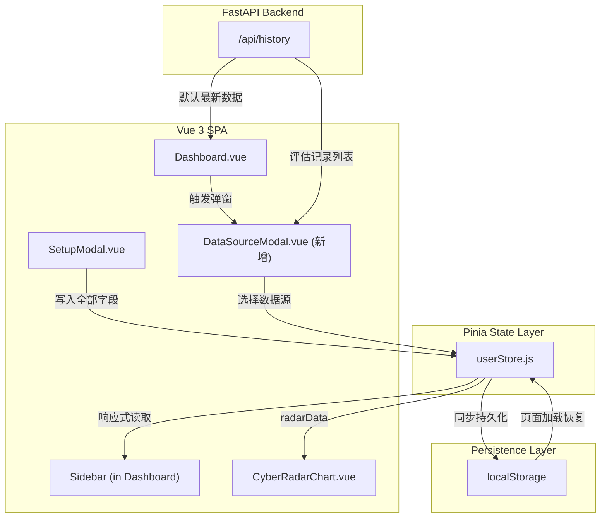
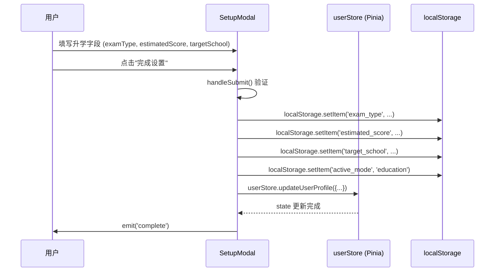
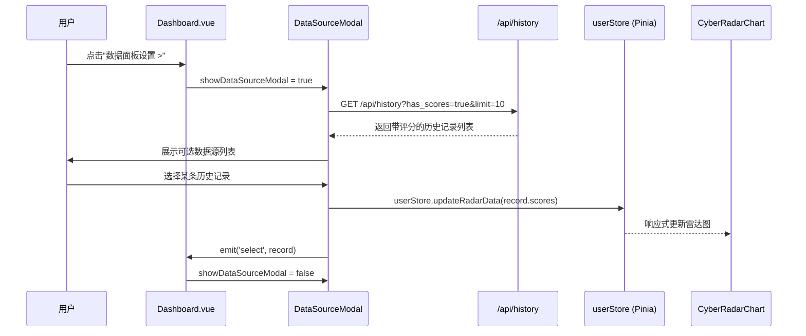
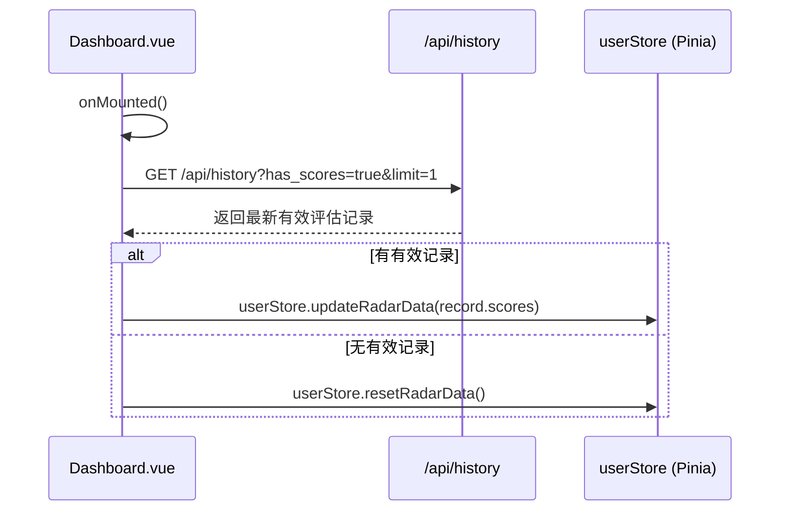

# Design Document: UX State Datasource Readability

## Overview

本次重构聚焦三大核心问题的系统性解决：(1) SetupModal 升学模式字段的状态持久化缺陷修复与侧边栏信息展示升级；(2) Dashboard 雷达图"数据面板设置"入口与个人信息配置的解耦，引入独立的 DataSourceModal 数据源切换弹窗；(3) 全局字号从反人类的 9px-11px 升维至可读的 12px-14px，并修复灰色文字对比度不足的无障碍问题。

整体设计遵循 Pinia Store 作为单一数据源（Single Source of Truth）的原则，localStorage 仅作为持久化层，所有 UI 渲染均从 Store 读取。新增的 DataSourceModal 组件实现了评估历史记录的筛选与数据源切换，使雷达图数据面板与个人信息配置彻底解耦。UI 可读性升级通过统一的 Tailwind 工具类替换策略实现，确保赛博朋克深色毛玻璃美感不受破坏。

## Architecture



## Sequence Diagrams

### 流程 1：SetupModal 状态持久化



### 流程 2：DataSourceModal 数据源切换



### 流程 3：Dashboard 加载时自动选择数据源



## Components and Interfaces

### Component 1: DataSourceModal (新增)

**Purpose**: 独立的数据源选择弹窗，从历史评估记录中筛选带有雷达图评分数据的记录，供用户切换当前 Dashboard 展示的数据源。

**Interface**:
```javascript
// Props
const props = defineProps({
  visible: { type: Boolean, default: false },
  historyRecords: { type: Array, default: () => [] }
})

// Emits
const emit = defineEmits(['close', 'select'])

// 内部状态
const filteredRecords = computed(() => {
  return props.historyRecords.filter(record => hasValidScores(record))
})

// 核心方法
function hasValidScores(record) { /* 判断记录是否含有效评分 */ }
function selectDataSource(record) { /* 选中并 emit */ }
```

**Responsibilities**:
- 过滤 historyRecords，仅展示含有效雷达图评分数据的记录
- 展示记录的类别标签、时间、摘要信息
- 用户点击选择后，emit('select', record) 通知父组件
- 支持关闭弹窗 emit('close')

### Component 2: SetupModal (修复)

**Purpose**: 个人信息配置弹窗，确保升学模式字段正确持久化。

**Interface** (现有，需修复):
```javascript
// handleSubmit 中升学模式字段的持久化逻辑
function handleSubmit() {
  // ... 验证逻辑 ...
  
  // 无论哪种模式，都写入 localStorage
  localStorage.setItem('active_mode', activeTab.value)
  
  if (activeTab.value === 'education') {
    localStorage.setItem('exam_type', examType.value)
    localStorage.setItem('estimated_score', estimatedScore.value.trim())
    localStorage.setItem('target_school', targetSchool.value.trim())
  }
  
  // 同步到 Pinia Store
  userStore.updateUserProfile({ /* 全部字段 */ })
}
```

**Responsibilities**:
- 确保升学模式下所有字段（examType, estimatedScore, targetSchool）正确写入 localStorage
- 同步更新 Pinia userStore
- 页面加载时从 localStorage 预填充所有字段

### Component 3: Sidebar 全局资产区域 (升级)

**Purpose**: 在侧边栏左下角动态展示用户模式信息，采用两行清晰排版。

**Interface**:
```javascript
// 从 userStore 响应式读取
const userStore = useUserStore()
const activeMode = computed(() => userStore.activeMode)
const examType = computed(() => userStore.examType)
const estimatedScore = computed(() => userStore.estimatedScore)
const targetJob = computed(() => userStore.targetJob)

// 考试类型标签映射
const examTypeLabel = computed(() => {
  const map = {
    'zhuanchaben': '专插本',
    'gaokao': '普通高考',
    'kaoyan': '考研',
    'kaogong': '考公',
    'other': '其他'
  }
  return map[examType.value] || '未设置'
})
```

**Responsibilities**:
- 根据 activeMode 动态渲染不同模式的信息
- 升学模式：第一行高亮考试类型标签，第二行展示分数/排位
- 求职模式：展示目标岗位和就绪状态
- 响应式更新，Store 变化时自动刷新

## Data Models

### Model 1: UserProfile (Pinia State)

```javascript
// userStore.js state 结构
const state = {
  candidateName: '',        // 用户姓名
  resumeText: '',           // 简历文本
  activeMode: 'job',        // 'job' | 'education'
  
  // 求职模式
  targetJob: '',            // 目标岗位
  jobDescription: '',       // JD 描述
  
  // 升学模式
  examType: '',             // 考试类型 key
  estimatedScore: '',       // 预估分数/排位
  targetSchool: '',         // 意向院校
  
  // 雷达图数据
  radarData: {
    indicators: [/* 6 维度 */],
    values: [0, 0, 0, 0, 0, 0]
  },
  
  // 当前数据源记录 ID (新增)
  activeDataSourceId: null  // number | null
}
```

**Validation Rules**:
- candidateName: 非空，最大 50 字符
- resumeText: 最少 20 字符，最大 10000 字符
- activeMode: 枚举值 'job' | 'education'
- examType: 枚举值 'zhuanchaben' | 'gaokao' | 'kaoyan' | 'kaogong' | 'other' | ''
- radarData.values: 每项 [0, 100] 整数

### Model 2: HistoryRecord (API 响应)

```javascript
// /api/history 返回的记录结构
const HistoryRecord = {
  id: Number,               // 记录 ID
  category: String,         // 'resume_diagnosis' | 'interview_*' | 'career_planning'
  user_input: String,       // 用户输入摘要
  ai_result: String,        // AI 结果摘要
  scores: Object | String,  // 雷达图评分 JSON (可能是字符串需 parse)
  extra_data: Object | String,
  created_at: String,       // 时间戳
  is_saved: Boolean         // 是否收藏
}
```

**Validation Rules**:
- scores 可能为 null、空对象、JSON 字符串，需安全解析
- 有效评分记录：scores 解析后至少包含 1 个维度的非零值

## Algorithmic Pseudocode

### 算法 1：筛选有效评估数据源

```javascript
/**
 * 从历史记录中筛选含有效雷达图评分的记录
 * @param {Array} records - 历史记录数组
 * @returns {Array} 含有效评分的记录列表
 * 
 * 前置条件: records 是数组，每项含 scores 字段
 * 后置条件: 返回数组中每项的 scores 至少有 1 个非零维度值
 */
function filterValidDataSources(records) {
  return records.filter(record => {
    let scores = record.scores
    
    // 安全解析 JSON 字符串
    if (typeof scores === 'string') {
      try { scores = JSON.parse(scores) } catch { return false }
    }
    
    // 空值检查
    if (!scores || typeof scores !== 'object') return false
    
    // 至少有一个维度的有效非零值
    return Object.values(scores).some(v => Number(v) > 0)
  })
}
```

**Preconditions:**
- `records` 是 Array 类型
- 每条记录可能含有 `scores` 字段（可能为 null/string/object）

**Postconditions:**
- 返回的数组是 `records` 的子集
- 每条返回记录的 `scores` 解析后至少有 1 个正数值
- 不修改原始 `records` 数组

**Loop Invariants:**
- filter 遍历过程中，已检查的记录要么被包含（有效）要么被排除（无效）

### 算法 2：自动加载最新数据源

```javascript
/**
 * Dashboard 加载时自动选择最新有效评估数据
 * 
 * 前置条件: API 可用，userStore 已初始化
 * 后置条件: radarData 被更新为最新有效数据，或重置为零值
 */
async function loadLatestRadarData() {
  const response = await fetch(`${API_BASE_URL}/history?has_scores=true&limit=1`)
  
  if (!response.ok) return  // 网络错误时保持当前状态
  
  const data = await response.json()
  const records = data.records || []
  
  if (records.length === 0) {
    userStore.resetRadarData()
    return
  }
  
  let scores = records[0].scores
  if (typeof scores === 'string') {
    try { scores = JSON.parse(scores) } catch { scores = {} }
  }
  
  if (scores && Object.keys(scores).length > 0) {
    userStore.updateRadarData(scores)
    userStore.activeDataSourceId = records[0].id
  } else {
    userStore.resetRadarData()
  }
}
```

**Preconditions:**
- API endpoint `/api/history` 可达
- `userStore` 已通过 Pinia 初始化

**Postconditions:**
- 成功时：`userStore.radarData.values` 反映最新评估数据
- 无数据时：`userStore.radarData.values` 全部为 0
- 网络错误时：状态不变

### 算法 3：SetupModal 持久化写入

```javascript
/**
 * 表单提交时将所有字段持久化到 localStorage 并同步 Store
 * 
 * 前置条件: 表单验证通过
 * 后置条件: localStorage 和 userStore 中的字段值一致
 */
function persistUserProfile(formData) {
  const { candidateName, resumeText, activeMode, targetJob, jobDescription,
          examType, estimatedScore, targetSchool } = formData
  
  // 基础字段始终写入
  localStorage.setItem('candidate_name', candidateName)
  localStorage.setItem('resume_text', resumeText)
  localStorage.setItem('userRole', 'registered')
  localStorage.setItem('active_mode', activeMode)
  
  // 模式特定字段写入
  if (activeMode === 'job') {
    localStorage.setItem('target_job', targetJob)
    localStorage.setItem('job_description', jobDescription)
  } else if (activeMode === 'education') {
    localStorage.setItem('exam_type', examType)
    localStorage.setItem('estimated_score', estimatedScore)
    localStorage.setItem('target_school', targetSchool)
  }
  
  // 同步到 Pinia Store（单一数据源）
  userStore.updateUserProfile(formData)
}
```

**Preconditions:**
- `formData` 中所有字段已通过验证
- `candidateName` 非空且 ≤ 50 字符
- `resumeText` ≥ 20 字符且 ≤ 10000 字符

**Postconditions:**
- localStorage 中对应 key 的值与 formData 一致
- `userStore` state 与 localStorage 同步
- 不会抛出异常（localStorage 写入失败时静默处理）

## Key Functions with Formal Specifications

### Function 1: hasValidScores(record)

```javascript
function hasValidScores(record) {
  let scores = record?.scores
  if (typeof scores === 'string') {
    try { scores = JSON.parse(scores) } catch { return false }
  }
  if (!scores || typeof scores !== 'object') return false
  return Object.values(scores).some(v => Number(v) > 0)
}
```

**Preconditions:**
- `record` 可以是任意值（函数内部做防御性检查）

**Postconditions:**
- 返回 `true` 当且仅当 record.scores 解析后至少有一个正数值
- 返回 `false` 对于 null、undefined、空对象、解析失败的情况
- 无副作用

### Function 2: userStore.updateRadarData(scores)

```javascript
updateRadarData(scores) {
  const dimensionMap = {
    '技术能力': 0, '沟通表达': 1, '项目经验': 2,
    '学习能力': 3, '团队协作': 4, '职业规划': 5
  }
  const newValues = [0, 0, 0, 0, 0, 0]
  for (const [key, value] of Object.entries(scores)) {
    const index = dimensionMap[key]
    if (index !== undefined) {
      newValues[index] = Math.max(0, Math.min(100, Number(value) || 0))
    }
  }
  this.radarData = { ...this.radarData, values: newValues }
}
```

**Preconditions:**
- `scores` 是对象，key 为中文维度名称，value 为数值或可转换为数值的字符串

**Postconditions:**
- `this.radarData.values` 是长度为 6 的数组
- 每个值 ∈ [0, 100]
- 未匹配的维度保持为 0
- `this.radarData.indicators` 不变

**Loop Invariants:**
- 遍历过程中 `newValues` 中已赋值的元素均在 [0, 100] 范围内

### Function 3: selectDataSource(record)

```javascript
function selectDataSource(record) {
  let scores = record.scores
  if (typeof scores === 'string') {
    try { scores = JSON.parse(scores) } catch { return }
  }
  
  if (scores && Object.keys(scores).length > 0) {
    userStore.updateRadarData(scores)
    userStore.activeDataSourceId = record.id
  }
  
  emit('select', record)
}
```

**Preconditions:**
- `record` 是有效的历史记录对象，含 `id` 和 `scores` 字段
- `record` 已通过 `hasValidScores` 筛选

**Postconditions:**
- `userStore.radarData` 更新为选中记录的评分数据
- `userStore.activeDataSourceId` 更新为选中记录的 ID
- 触发 `emit('select', record)` 事件

## Example Usage

```javascript
// Example 1: DataSourceModal 使用
<DataSourceModal
  :visible="showDataSourceModal"
  :historyRecords="historyRecords"
  @close="showDataSourceModal = false"
  @select="handleDataSourceSelect"
/>

// Example 2: 侧边栏动态渲染
<template v-if="userStore.activeMode === 'education'">
  <div class="flex items-center gap-2">
    <span class="text-xs px-2 py-0.5 rounded-full bg-purple-500/20 text-purple-300 border border-purple-500/30">
      {{ examTypeLabel }}
    </span>
  </div>
  <p class="text-xs text-gray-400 mt-1">
    分数/排位: {{ userStore.estimatedScore || '未设置' }}
  </p>
</template>

// Example 3: 字号升级替换规则
// Before: text-[9px] text-gray-600
// After:  text-xs text-gray-400
```

## Correctness Properties

*A property is a characteristic or behavior that should hold true across all valid executions of a system — essentially, a formal statement about what the system should do. Properties serve as the bridge between human-readable specifications and machine-verifiable correctness guarantees.*

### Property 1: 持久化完整性（Persistence Round-Trip）

*For any* valid form submission in education mode with arbitrary examType, estimatedScore, and targetSchool values, after SetupModal calls persistUserProfile(), both localStorage and UserStore SHALL contain the exact same field values that were submitted.

**Validates: Requirements 1.1, 1.2, 1.3, 1.4, 1.5, 1.6, 1.7**

### Property 2: 表单预填充一致性（Pre-fill Round-Trip）

*For any* user profile previously persisted to localStorage (in either 'job' or 'education' mode), opening SetupModal SHALL result in all form fields being pre-populated with values identical to those stored in localStorage.

**Validates: Requirements 2.1, 2.2, 2.3**

### Property 3: Store-localStorage 双向同步（Store-LocalStorage Sync Round-Trip）

*For any* arbitrary user profile written via userStore.updateUserProfile(), a subsequent call to userStore.loadFromStorage() (simulating a page refresh) SHALL restore all fields to the exact same values, such that ∀ field ∈ userProfile, userStore[field] === localStorage.getItem(field_key).

**Validates: Requirements 3.2, 10.1, 10.2, 10.3, 10.4**

### Property 4: 侧边栏响应式展示（Sidebar Reactive Display）

*For any* UserStore state with activeMode set to 'education' and arbitrary examType and estimatedScore values, the Sidebar rendered output SHALL contain the mapped Chinese exam type label and the estimatedScore string. *For any* UserStore state with activeMode set to 'job' and an arbitrary non-empty targetJob, the Sidebar rendered output SHALL contain the targetJob string.

**Validates: Requirements 4.1, 4.2, 4.3, 5 (Requirement 3.5)**

### Property 5: 未知考试类型回退（Unknown examType Fallback）

*For any* string value that is not one of the five recognized examType keys ('zhuanchaben', 'gaokao', 'kaoyan', 'kaogong', 'other'), the Sidebar examTypeLabel computed property SHALL return '未设置'.

**Validates: Requirements 4.6**

### Property 6: 有效数据源筛选（Valid DataSource Filtering）

*For any* array of HistoryRecords (containing any mix of records with valid scores, null scores, empty scores, and malformed JSON scores), filterValidDataSources() SHALL return a subset where every element satisfies hasValidScores() === true, and no element that satisfies hasValidScores() === true is excluded.

**Validates: Requirements 5.4, 8.1, 8.4, 8.5, 8.6**

### Property 7: 筛选不修改原数组（Filter Immutability）

*For any* input records array, calling filterValidDataSources() SHALL NOT modify the original array — the original array's length and element references SHALL remain identical before and after the call.

**Validates: Requirements 8.7**

### Property 8: hasValidScores 正确性（hasValidScores Correctness）

*For any* HistoryRecord where scores is a valid JSON string encoding an object with at least one positive numeric value, hasValidScores() SHALL return true. *For any* HistoryRecord where scores is null, undefined, an empty object, an all-zero object, or an unparseable string, hasValidScores() SHALL return false.

**Validates: Requirements 8.1, 8.2, 8.3, 8.4, 8.5**

### Property 9: 数据源选择更新 Store（DataSource Selection Updates Store）

*For any* valid HistoryRecord with ValidScores, when selectDataSource(record) is called in DataSourceModal, userStore.radarData SHALL be updated to reflect the record's scores AND userStore.activeDataSourceId SHALL equal the record's id.

**Validates: Requirements 5.6, 5.7, 7.3**

### Property 10: updateRadarData 值域约束（Radar Data Range Invariant）

*For any* scores object passed to userStore.updateRadarData() — including objects with negative values, values exceeding 100, non-numeric strings, and unrecognized dimension keys — every element of the resulting radarData.values array SHALL be in the range [0, 100], the array SHALL have length 6, and radarData.indicators SHALL remain unchanged.

**Validates: Requirements 9.1, 9.2, 9.3, 9.4**

### Property 11: Dashboard 挂载自动加载（Dashboard Mount Auto-Load）

*For any* valid HistoryRecord with ValidScores returned by the mocked `/api/history` API on Dashboard mount, userStore.radarData SHALL be updated to reflect that record's scores and userStore.activeDataSourceId SHALL equal the record's id. When the API returns an empty list, userStore.radarData.values SHALL all be 0.

**Validates: Requirements 7.1, 7.2, 7.3, 7.4**

### Property 12: DataSourceModal 记录展示完整性（Record Display Completeness）

*For any* HistoryRecord with ValidScores displayed in DataSourceModal, the rendered output for that record SHALL contain the record's category label, creation timestamp, and a non-empty summary derived from user_input.

**Validates: Requirements 5.5**

## Error Handling

### Error Scenario 1: localStorage 写入失败

**Condition**: 浏览器 localStorage 已满或处于隐私模式
**Response**: try-catch 包裹写入操作，失败时 Pinia Store 仍正常更新（内存中可用）
**Recovery**: 用户当前会话数据正常，下次刷新可能丢失；可考虑 toast 提示

### Error Scenario 2: 历史记录 API 请求失败

**Condition**: 网络断开或后端服务不可用
**Response**: DataSourceModal 展示"暂无数据"空状态；Dashboard 保持当前雷达图状态不变
**Recovery**: 用户可手动重试；不影响其他功能使用

### Error Scenario 3: scores JSON 解析失败

**Condition**: 后端返回的 scores 字段格式异常
**Response**: hasValidScores 返回 false，该记录不出现在数据源列表中
**Recovery**: 静默跳过，不影响其他有效记录的展示

### Error Scenario 4: 字号替换后布局溢出

**Condition**: 放大字号后文字超出容器宽度
**Response**: 使用 Tailwind 的 truncate、flex-wrap、gap 调整
**Recovery**: 通过 min-w-0 和 overflow-hidden 防止布局破坏

## Testing Strategy

### Unit Testing Approach

- 测试 `hasValidScores()` 函数对各种输入的正确性（null、空对象、有效对象、JSON 字符串）
- 测试 `userStore.updateRadarData()` 的值 clamp 逻辑
- 测试 `filterValidDataSources()` 的过滤准确性
- 测试 `persistUserProfile()` 写入 localStorage 的完整性

### Property-Based Testing Approach

**Property Test Library**: fast-check

- 对任意 scores 对象，updateRadarData 后 values 中每个值 ∈ [0, 100]
- 对任意 records 数组，filterValidDataSources 返回的子集中每条记录都满足 hasValidScores === true
- 对任意合法 formData，persistUserProfile 后 localStorage 和 Store 状态一致

### Integration Testing Approach

- E2E 测试：SetupModal 填写升学字段 → 点击完成 → 刷新页面 → 侧边栏正确展示
- E2E 测试：Dashboard 加载 → 点击"数据面板设置" → DataSourceModal 弹出 → 选择记录 → 雷达图更新
- 视觉回归测试：字号升级后截图对比，确保无布局溢出

## Performance Considerations

- DataSourceModal 仅在用户点击时加载历史记录，不在 Dashboard 初始化时预加载全部数据
- 历史记录 API 请求限制 `limit=10`，避免大量数据传输
- 雷达图数据更新通过 Pinia 响应式系统自动触发 ECharts 重绘，无需手动 DOM 操作
- 字号替换为静态 Tailwind 类名，无运行时性能开销

## Security Considerations

- localStorage 中不存储敏感信息（仅用户名、简历文本、模式偏好）
- API 请求使用相对路径，避免 CORS 问题
- scores JSON 解析使用 try-catch 防御，避免恶意数据导致前端崩溃

## Dependencies

- **Pinia** (已有): 状态管理，新增 `activeDataSourceId` 字段
- **Vue 3 Composition API** (已有): `<script setup>`, computed, ref
- **Tailwind CSS 4** (已有): 字号和颜色工具类
- **ECharts + vue-echarts** (已有): 雷达图渲染
- **lucide-vue-next** (已有): 图标组件
- 无新增外部依赖
